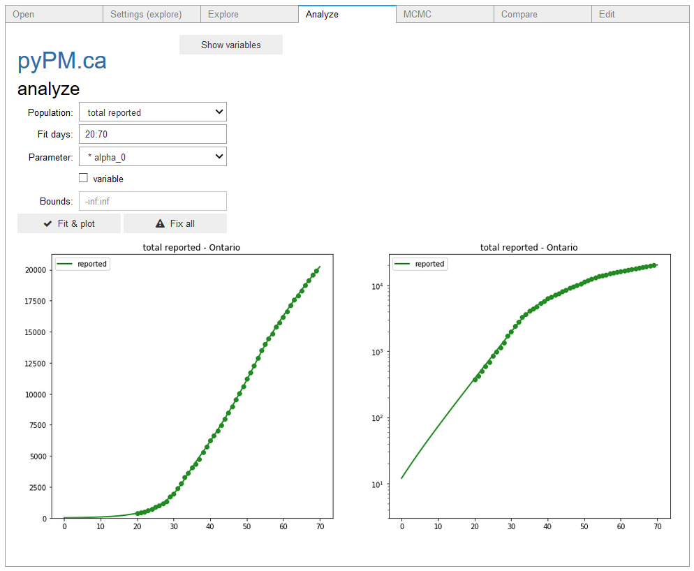
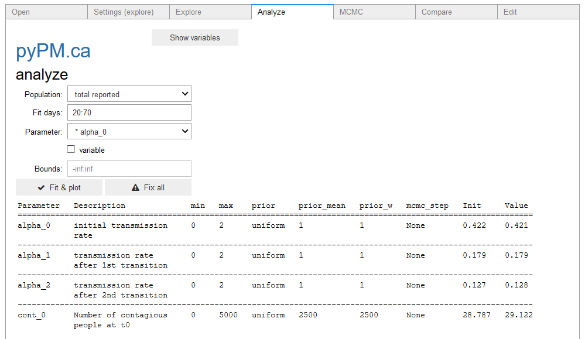

## [ipypm](index.md) - Analyze tab

The analyze tab allows you to find point estimates for model parameters, by finding the set of parameters that
best match the data.

* The region to be used is chosen in the explore tab.
* The population from that region is chosen in the dropdown. Generally it is best to start with reported cases
(total reported as shown in the example above).
* Choose the range of days to be used in the fit, the format is start:end
* Select the parameters to be adjusted in the fit. Select each one, then select the variable check box.
* The variable parameters are moved to the top of the parameter list and highlight with an asterix ('*')
* Bounds can be set for the parameter variation.

Note that if an integer parameter is set to be variable the bounds must be set to a range < 15. For each
integer value in the range, the overall goodness of fit is evaluated and reported (for the best fit, with
the float variables being allowed to vary).
The integer parameter is set to the value that produces the best fit.
Turn the integer to be fixed and do the fit again to find the best overall fit.

The Fit & plot button initiates the fitting which uses
the scipy.optimize.curve_fit method.

The Fix all button returns all variable parameters to be fixed. This is useful
when moving to fit other parameters with other data (such as ICU data).

The button at the top (show variables) produces a table of the variable parameters and their initial and current values:

