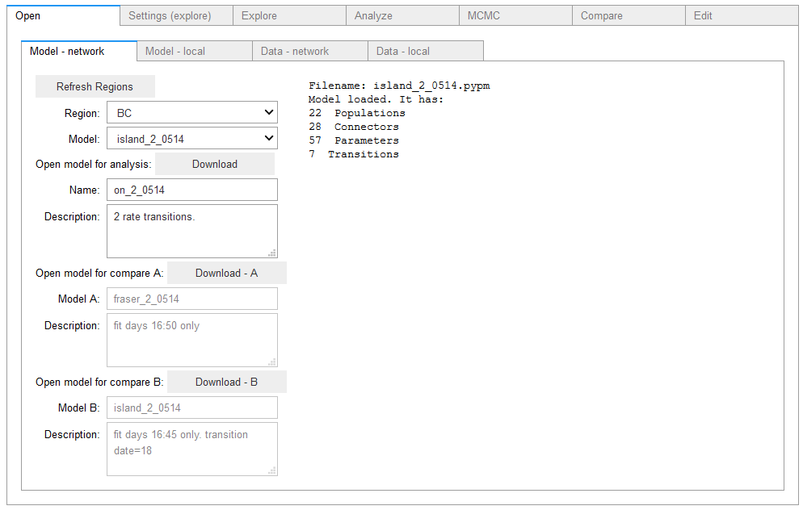
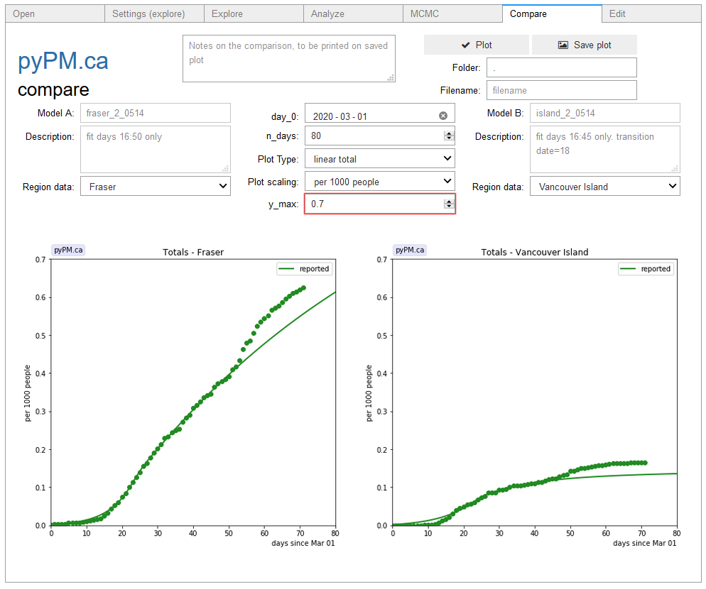

## [ipypm](index.md) - Compare tab

The Compare tab lets you show two models/data sets side by side, as an A-B comparison.

1. Go to the "Open tab" and load models for compare A and compare B.

2. Open the data source that corresponds to these models as usual in the Open -> Data tab.
3. Go to the compare tab. You can select a scaling that compares the rates per capital if you wish, and set the vertical scales
to be the same, as shown in the example below.

