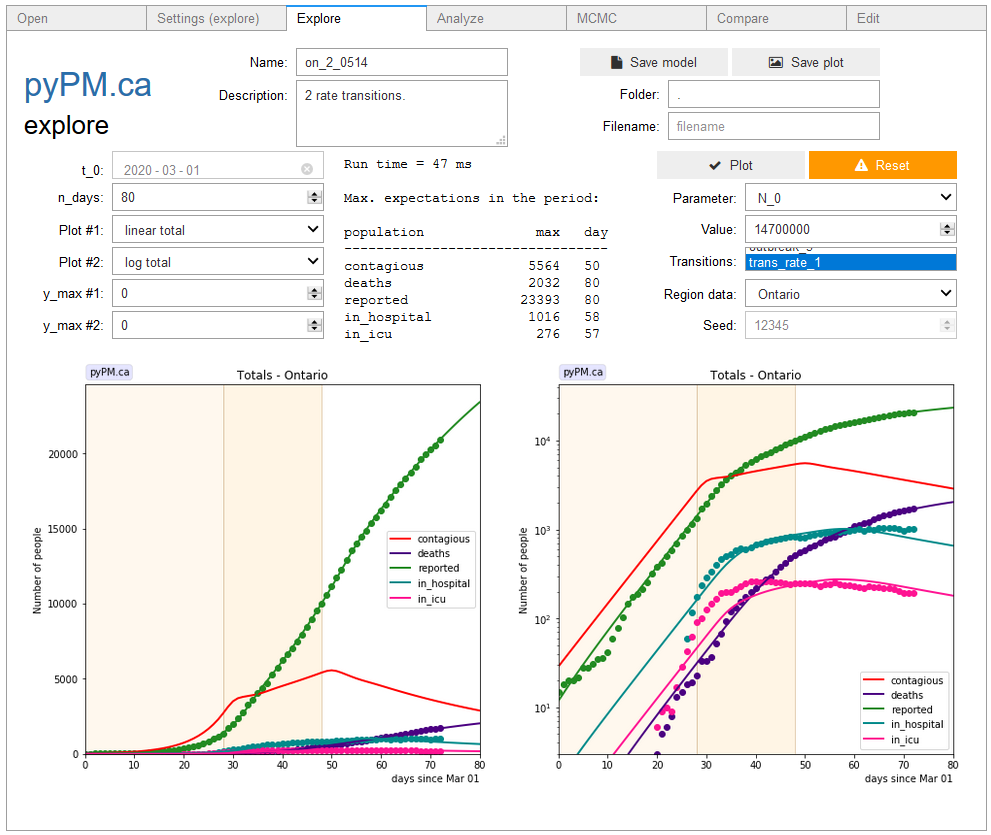

## ipypm - Explore tab

This tab allows you to explore how model predictions for the visible populations are affected by changing model parameters.
When you change the value for a model parameter the model is automatically rerun to show the new model predictions.

### Top section

* The top-middle portion of this tab shows the name of the model and a brief description.
* You can make changes to these, and save the current settings for the model in a new file (or update and existing file)
by filling out the filename and clicking "Save model". All current parameter values are set to be the default parameter values.
* It is recommended to use the model name as the filename, but this is not enforced.
* The filetype will automatically be set to `.pypm' to identify it as a pyPM.ca model file.
* To save the current plot enter a filename and click on "Save plot".
The filetype defines the file format. .png and .pdf are good choices.

### Middle section

#### Left

* t_0: is currently disabled
* n_days: number of days for the model to calculate. The plots shows the time history for sizes of each visible population
(as selected in the [settings tab](settings.md).
* Plot #1 (left) and #2 (right): Choose the plot type (linear/log and total/daily). The "total" type is cumulative or "current". Daily corresponds to
that new cases, hospitalizations, deaths, for that day. Generally daily data is not available for most data sources.
* y_max #1 and #2: if zero, the vertical axis for the plot will be automatically scaled. Otherwise the number specifies the maximum.

### Middle

The time required to run the model is generally an overestimate. A table of maxima for the visible populations
are shown to directly see the effect when changing parameters.

#### Right

* Plot: Forces the model to redo its calculation and plot the results.
* Reset: Changes all parameters back to their initial values (those values stored in the model file).
* Parameter: Dropdown selector to choose the parameter to adjust
* Value: Typing a new number and hitting enter will cause the model to recalculate its predictions for the new value
* Transitions: Select which transitions are to be enabled. Examples of transitions are
  * Modification to parameters on a certain day (such as a change to transmission rate due to changes in lockdown measures)
  * Injections of new members into a population (such as an injection of newly infected members to model an outbreak)
   Select the transition by moving your mouse over the box, and use the roller wheel to roll the options. Control click changes
   the stated between enabled (highlighted) and disabled (not highlighted)
* Region data: Show the data for the selected region on the plots. If simulation is chosen, then the same model is used to produce
simulated data according to the model parameters. When looking at cumulative data, you may be surprised by the large
correlated variation for different simulated samples.
* When viewing simulated samples, you can enter a seed to produce a consistent set of simulated data. If the seed is set to 0, then
each time a plot is made (clicking on plot or changing a parameter value) a new seed is used.

### Lower section

The curves show the model expectation values for the size of each visible population for each day.
The points show the region data for those days (or show simulated data if "Simulation" is chosen as the region).
The plots can be saved (see top section of tab).