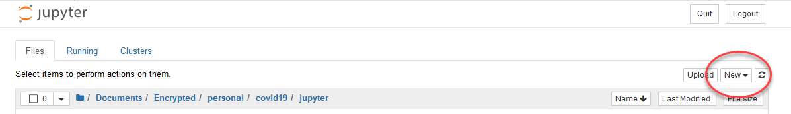

## Overview
The `ipypm` package uses interactive python widgets (ipywidgets) to provide a graphical user interface
to the pypmca modelling engine.
It runs in a jupyter notebook, either on your computer (software installation required)
or on a jupyterhub server (no software installation required).

With `ipypm`, you can load models, explore their behaviour by adjusting parameters,
load data to confront the models, and perform basic parameter estimation by fitting models to the data.
The model structure itself can be edited through the GUI.

### Quickstart

Links are provided [here](https://github.com/pypm/quickstart)
to start `ipypm` with just a few clicks on Binder or a jupyter hub server.

### Local installation and startup

You can install the pyPM.ca software to run on your own computer/server by:
* Ensuring that you have Python (version > 3.5) and Jupyter notebook installed
  * If you need to install Python, consider [anaconda](https://www.anaconda.com/products/individual) which includes Jupyter notebook
* Install ipypm software and start a jupyter notebook
  * `pip install ipypm`
  * `jupyter notebook`
* create a new Python 3 notebook (click "New")

* Enter the following two lines into the empty cell in the notebook:

```
from ipypm import ipypm
ipypm.run_gui()
```

   these tell python to import `ipypm` and start the gui. Execute the lines by hitting _shift-enter_


* In more advanced analyses with ipypm, you will want access to methods and data. In that case you
need to create an ipypm object for reference, and start the gui using that object:

```
from ipypm import ipypm
my_ipypm = ipypm.ipypm()
my_ipypm.get_display()
```

### General information

* If you find that the GUI is not responding, you can restart by restarting the jupyter notebook kernel:
  * Menu -> Kernel -> Restart and Clear Output
  * execute the command to display the GUI.

### Tabs

The `ipypm` interface is divided into tabs. Only Open and Edit are shown when you start.
After you load a model to work with, the other tabs will appear.

More information about these tabs are here:

* Tabs:
  * [Open](open.md): Loading models and data
  * [Settings](settings.md): Selecting what is visible
  * [Explore](explore.md): Exploring models with data
  * Explore: Adding transitions
  * Analyze: Fitting models to data (estimating model parameters)
  * MCMC: Using MCMC methods to estimate uncertainty bands in future projections
  * Compare: Comparing two models side-by-side
  * Edit: Examining a model in detail and making changes to its structure.
* Interacting with the ipypm models and data directly in jupyter notebook cells
