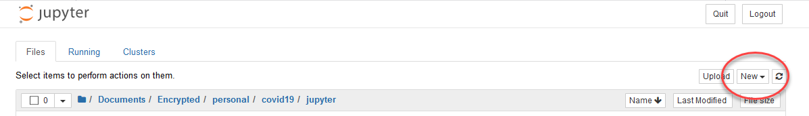

## [ipypm](index.md) - Installation

You can install the pyPM.ca software to run on your own computer/server by:
* Ensuring that you have Python (version > 3.5) and Jupyter notebook installed
  * If you need to install Python, consider [anaconda](https://www.anaconda.com/products/individual) which includes Jupyter notebook
* Install ipypm software and start a jupyter notebook
  * `pip install ipypm`
  * `jupyter notebook`
* create a new Python 3 notebook (click "New" as shown in the image below):

* Enter the following two lines into the empty cell in the notebook:

```
from ipypm import ipypm
ipypm.run_gui()
```

   these tell python to import `ipypm` and start the gui. Execute the lines by hitting _shift-enter_


* In more advanced analyses with ipypm, you will want access to methods and data. In that case you
need to create an ipypm object for reference, and start the gui using that object:

```
from ipypm import ipypm
my_ipypm = ipypm.ipypm()
my_ipypm.get_display()
```

### In case of problems

* If you get an error that looks like ipywidgets cannot be found, you can install the library:
  * If using conda enter the following in the terminal:
    * conda install -c conda-forge ipywidgets
  * For pip there are two steps: installing and enabling:
    * pip install ipywidgets
    * jupyter nbextension enable --py widgetsnbextension

* If you find that the GUI is not responding, you can restart by restarting the jupyter notebook kernel:
  * Menu -> Kernel -> Restart and Clear Output
  * execute the command to display the GUI.
