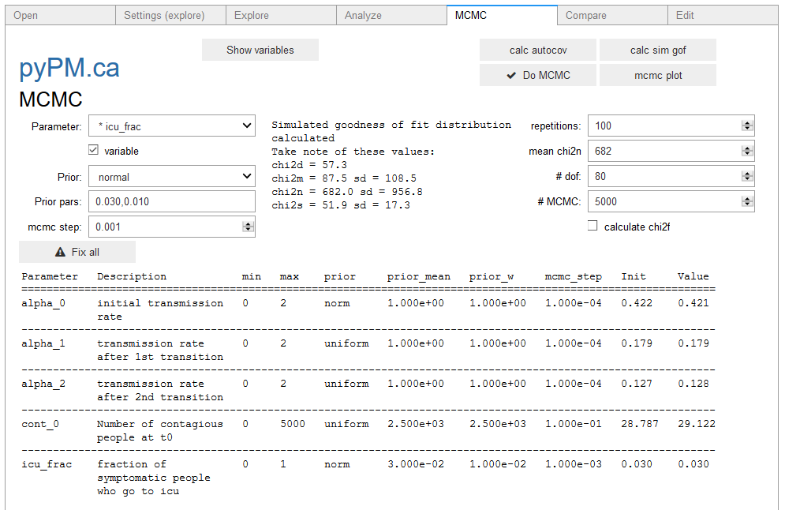
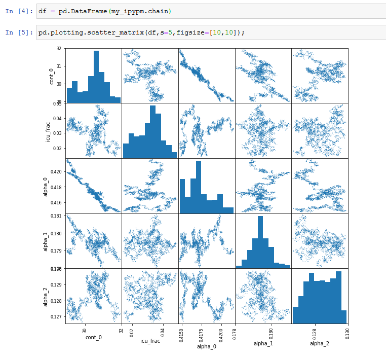
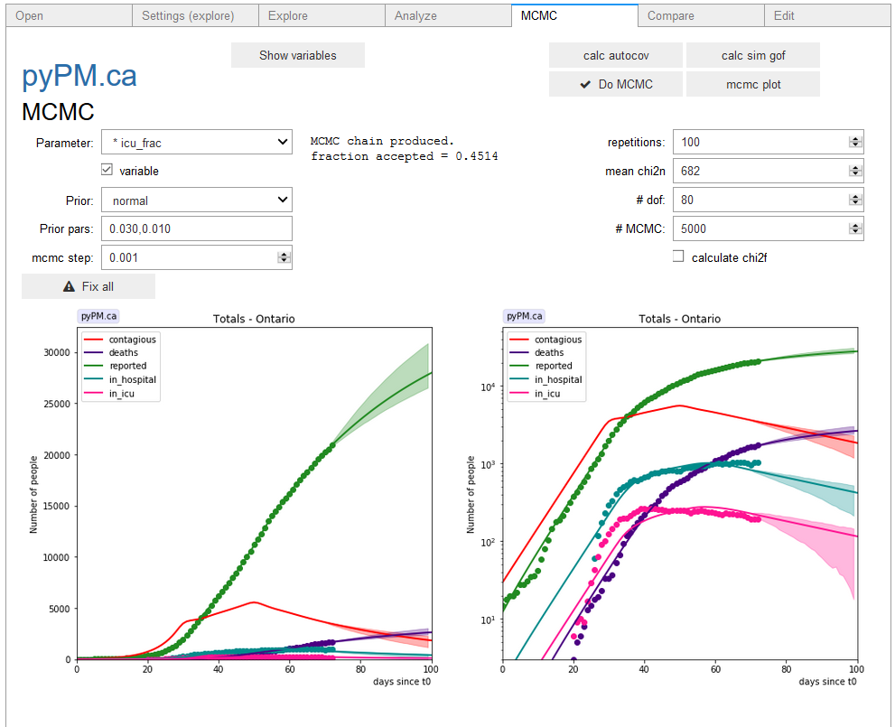

## [ipypm](index.md) - MCMC tab

The MCMC tab allows you to produce a projection of population sizes along with 95% confidence belts.
The method for defining the posterior probably density for the MCMC process is described in the `pypmca` documentation
[here](../pypmca/mcmc.md).

There are several steps required:
1. In the Explore tab, set n_days to show the projection period into the future. Hit "Plot" to see if that looks right.
2. In the Analyze tab, you need to have defined the variable parameters and done a fit, to define the reference model
with which the MCMC analysis is based.
3. In the MCMC window, add any additional variables you wish to include and specify normal priors for them. If these
variables affect the data used in the Analyze tab, they should have been set for that analysis. Do the analysis over.
4. Set MCMC step sizes for each variable. In general the step sizes should be a fraction of their one-sigma uncertainty.
If these are not known, use your best guess. After starting MCMC (see below) you will see the fraction of MCMC steps accepted.
If that number is less than 0.3, you should reduce the MCMC step size. If that number > 0.9, you should increase the step
size... these are just rough guidelines!
5. Click on the show variables to see that all variables are ready. See image below.
6. Calculate the autocovariance (button)
7. Calculate the goodness of fit statistics for simulated samples (`cal sim gof` button). This will print the values as shown
in the image below:

8. Enter the chi2_n number into the text box. This is used in the normalization part of the likelihood calculation.
9. Enter a number of degrees of freedom, which is used in the shape part of the likelihood calculation.
10. Choose the number of MCMC points to produce. 5000 will take a couple of minutes.
11. Produce the chain of MCMC points (click the `Do MCMC` button). The chain is available for inspection: my_ipypm.chain
An example is shown how to visualize the chain using pandas below.

12. Produce the projection plot with 95% CL bands by clicking on the `mcmc plot` button.

