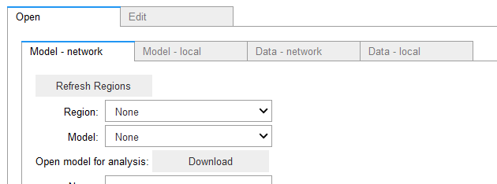

## [ipypm](index.md) - Open tab

The first tab displayed lets you choose a model to work with:

### Model - network

To use a model from the pyPM.ca model repository, download it by first refreshing the catalog (Refresh Regions)
then choose the region of interest. Generic reference models are collected in the "reference folder".

Choose a particular model for the selected region and click on the "Download" button. A short summary of the
model will be given.

### Model - local

If you want to use a model that you have created click the sub-tab "Model - local", click on the top "upload" button in
that tab and navitage to the model. Only files ending in `.pypm` (pypmca model files) are shown.

If a problem prevents you from downloading a model from the pyPM.ca model [repository](https://github.com/pypm/models),
you can clone that repository to your computer and use this sub-tab to load the model.

### Data - network

After refreshing the catalog, download the region of interest. Generally that gives you access to many sub regions. Currently:
* BC: Daily case data for the 5 BC health authorities. Also broken down by sex and age.
* Canada: Daily case, hospitalization, and deaths for each province and territory
* USA: Daily case, hospitalization, and deaths for each US state and territory. Some states include ventilator data.

The data sources are provided when you click the download. The sub-regions are listed.

### Data - local

If a problem prevents you from downloading data from the pyPM.ca data [repository](https://github.com/pypm/data),
you can clone that repository to your computer and use this sub-tab to load the model.

Since the data is updated regularly, you may first want to `git pull` before loading the data.

