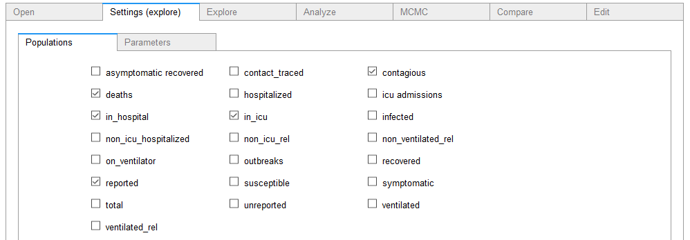

## ipypm - Settings tab

The settings tab allows you to select the set of populations to see in plots and the set of parameters to appear in dropdown
menus in the three next tabs (Explore, Analyze, and MCMC).

When you save a model, these settings are saved with the model.

In particular, when saving a model to be used in the pyPM.ca compare tab, ensure that you have selected the populations that you
want visible in the comparison.

More information about how models are constructed is found the in [pypmca documentation](../pypmca/index.md).

You can invesitage the model in detail by using the [Edit tab](edit.md)