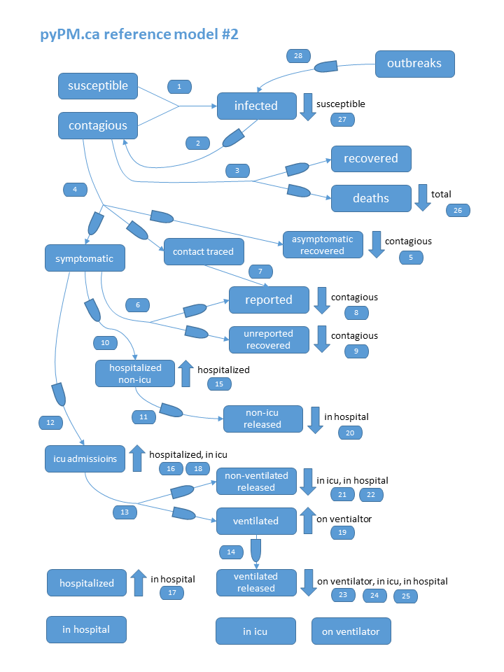

## [pypmca](index.md) reference model #2

The figure below is an illustration of the connections between populations
that makes up the ``pypmca`` reference model #2.

Each of the rounded blocks represents a population and the lines between them are the connectors.
Many of the connectors involve delays, which are symbolized by the "boat" symbols.
Simple connectors that directly add to or subtract from another population are shown by the labeled up and down arrows.

The order of the processing of the connectors are given by the numbers that label the connectors.

This [page](https://github.com/pypm/pypmca/blob/master/examples/jupyter/ref_model_2.ipynb) shows
the python code that was used to create the model.
Creating a new model can be done by starting with this model and making adjustments, or to start from a blank slate.
Model editing can be done by changing the python code, or by using the GUI editor provided by [ipypm](../ipypm).

### Reference model #2.1

Reference model #2.1 was prepared to allow reporting anomalies to be modelled.
The population reported is renamed as "positives".
Incoming members to the positives population, are immediately added to the new "reported" population.
The "reported" population can also receive members from the "report anomalies" population which can
receive a burst of new reports from an injector.
This allows both BC and Quebec data to be fit by the model.

The model also turns on the
* "reporting noise" when producing simulated data, to mimic the large negatively correlated
noise due to the reporting process.
* negative binomial process for the infection cycle. The default parameter ``p=2`` produces random numbers
whoe variance is twice that of a Poisson distribution.