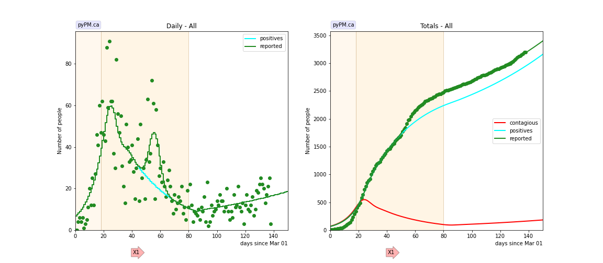
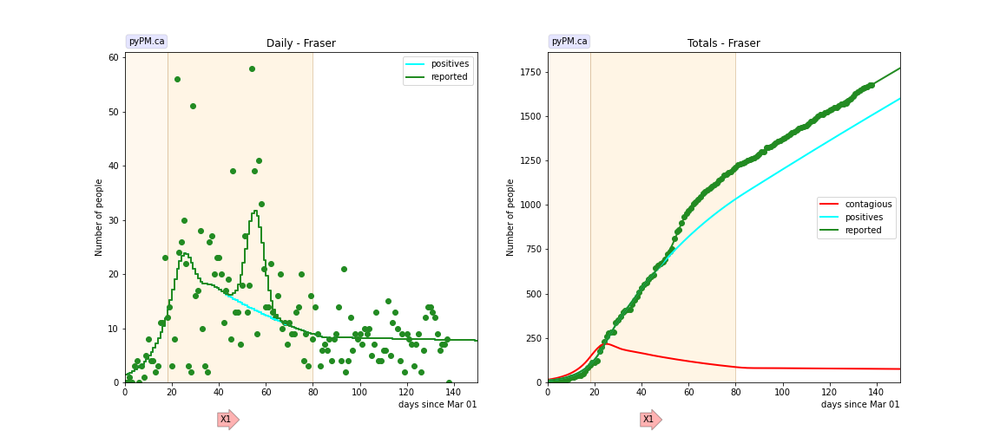
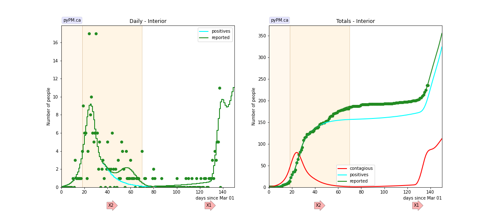
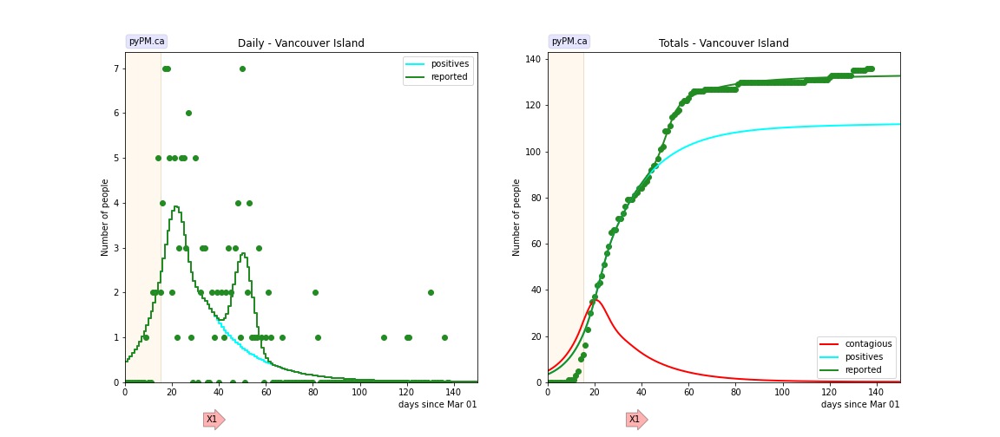
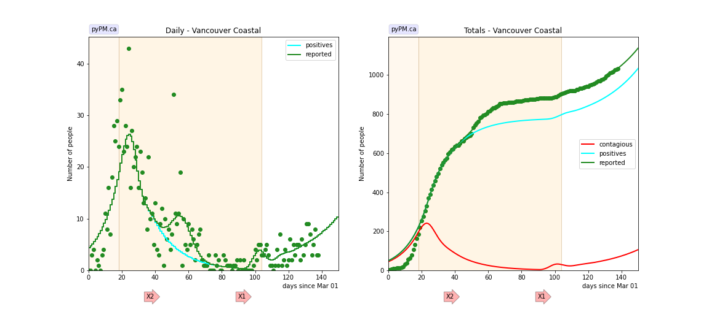
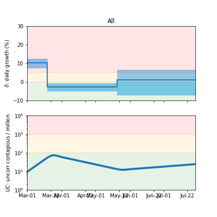
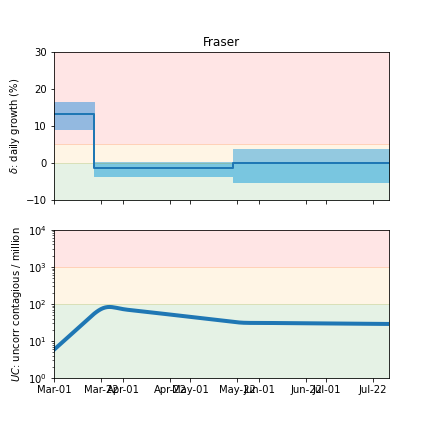
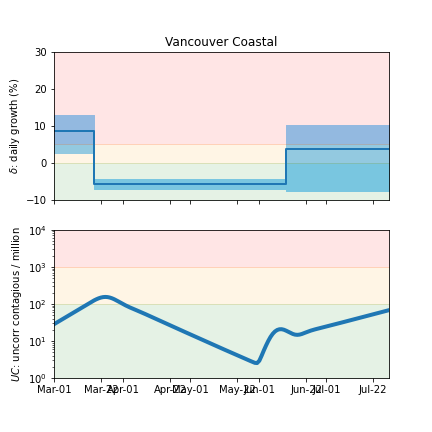

## July 19, 2020 Analysis of BC regional data

The following shows graphs of daily cases and cumulative cases.
A reporting anomaly is added to account for the change in testing policy in mid April.
Table shows the estimates for growth parameters, followed by graphical summaries.
Due to the low number of cases, there are large uncertainties for the current growth rates.
An outbreak in Kelowna has generated a spike in cases.

Cases from the Northern Health region are
not shown because there are very few cases reported.

### [BC total](img/bc_2_3_0719.pdf)

There has been two localized outbreaks since day 100: Coastal and Interior (see below). These cases are
not treated as localized outbreaks in the overall BC fit. The estimated daily growth rate is larger
than would be found if the localized outbreaks were modelled as such.

### [Fraser](img/fraser_2_3_0719.pdf)

### [Interior](img/interior_2_3_0719.pdf)

The spike in cases fit to have occured on day 121, is due to the Kelowna outbreak (attributed to Canada Day events).
It is difficult to estimate the size of the outbreak until the case numbers are seen to fall again.

### [Island](img/island_2_3_0719.pdf)

The small number of cases make it difficult to measure the growth rate.

### [Coastal](img/coastal_2_3_0719.png)

A small localized outbreak appeared in mid June.

## Tables

The tables below are results from the fits to reference model 2.3.

### Daily fractional growth rates (&delta;)

HA| &delta;0 | day 1 | &delta;1 | day 2 | &delta;2 
---|---|---|---|---|---
bc*|0.188 +/- 0.047|16|-0.041 +/- 0.006|80|-0.007 +/- 0.020
bc|0.102 +/- 0.013|18|-0.027 +/- 0.010|80|0.012 +/- 0.033
fraser|0.132 +/- 0.018|18|-0.014 +/- 0.010|80|0.000 +/- 0.022
interior|0.224|18|-0.084|70|0.031
island|0.116|15|-0.049
coastal|0.086 +/- 0.026|18|-0.056 +/- 0.007|104|0.037 +/- 0.042

* &delta;0: initial daily fractional growth parameter
* day 1: days after March 1, 2020 when transmission rate changed

* bc* is the result from the [Canada wide study](../prov20200711) that
used case numbers reported at the daily briefings.
The changes in the BC data (with modified case dates) affects the estimate for &delta;0.

## Infection status

The following plots summarize the infection history.
The upper plot shows the daily growth/decline from the fit. Bands show approximate 95% CL intervals.
The lower plot shows the size of the infection: the uncorrected circulating contagious population per
million.

### [BC total](img/bc-summary.pdf)

### [Fraser](img/fraser-summary.pdf)

### [Coastal](img/coastal-summary.pdf)

## [return to case studies](../index.md)

