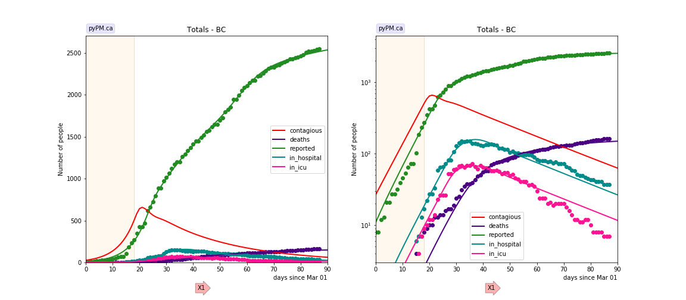
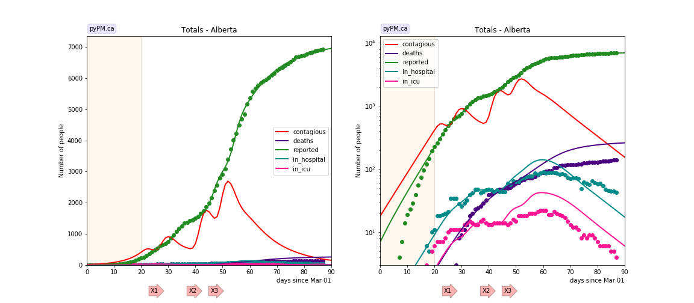
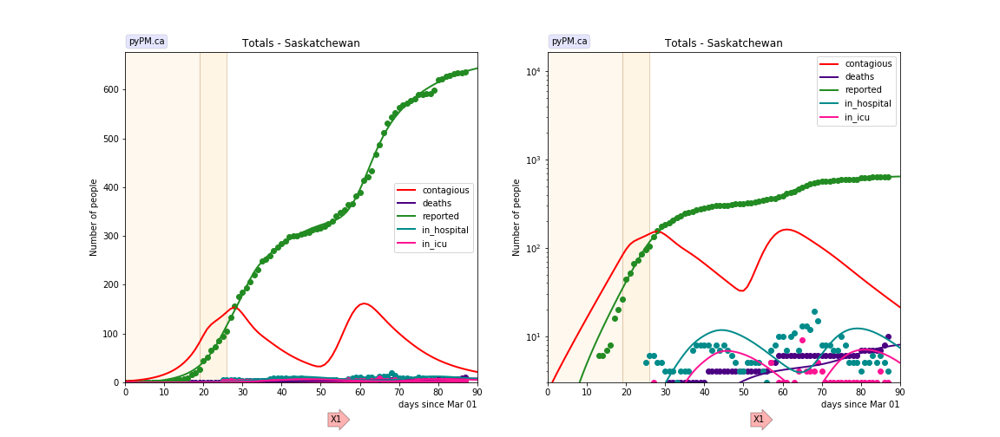
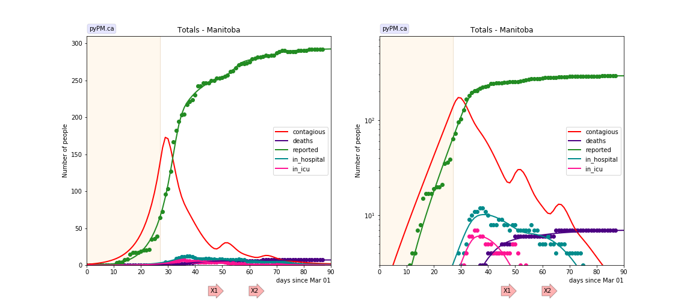
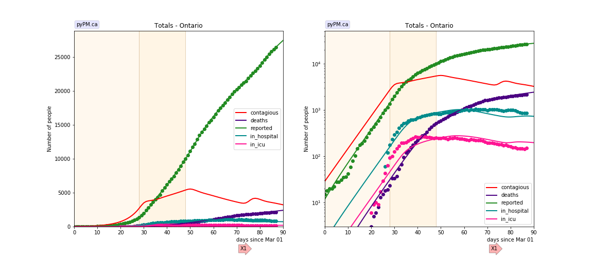
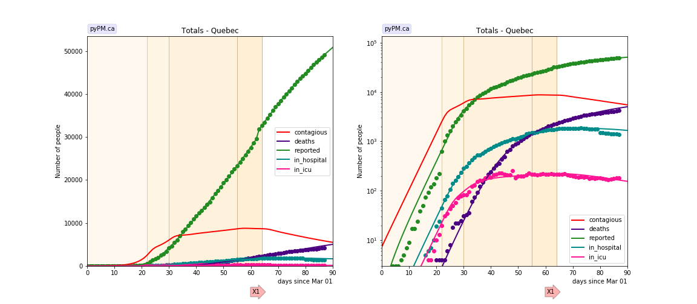
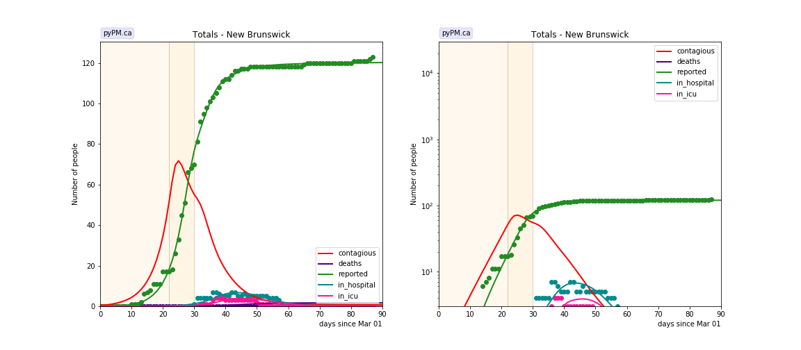
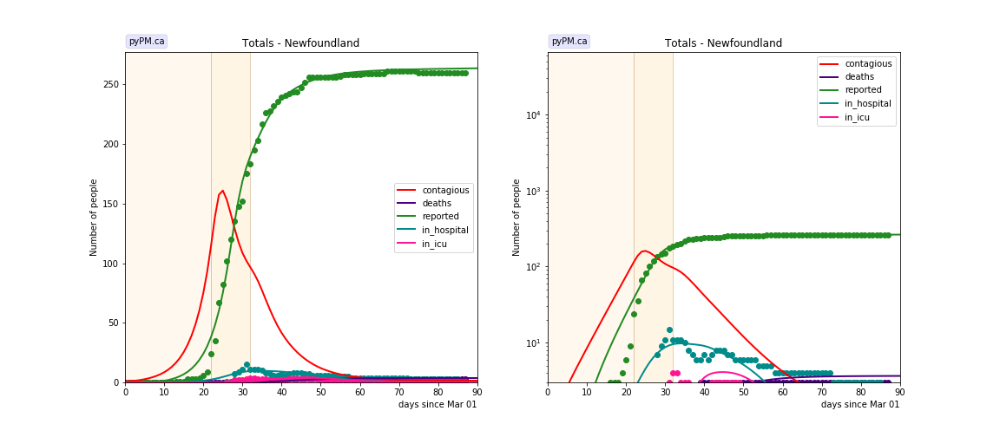

## May 28, 2020 Analysis of provincial data

As relaxation is getting underway, it is important to have a good fit to the
data prior to the onset of changes due to relaxation.

All provinces except PEI (which has very few cases) are fit to the reference model 2.2.
Reporting anomalies are included for BC and Quebec.

The following shows graphs followed by tables.
The models and data used to produce these
are conveniently made available through the [ipypm](../../ipypm) user interface.

### BC

The data is consistent with a single transition in the transmission rate and almost 400 cases
added in late April. The anomalous cases are seen in all health regions and is expected to be
due to a change in test/reporting policy.
The data does not support a constant chang in probability for an
infected individual to get a positive test result.
The cyan line shows the model prediction without including the reporting anomaly.

### Alberta

The data is consistent with one change in transmissionrate in mid March and 3 separate
large outbreaks. These have been reported in the media to be due to meat packing plants.
The data is consistent with each outbreaks taking place over a very short period of time.
Only two parameters are used to characterize each outbreak: date and number of infections.
The shapes of the case (and contagious populations) are outcomes of the other model parameters
which were not tuned.

The hospitalization and death rates from these outbreaks appear to be smaller than the
cases from March.

### Saskatchewan

The data is consistent with two transitions in transmission rates and one large outbreak,
reported in the media to be in Northern communities.
The data suggests that the outbreak took place over a period of about 10 days.

### Manitoba

The data is consistent with one change to the transmission rate.
There is some evidence for two outbreaks, much smaller than what was seen in Alberta and Saskatchewan.

### Ontario

The data is consistent with 2 changes in tranmission rate.

### Quebec

Three changes in transmission rate are necessary to fit the data.
A large backlog of case reports were released on May 3.
The cyan line shows the model prediction without including the reporting anomaly.
The current transmission rate is very close to exponential growth.

### New Brunswick

The data is consistent with two changes in transmission rates.

### Newfoundland

The data is consistent with two changes in transmission rates.

### Nova Scotia

The data is consistent with two changes in transmission rates.

## Tables

The tables below are results from the fits to reference model 2.1.
These are shown for purposes of comparison.

### Reproduction numbers

prov|cont_0 | R_0 | t_1 | R_1 | t2 | R_2 | t3 | R_3 | t4 | R_4
---|---|---|---|---|---|---|---|---|---|---
bcc|26.8|2.80|18|0.76
ab|17.9|2.69|20|0.52
sk|2.3|3.02|19|1.45|26|0.50
mb|1.0|2.86|27|0.28
on|28.6|2.78|28|1.18|48|0.84
qc|7.3|4.65|22|1.65|30|1.07|55|0.99|64|0.87
nb|0.6|3.44|22|0.66|30|0.22
nl|1.0|3.66|22|0.51|32|0.29
ns|2.6|2.59|25|1.34|44|0.39

* cont_0: size of contagious population on March 1, 2020
* reproduction values, R_i, for different periods, separated by the times t_i (days)
* for refence model 2, R = 6.58 * alpha. (Scale factor found empirically)

## [return to case studies](../index.md)

