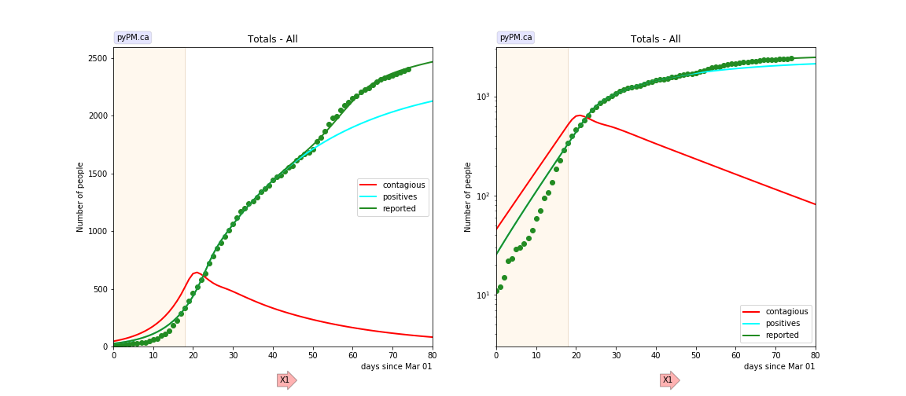
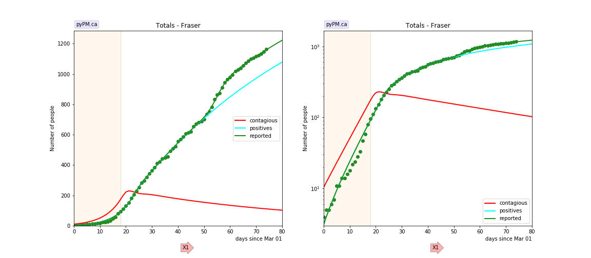
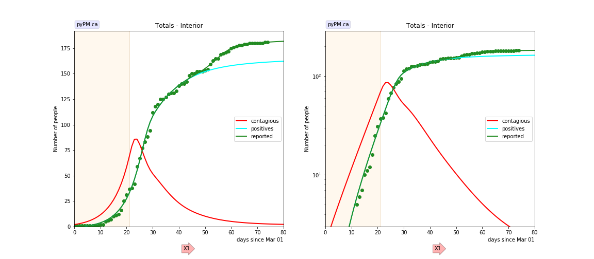
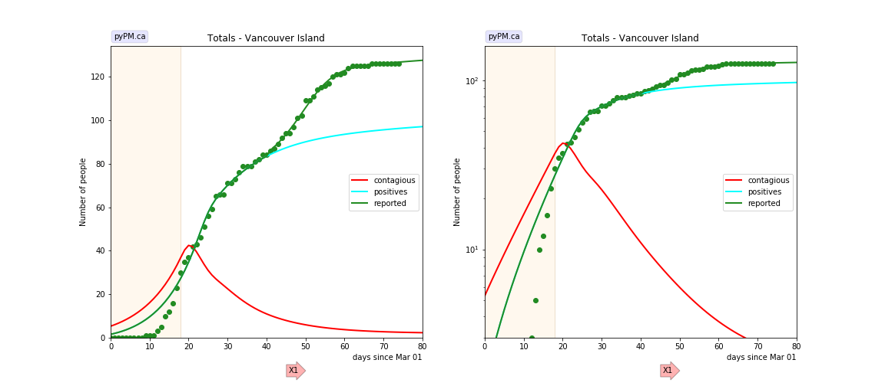
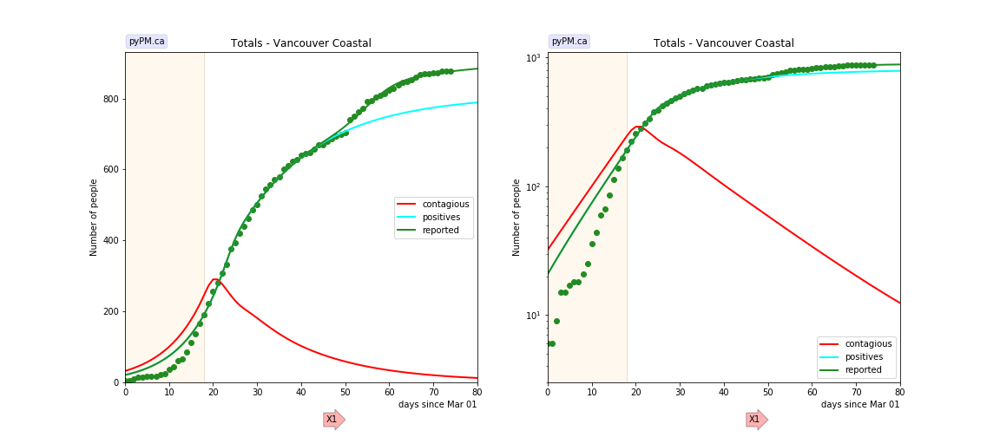

## May 18, 2020 Analysis of BC regional data

As relaxation is getting underway, it is important to have a good fit to the
data prior to the onset of changes due to relaxation.

The following shows graphs followed by tables.
All regional data are consistent with a single change in transmission rate
and a case reporting anomaly. Cases from the Northern Health region are
not shown because there are very few cases reported.

The models and data are conveniently made available through the [ipypm](../../ipypm) user interface.

### BC total

### Fraser

### Interior

### Island

### Coastal

## Tables

The tables below are results from the fits to reference model 2.1.
These are shown for purposes of comparison.

### Reproduction numbers

prov|cont_0 | R_0 | t_1 | R_1 
---|---|---|---|---
bc|45.5|2.39|18|0.75
bc*|26.8|2.80|18|0.73
fraser|10.4|2.67|18|0.89
interior|2.0|2.72|21|0.46
island|5.3|1.95|18|0.50
coastal|32.1|2.10|18|0.62

* cont_0: size of contagious population on March 1, 2020
* reproduction values, R_i, for different periods, separated by the times t_i (days)
* for refence model 2.1, R = 6.58 * alpha. (Scale factor found empirically)
* bc* is the result from the [Canada wide study](../prov20200518) that
used case numbers reported at the daily briefings.
The changes in the BC data (with modified case dates) affects the estimate for R_0.

### Reporting anomaly

prov|total | anomaly | day | std dev
---|---|---|---|---
bc|2444|340.7|57.0|5.9
fraser|1195|144.4|54.7|3.0
interior|181|19.5|54.3|4.7
island|126|30.5|49.3|5.8
coastal|882|95.4|54.6|4.9

* total: total number of cases (May 18, 2020)
* anomaly: number of report anomaly cases
* day: mean day of report anomaly
* std dev: standard deviation of spread of report anomaly

## [return to case studies](../index.md)

