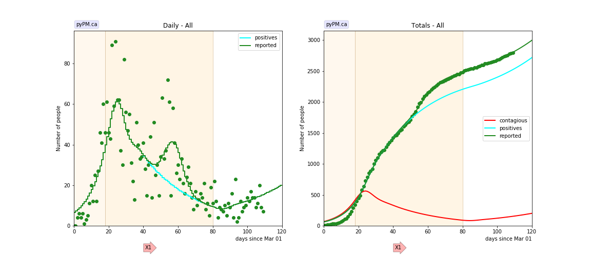
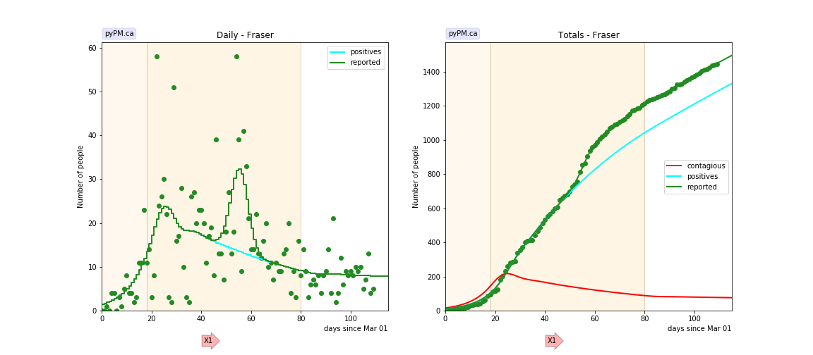
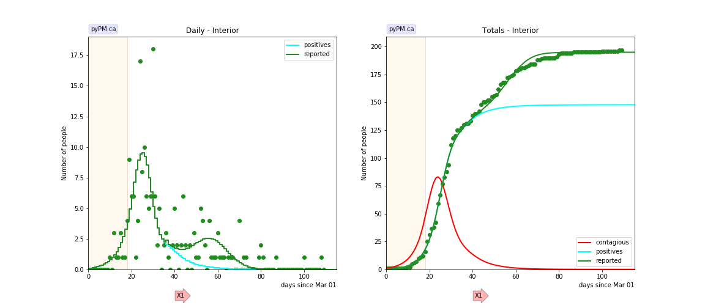
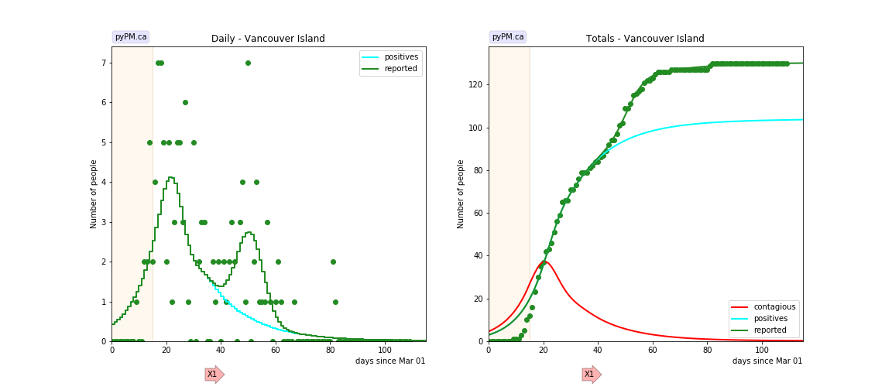
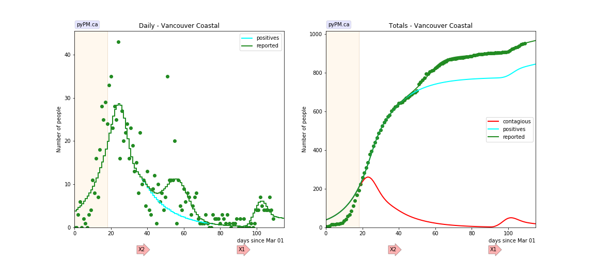
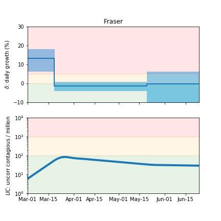

## June 20, 2020 Analysis of BC regional data.

The following shows graphs followed by tables.
All regional data are consistent with a single change in transmission rate
and a case reporting anomaly. Cases from the Northern Health region are
not shown because there are very few cases reported.

### [BC total](img/bc_2_3_0620.pdf)

### [Fraser](img/fraser_2_3_0620.pdf)

### [Interior](img/interior_2_3_0620.pdf)

### [Island](img/island_2_3_0620.pdf)

### [Coastal](img/coastal_2_3_0620.png)

A small outbreak appears to be underway starting in mid June.

## Tables

The tables below are results from the fits to reference model 2.3.
These are shown for purposes of comparison.

### Daily fractional growth rates (&delta;)

HA| &delta;0 | day 1 | &delta;1 | day 2 | &delta;2 
---|---|---|---|---|---
bc|0.105|18|-0.029|80|0.026
bc*|0.187 +/- 0.030|16|-0.040 +/- 0.008|80|-0.011 +/- 0.024
fraser|0.131|18|-0.014|80|-0.002
interior|0.224|18|-0.104
island|0.124|15|-0.058
coastal|0.096|18|-0.061

* &delta;0: initial daily fractional growth parameter
* day 1: days after March 1, 2020 when transmission rate changed

* bc* is the result from the [Canada wide study](../prov20200620) that
used case numbers reported at the daily briefings.
The changes in the BC data (with modified case dates) affects the estimate for &delta;0.

## Infection status

The following plots summarize the infection history.
The upper plot shows the daily growth/decline from the fit. Bands show approximate 95% CL intervals.
The lower plot shows the size of the infection: the uncorrected circulating contagious population per
million.

### [BC total](img/bc-summary.pdf)

### [Fraser](img/fraser-summary.pdf)

## [return to case studies](../index.md)

