## August 24, 2020 Analysis of BC regional data

The following shows graphs of daily cases and cumulative cases.
A reporting anomaly is added to account for the change in testing policy in mid April.
Table shows the estimates for growth parameters, followed by graphical summaries.
Due to the low number of cases, there are large uncertainties for the current growth rates.
An outbreak in Kelowna has generated a spike in cases ine the Interior health region.

Cases from the Northern Health region are
not shown because there are very few cases reported.

### [BC total](img/bc_2_3_0824.pdf)

There has been two localized outbreaks since day 100: Coastal and Interior (see below). These cases are
not treated as localized outbreaks in the overall BC fit. The estimated daily growth rate is larger
than would be found if the localized outbreaks were modelled as such.

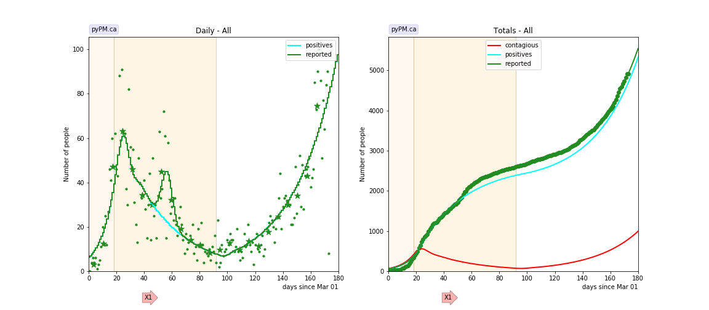

### [Fraser](img/fraser_2_3_0824.pdf)

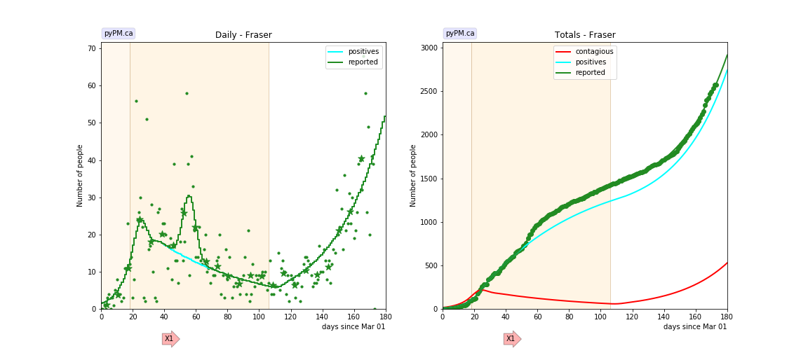

### [Interior](img/interior_2_3_0824.pdf)

The spike in cases fit to have occured on day 121, is due to the Kelowna outbreak (attributed to Canada Day events).
A total of about 200 infections are injected in the model that day in order to fit the data.

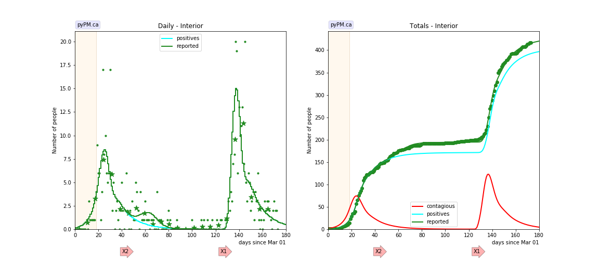

### [Island](img/island_2_3_0824.pdf)

The small number of cases make it difficult to measure the growth rate.

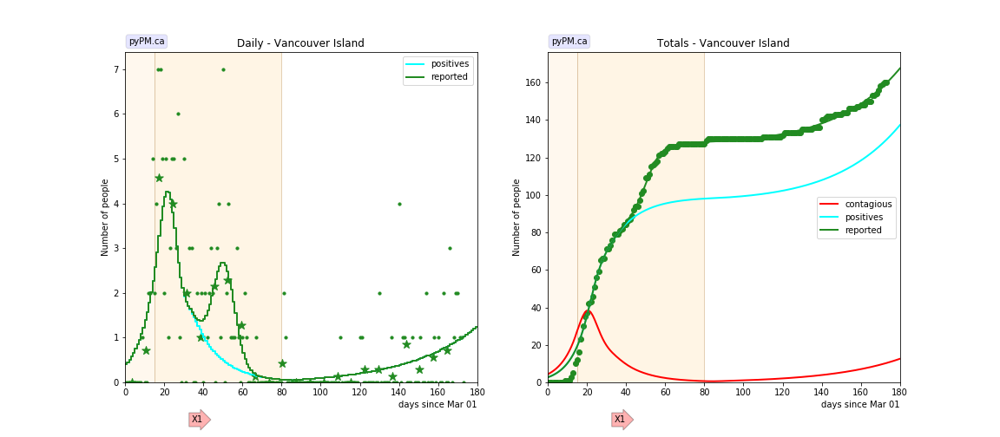

### [Coastal](img/coastal_2_3_0824.pdf)

A small localized outbreak appeared in mid June. It appears that another outbreak is underway now... more data required
to distinguish this from a rapid growth phase.

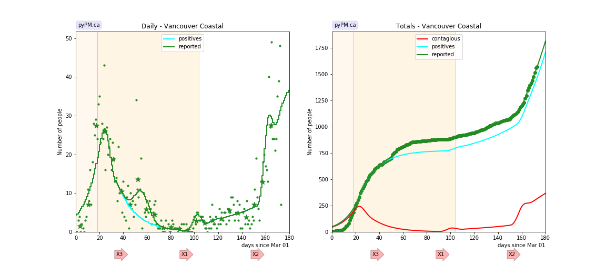

## BC data broken down by age group

### [10-19](img/bc10_2_3_0824.pdf)

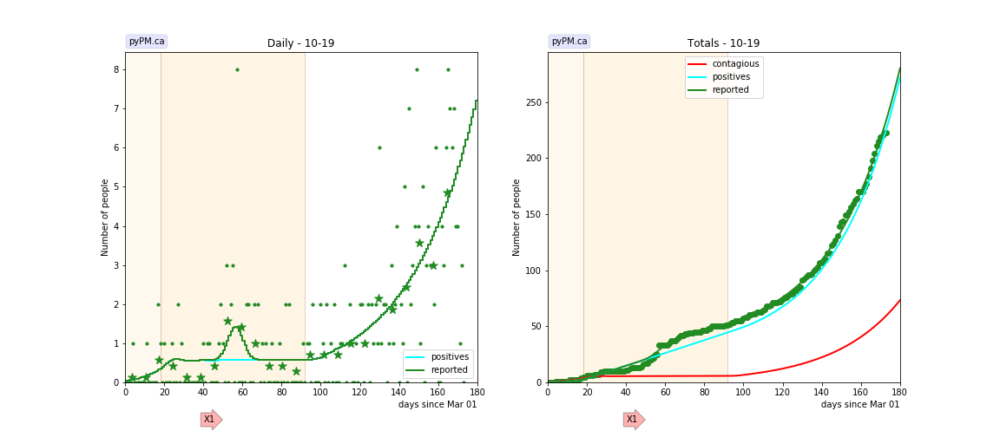

### [20-29](img/bc20_2_3_0824.pdf)

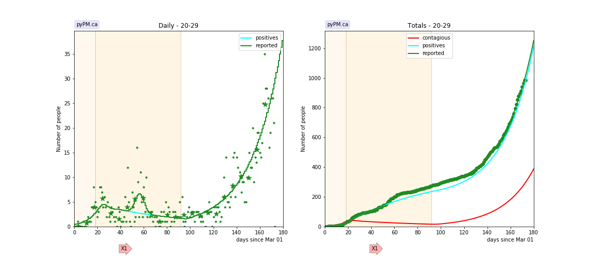

### [30-39](img/bc30_2_3_0824.pdf)

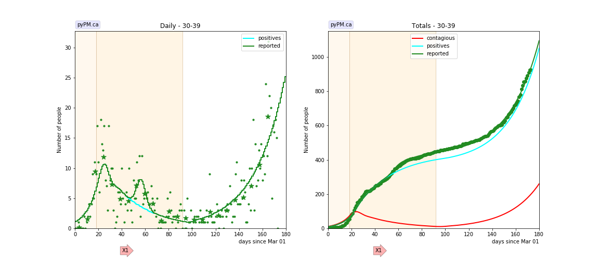

### [40-49](img/bc40_2_3_0824.pdf)

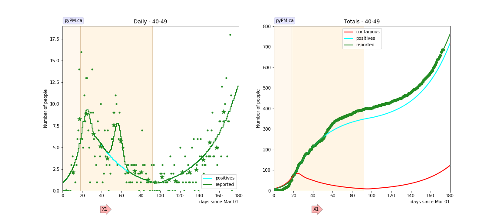

### [50-59](img/bc50_2_3_0824.pdf)

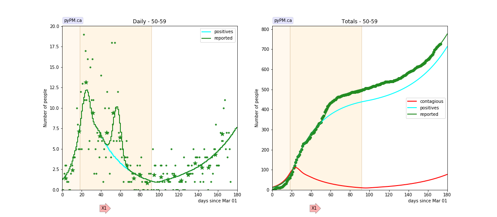

### [60-69](img/bc60_2_3_0824.pdf)

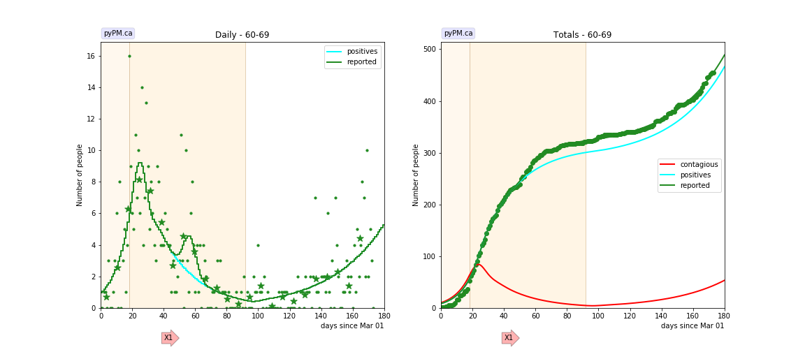

### [70-79](img/bc70_2_3_0824.pdf)

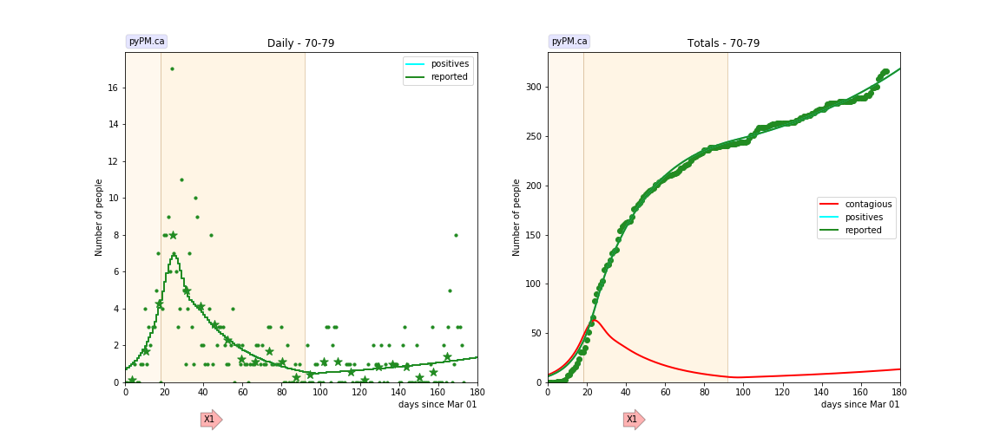

### [80-89](img/bc80_2_3_0824.pdf)

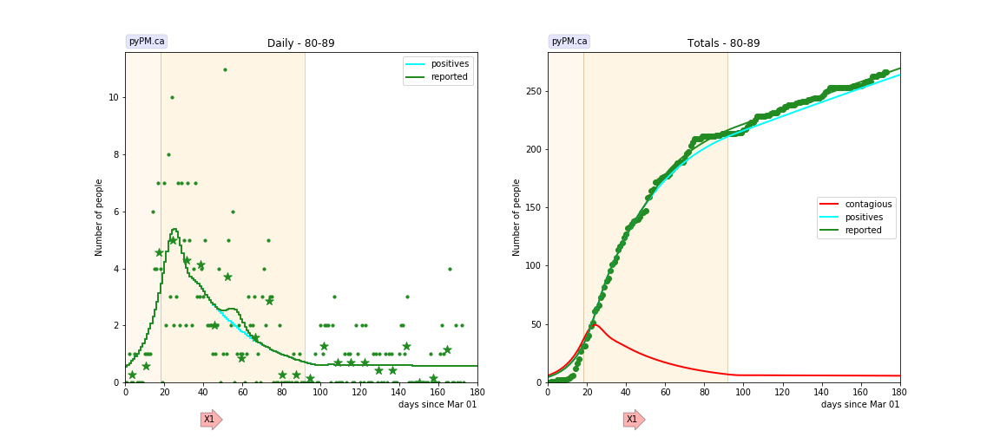

## Tables

The tables below are results from the fits to reference model 2.3.

### Daily fractional growth rates (&delta;)

HA| &delta;0 | day 1 | &delta;1 | day 2 | &delta;2 
---|---|---|---|---|---
bc|0.106 +/- 0.011|18|-0.027 +/- 0.006|92|0.033 +/- 0.015
fraser|0.132 +/- 0.042|18|-0.014 +/- 0.011|106|0.033 +/- 0.040
interior|0.195|18|-0.067
island|0.130 +/- 0.017|15|-0.065 +/- 0.028|80|0.029 +/- 0.011
coastal|0.086 +/- 0.019|18|-0.057 +/- 0.025|104|0.022 +/- 0.025

* &delta;0: initial daily fractional growth parameter
* day 1: days after March 1, 2020 when transmission rate changed

Age| &delta;0 | day 1 | &delta;1 | day 2 | &delta;2 
---|---|---|---|---|---
10|0.106|18|0.000|92|0.030
20|0.106|18|-0.012|92|0.039
30|0.106|18|-0.029|92|0.039
40|0.106|18|-0.029|92|0.032
50|0.106|18|-0.032|92|0.026
60|0.106|18|-0.039|92|0.030
70|0.106|18|-0.033|92|0.012
80|0.106|18|-0.027|92|-0.001

* &delta;0, day 1: fixed to full BC fit

## Infection status

The following plots summarize the infection history.
The upper plot shows the daily growth/decline from the fit. Bands show approximate 95% CL intervals.
The lower plot shows the size of the infection: the uncorrected circulating contagious population per
million.

### [BC total](img/bc-summary.pdf)

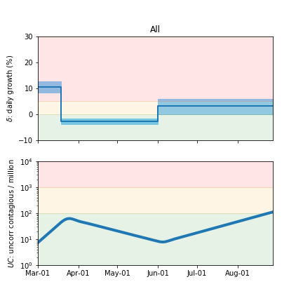

### [Fraser](img/fraser-summary.pdf)

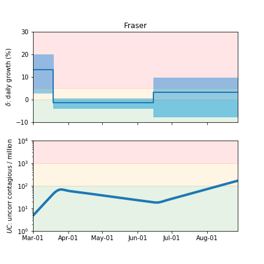

### [Coastal](img/coastal-summary.pdf)

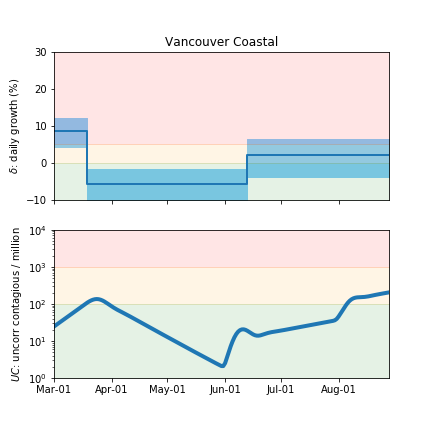

### [Vancouver Island](img/island-summary.pdf)

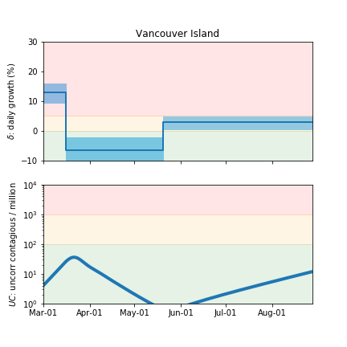

## [return to case studies](../index.md)

