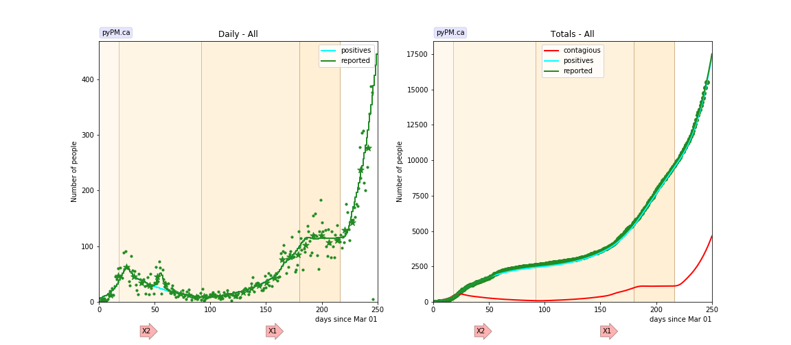
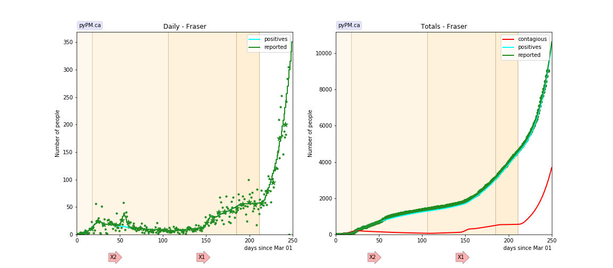
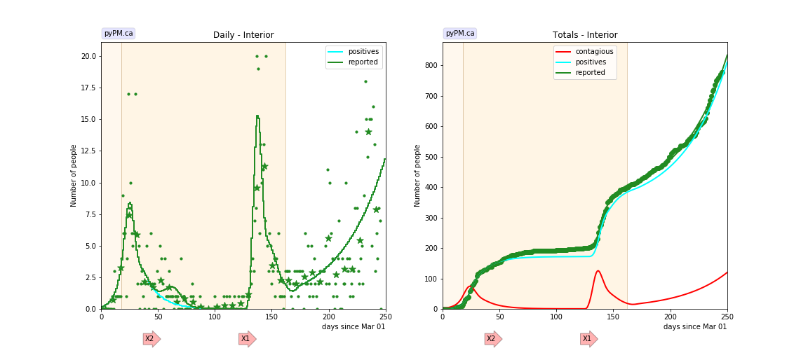
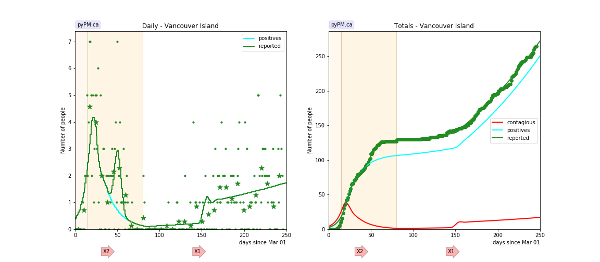
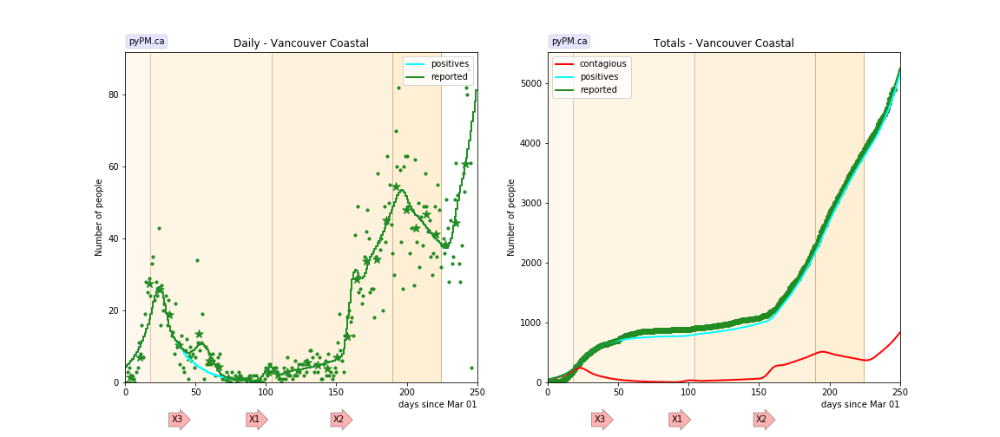
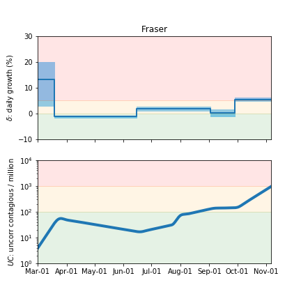
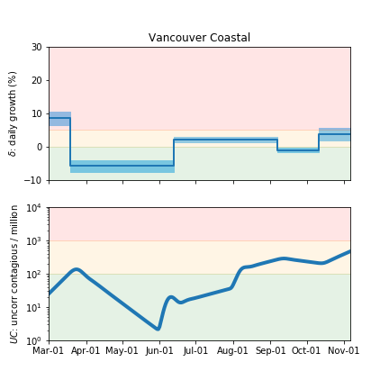
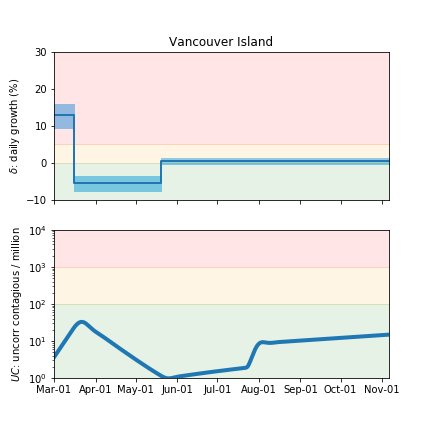

## November 3, 2020 Analysis of BC regional data

The following shows graphs of daily cases and cumulative cases.
A reporting anomaly is added to account for the change in testing policy in mid April.
Table shows the estimates for growth parameters, followed by graphical summaries.

Cases from the Northern Health region are
not shown because there are very few cases reported.

### [BC total](img/bc_2_3_1103.pdf)

There has been localized outbreaks in Coastal, Interior, and Fraser regions (see below). A single outbreak is
included in the overall BC fit.

### [Fraser](img/fraser_2_3_1103.pdf)

### [Interior](img/interior_2_3_1103.pdf)

The spike in cases fit to have occured on day 121, is due to the Kelowna outbreak (attributed to Canada Day events).
A total of about 200 infections are injected in the model that day in order to fit the data.

### [Island](img/island_2_3_1103.pdf)

The small number of cases make it difficult to measure the growth rate.

### [Coastal](img/coastal_2_3_1103.pdf)

Two outbreaks seen.

## Tables

The tables below are results from the fits to reference model 2.3.

### Daily fractional growth rates (&delta;)

HA| &delta;0 | day 1 | &delta;1 | day 2 | &delta;2
---|---|---|---|---|---
bc|10.6 +/- 1.1|18|-2.5 +/- 0.6|92|3.0 +/- 0.7|180|0.2 +/- 0.4|216|4.8 +/- 0.4
fraser|13.2 +/- 4.2|18|-1.2 +/- 0.3|106|1.9 +/- 0.4|185|0.3 +/- 0.6|211|5.5 +/- 0.3
coastal|8.6 +/- 1.1|18|-5.6 +/- 0.9|104|2.3 +/- 0.4|190|-0.9 +/- 0.3|224|3.9 +/- 0.9
island|13.0 +/- 1.7|15|-5.3 +/- 1.0|80|0.6 +/- 0.4
interior|0.195|18|-6.6|162|2.6

* &delta;0: initial daily fractional growth parameter (in percent)
* day 1: days after March 1, 2020 when transmission rate changed

### Infection outbreaks

HA / age | day | number  | day | number  
---|---|---|---|---
bc|156|125.5
fraser|145|210.2|206|227.5
interior|127|198.6|185|34.1
island|145|10.9
coastal|92|52.3|152|256.0

## Infection status

The following plots summarize the infection history.
The upper plot shows the daily growth/decline from the fit. Bands show approximate 95% CL intervals.
The lower plot shows the size of the infection: the uncorrected circulating contagious population per
million.

### [BC total](img/bc-summary.pdf)

### [Fraser](img/fraser-summary.pdf)

### [Coastal](img/coastal-summary.pdf)

### [Vancouver Island](img/island-summary.pdf)

## [return to case studies](../index.md)

