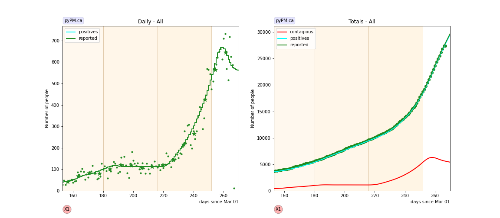
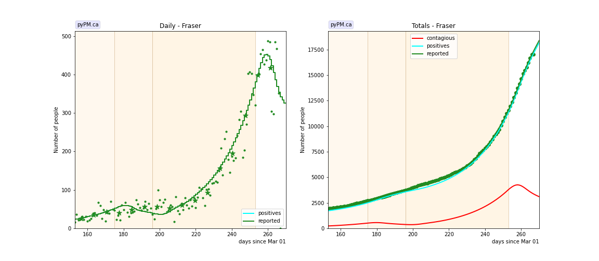
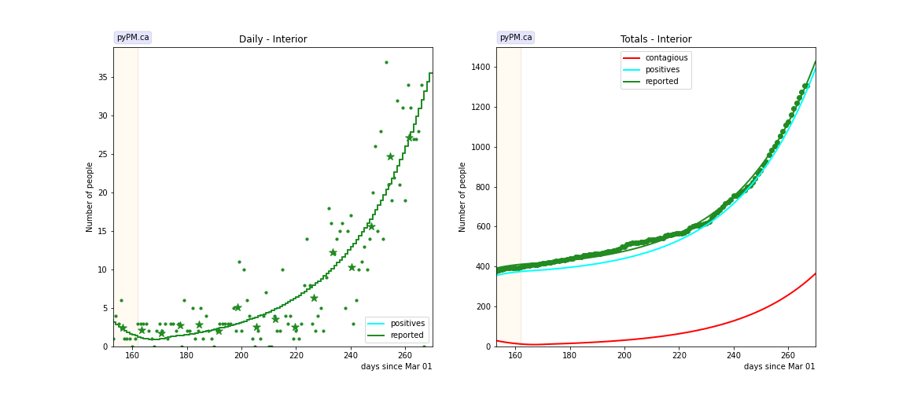
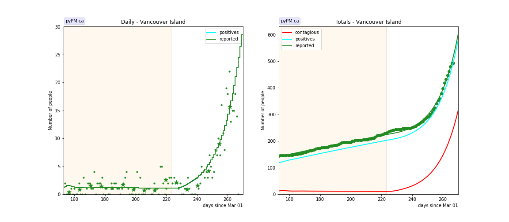
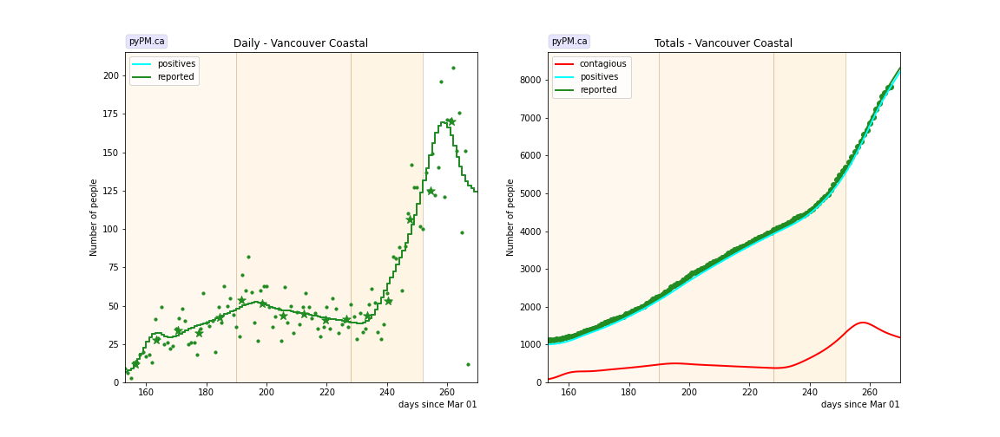
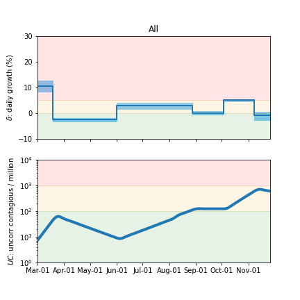
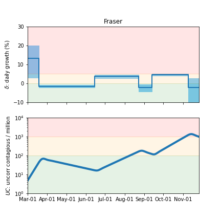
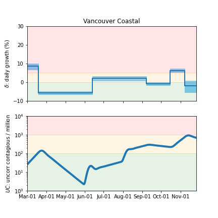
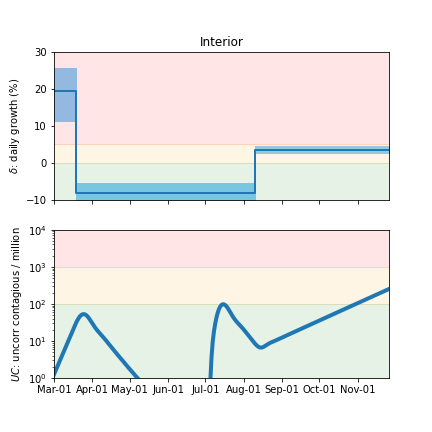
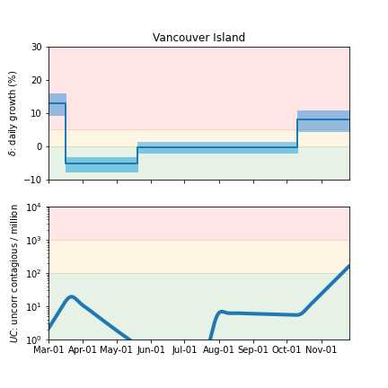

## November 25, 2020 Analysis of BC regional data

The following shows graphs of daily cases and cumulative cases. Data through November 22 are used,
with the plots starting on August 1.
In early November, new restrictions came into force for the Fraser and Vancouver Coastal health regions.
The analysis finds the date for dramatic reductions in transmission rate to be on November 7/8.

Cases from the Northern Health region are
not shown because there are very few cases reported.

The points are daily cases, and the stars show weekly average, to help guide the eye.

### [BC total](img/bc_2_3_1125.pdf)

### [Fraser](img/fraser_2_3_1125.pdf)

### [Interior](img/interior_2_3_1125.pdf)

### [Island](img/island_2_3_1125.pdf)

The small number of cases make it difficult to measure the growth rate.
There appears to be a significant increase in growth in the past month.

### [Coastal](img/coastal_2_3_1125.pdf)

## Tables

The tables below are results from the fits to reference model 2.3.

### Daily fractional growth rates (&delta;)

HA| &delta;0 | day 1 | &delta;1 | day 2 | &delta;2
---|---|---|---|---|---
bc|10.6 +/- 1.1|18|-2.5 +/- 0.3|92|3.0 +/- 0.6|180|0.1 +/- 0.3|216|5.0 +/- 0.2|252|-0.9 +/- 0.8
fraser|13.2 +/- 4.2|18|-1.5 +/- 0.3|106|3.7 +/- 0.5|175|-2.3 +/- 0.9|196|4.6 +/- 0.2|253|-2.3 +/- 3.1
interior|19.6 +/- 3.6|18|-8.3 +/- 1.7|162|3.6 +/- 0.5
island|13.0 +/- 1.7|15|-5.3 +/- 1.1|80|-0.2 +/- 0.8|223|8.0 +/- 1.6
coastal|8.6 +/- 0.8|18|-5.6 +/- 0.4|104|2.2 +/- 0.7|190|-0.6 +/- 0.4|228|6.4 +/- 0.5|252|-1.9 +/- 1.5

* &delta;0: initial daily fractional growth parameter (in percent)
* day 1: days after March 1, 2020 when transmission rate changed

## Infection status

The following plots summarize the infection history.
The upper plot shows the daily growth/decline from the fit. Bands show approximate 95% CL intervals.
The lower plot shows the size of the infection: the uncorrected circulating contagious population per
million.

### [BC total](img/bc-summary.pdf)

### [Fraser](img/fraser-summary.pdf)

### [Coastal](img/coastal-summary.pdf)

### [Interior](img/interior-summary.pdf)

### [Vancouver Island](img/island-summary.pdf)

## [return to case studies](../index.md)

