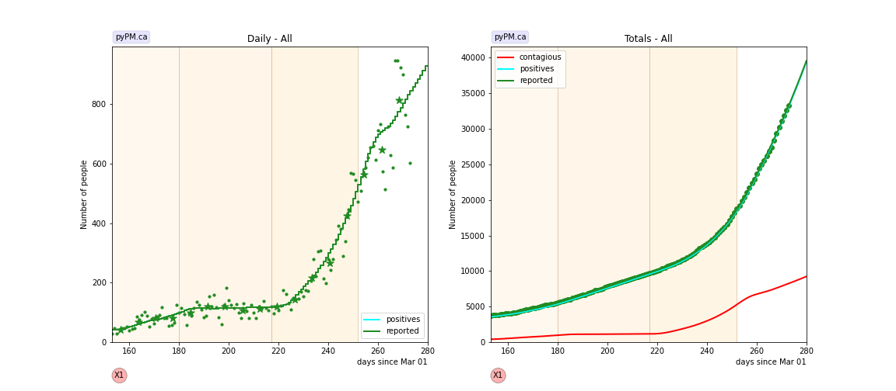
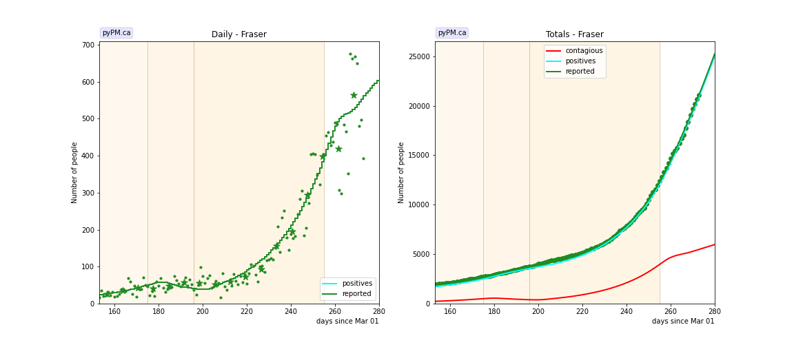
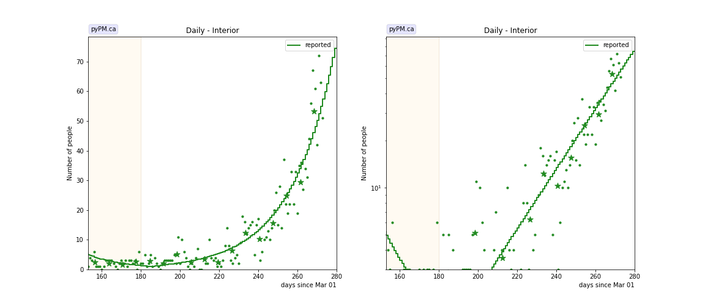
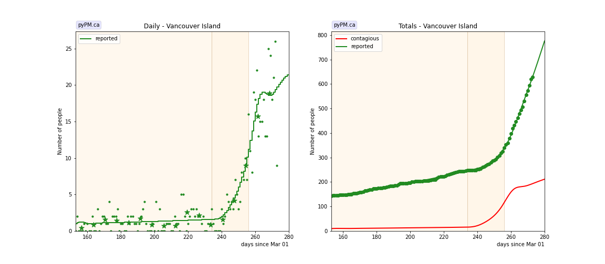
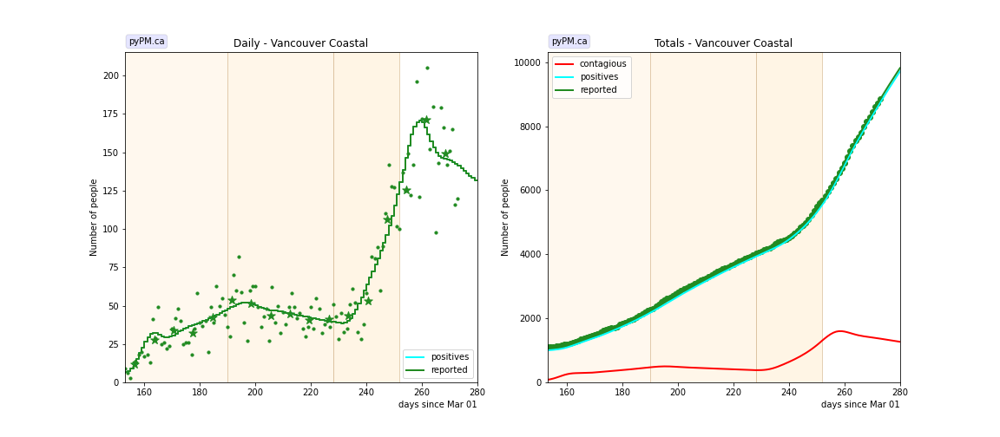
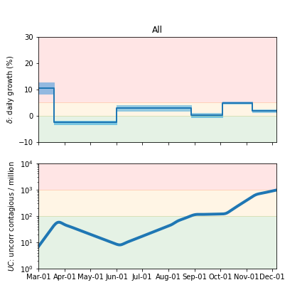
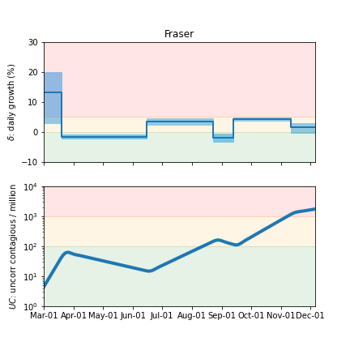
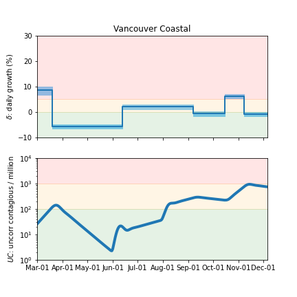
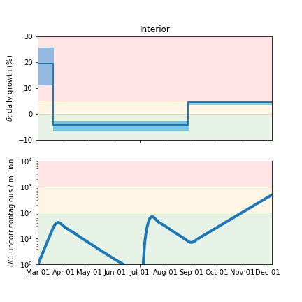
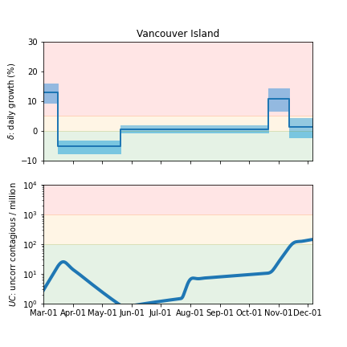

## December 1, 2020 Analysis of BC regional data

The following shows graphs of daily cases and cumulative cases. Data through November 29 are used,
with the plots starting on August 1.
In early November, new restrictions came into force for the Fraser and Vancouver Coastal health regions.
The analysis finds the date for reductions in transmission rates to be on November 7/8.

The transition in transmission rate for Vancouver Island is found to be around November 11.
Growth continues in the Interior.

The points are daily cases, and the stars show weekly average, to help guide the eye.

### [BC total](img/bc_2_3_1201.pdf)

### [Fraser](img/fraser_2_3_1201.pdf)

### [Interior](img/interior_2_3_1201.pdf)

### [Island](img/island_2_3_1201.pdf)

The small number of cases make it difficult to measure the growth rate.
There was significant growth in October-November, but has diminished significantly
due to a reduced transmission rate starting around Nov 11.

### [Coastal](img/coastal_2_3_1201.pdf)

## Tables

The tables below are results from the fits to reference model 2.3.

### Daily fractional growth rates (&delta;)

HA| &delta;0 | day 1 | &delta;1 | day 2 | &delta;2
---|---|---|---|---|---
bc|10.6 +/- 1.1|18|-2.5 +/- 0.3|92|3.0 +/- 0.6|180|0.3 +/- 0.4|217|5.0 +/- 0.2|252|1.8 +/- 0.4
fraser|13.2 +/- 4.2|18|-1.5 +/- 0.3|106|3.6 +/- 0.6|175|-1.9 +/- 0.7|196|4.4 +/- 0.3|255|1.5 +/- 0.8
interior|19.6 +/- 3.6|18|-4.4 +/- 0.9|180|4.5 +/- 0.4
island|13.0 +/- 1.7|15|-5.3 +/- 1.1|80|0.6 +/- 0.6|234|10.9 +/- 2.0|256|1.3 +/- 1.6
coastal|8.6 +/- 0.8|18|-5.6 +/- 0.4|104|2.1 +/- 0.5|190|-0.6 +/- 0.5|228|6.3 +/- 0.4|252|-0.7 +/- 0.4

* &delta;0: initial daily fractional growth parameter (in percent)
* day 1: days after March 1, 2020 when transmission rate changed
* Note: November 7 is day 252 in this scheme

## Infection status

The following plots summarize the infection history.
The upper plot shows the daily growth/decline from the fit. Bands show approximate 95% CL intervals.
The lower plot shows the size of the infection: the uncorrected circulating contagious population per
million.

### [BC total](img/bc-summary.pdf)

### [Fraser](img/fraser-summary.pdf)

### [Coastal](img/coastal-summary.pdf)

### [Interior](img/interior-summary.pdf)

### [Vancouver Island](img/island-summary.pdf)

## [return to case studies](../index.md)

