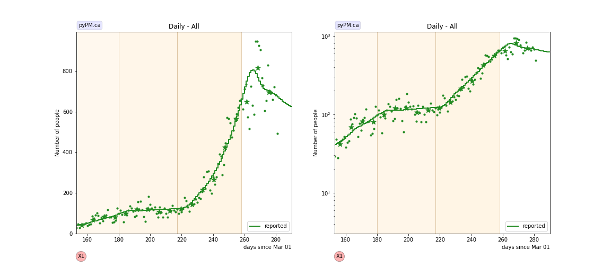
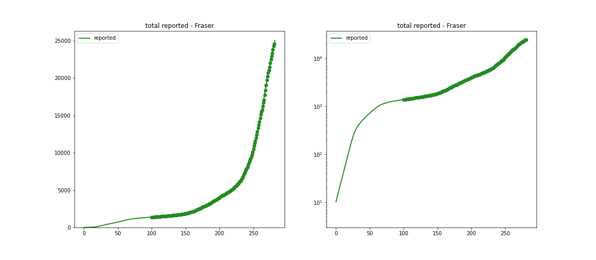
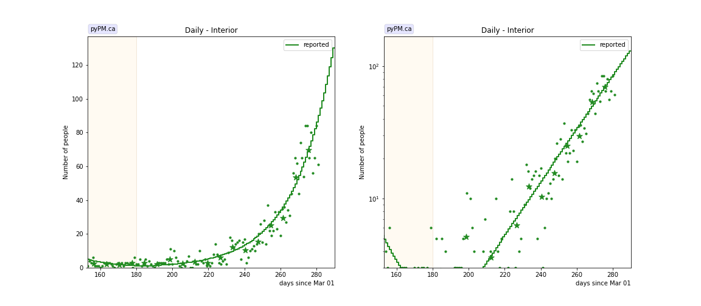
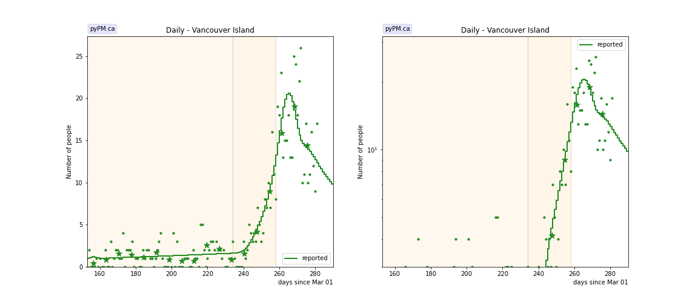
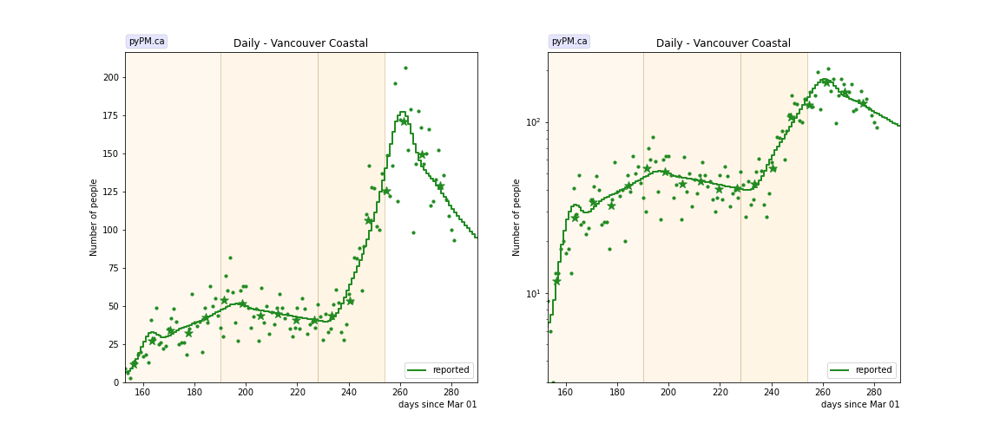
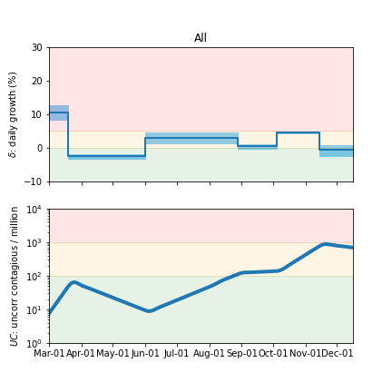
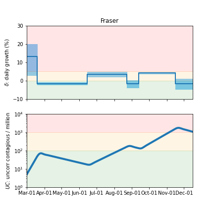
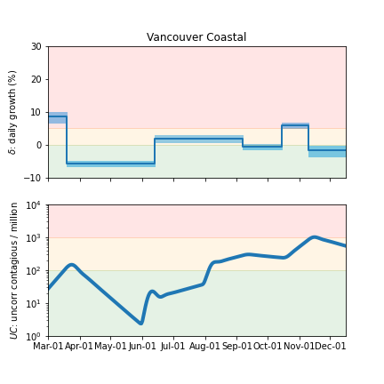
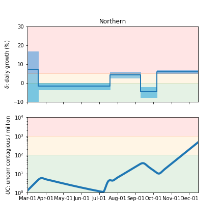
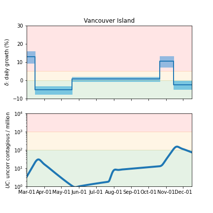

## December 9, 2020 Analysis of BC regional data

The following shows graphs of daily cases and cumulative cases. Data through December 7 are used,
with the plots starting on August 1.
In early November, new restrictions came into force for the Fraser and Vancouver Coastal health regions.

This analysis lets the fit determine the transition date from the data.
The uncertain effective transition date results in additional uncertainty in estimating the transmission rate.
To account for this, the transition date is adjusted by +/- 2 days around the best fit date.
This process increases the interval quoted for the final growth rate substantially.

Growth continues in the Interior and Northern regions.

The points are daily cases, and the stars show weekly average, to help guide the eye.

### [BC total](img/bc_2_3_1209.pdf)

### [Fraser](img/fraser_2_3_1209.pdf)

### [Interior](img/interior_2_3_1209.pdf)

### [Island](img/island_2_3_1209.pdf)

The small number of cases make it difficult to measure the growth rate.
There was significant growth in October-November, but has diminished significantly
due to a reduced transmission rate starting around Nov 11.

### [Coastal](img/coastal_2_3_1209.pdf)

### [Northern](img/northern_2_3_1209.pdf)

## Tables

The tables below are results from the fits to reference model 2.3.

### Daily fractional growth rates (&delta;)

HA| &delta | day | &delta; | day | &delta; | day | &delta;
---|---|---|---|---|---|---|---
bc| 3.0 +/-  0.8|Aug 28| 0.5 +/-  0.4|Oct 04| 4.6 +/-  0.2|Nov 14|-0.6 +/-  0.8
fraser| 3.6 +/-  0.7|Aug 23|-1.6 +/-  1.0|Sep 13| 4.3 +/-  0.2|Nov 16|-1.6 +/-  1.4
interior|-4.8 +/-  0.9|Aug 28| 4.8 +/-  0.3
island| 0.7 +/-  0.6|Oct 21| 10.6 +/-  1.5|Nov 14|-2.4 +/-  1.2
coastal| 2.1 +/-  0.5|Sep 07|-0.5 +/-  0.4|Oct 15| 5.9 +/-  0.4|Nov 10|-1.6 +/-  0.8
northern|-1.7 +/-  0.9|Jul 19| 4.4 +/-  0.8|Sep 09|-4.7 +/-  1.4|Oct 07| 6.0 +/-  0.5

* &delta;: daily fractional growth parameter (in percent)
* day: dates when transmission rate changed

## Infection status

The following plots summarize the infection history.
The upper plot shows the daily growth/decline from the fit. Bands show approximate 95% CL intervals.
The lower plot shows the size of the infection: the uncorrected circulating contagious population per
million.

### [BC total](img/bc-summary.pdf)

### [Fraser](img/fraser-summary.pdf)

### [Coastal](img/coastal-summary.pdf)

### [Interior](img/interior-summary.pdf)

### [Northern](img/northern-summary.pdf)

### [Vancouver Island](img/island-summary.pdf)

## [return to case studies](../index.md)

