## December 24, 2020 Analysis of BC regional data

The following shows graphs of daily cases and cumulative cases. Data through December 22 are used,
with the plots starting on June 1.
In early November, new restrictions came into force for the Fraser and Vancouver Coastal health regions.

This analysis lets the fit determine the transition date from the data.
The uncertain effective transition date results in additional uncertainty in estimating the transmission rate.
To account for this, the transition date is adjusted by +/- 2 days around the best fit date.
This process increases the interval quoted for the final growth rate substantially when a transition has occured recently.

All regions are now showing declining infection rates.

The points are daily cases, and the stars show weekly average, to help guide the eye.

At the bottom, forecasts (with forecast intervals) for the coming 4 weeks are shown. 

### [BC total](img/bc_2_3_1224.pdf)

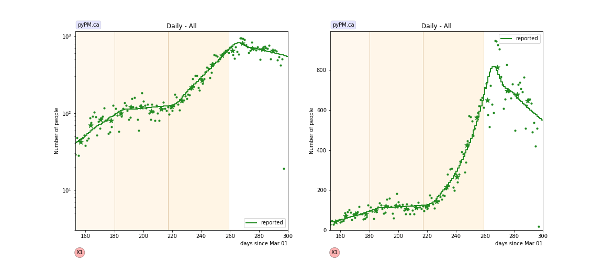

### [Fraser](img/fraser_2_3_1224.pdf)

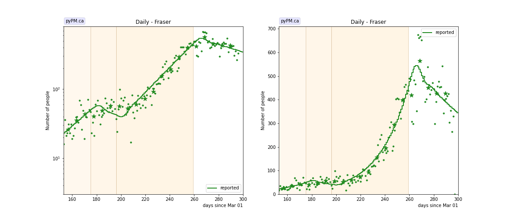

### [Interior](img/interior_2_3_1224.pdf)

### [Island](img/island_2_3_1224.pdf)

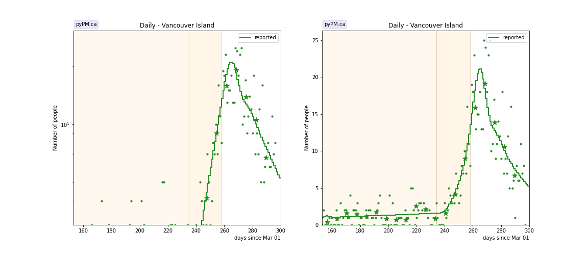

### [Coastal](img/coastal_2_3_1224.pdf)

### [Northern](img/northern_2_3_1224.pdf)

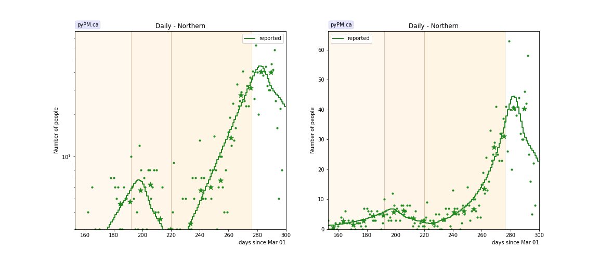

## Tables

The tables below are results from the fits to reference model 2.3.

### Daily fractional growth rates (&delta;)

HA| &delta; | day | &delta; | day | &delta; | day | &delta;
---|---|---|---|---|---|---|---
bc| 3.1 +/-  0.4|Aug 28| 0.6 +/-  0.2|Oct 04| 4.5 +/-  0.1|Nov 15|-0.8 +/-  0.7
fraser| 3.6 +/-  0.7|Aug 23|-1.7 +/-  1.0|Sep 13| 4.3 +/-  0.2|Nov 15|-0.8 +/-  0.8
interior|-4.8 +/-  0.6|Aug 28| 4.8 +/-  0.3|Dec 03|-3.7 +/-  2.7
island| 0.6 +/-  0.6|Oct 21| 10.8 +/-  1.3|Nov 14|-3.4 +/-  1.7
coastal| 2.2 +/-  0.5|Sep 07|-0.7 +/-  0.5|Oct 15| 6.4 +/-  0.4|Nov 08|-1.2 +/-  0.6
northern| 4.1 +/-  1.0|Sep 09|-4.3 +/-  1.8|Oct 07| 5.8 +/-  0.5|Dec 02|-3.2 +/-  2.1

* &delta;: daily fractional growth rate (in percent per day)
* day: dates when transmission rate changed - resulting in a change in growth rate

## Infection status

The following plots summarize the infection history.
The upper plot shows the daily growth/decline from the fit. Bands show approximate 95% CL intervals.
The lower plot shows the size of the infection: the uncorrected circulating contagious population per
million.

### [BC total](img/bc-summary.pdf)

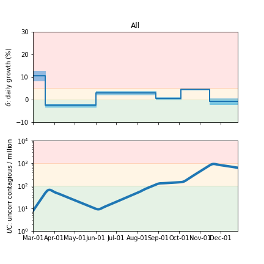

### [Fraser](img/fraser-summary.pdf)

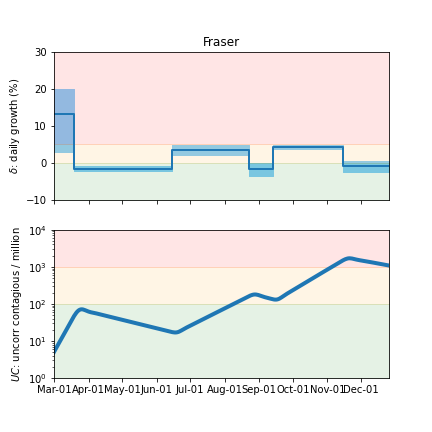

### [Coastal](img/coastal-summary.pdf)

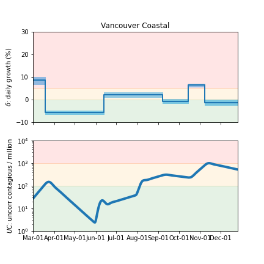

### [Interior](img/interior-summary.pdf)

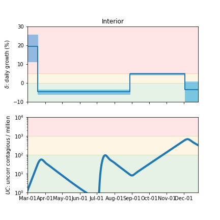

### [Northern](img/northern-summary.pdf)

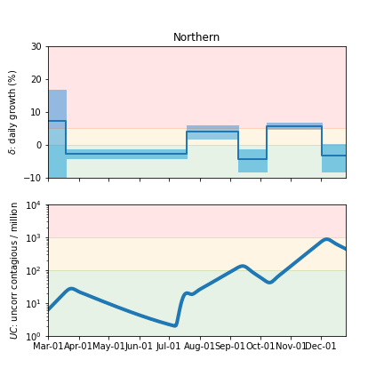

### [Vancouver Island](img/island-summary.pdf)

## Forecasts

The procedure used here to produce the BC forecast intervals has
been used in US forecasts for the past several months and coverage of those intervals have been reasonable.
The forecasts assume that no dramtic changes in policy or behaviour occur over the next several weeks.
With the holiday period this may not be a valid assumption.

In the figures below, the stars represent the weekly data,
the curves represent the model summary and forecast,
with the bands showing the 50%, 80%, and 95% intervals.

### [BC total](img/bc-forecast.pdf)

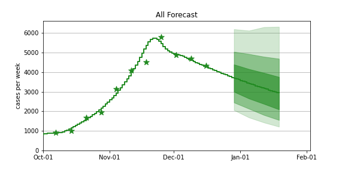

### [Fraser](img/fraser-forecast.pdf)

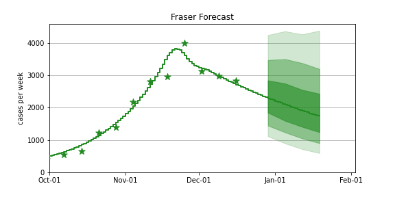

### [Coastal](img/coastal-forecast.pdf)

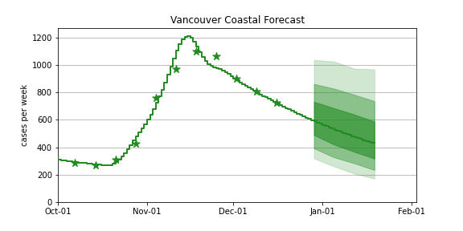

### [Interior](img/interior-forecast.pdf)

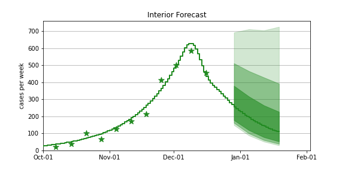

### [Northern](img/northern-forecast.pdf)

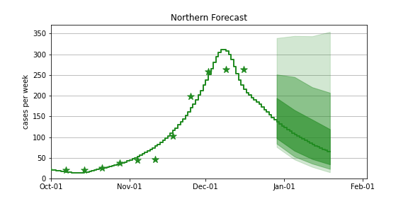

### [Vancouver Island](img/island-forecast.pdf)

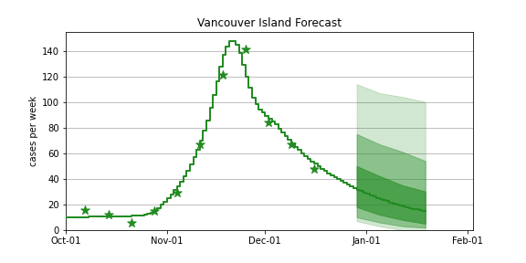

## [return to case studies](../index.md)

