## January 12, 2021 Analysis of BC regional data

The following shows graphs of daily cases and cumulative cases. Data through January 10 are used,
with the plots starting on August 1.
In early November, new restrictions came into force for the Fraser and Vancouver Coastal health regions.

This analysis estimates transition date from the data.
The uncertain effective transition date results in additional uncertainty in estimating the transmission rate.
To account for this, the transition date is adjusted by +/- 2 days around the best fit date.
This process increases the interval quoted for the final growth rate substantially when a transition has occured recently.

Since the last analysis (posted December 24) several changes have been seen:
 * There appears to have been a significant outbreak in Vancouver Coastal occuring near Christmas. More data is required to
 rule out the possibility of the recent increase arising from general community spread.
 * Vancouver Island, Interior, and Northern health authorities are now showing growth. The most significant growth is in
 Vancouver Island Health Authority, showing 5 +/- 2% growth per day since Dec 13.

The points are daily cases, and the stars show weekly average, to help guide the eye.

At the bottom, forecasts (with forecast intervals) for the coming 4 weeks are shown. As a comparison, the Dec 24 forecasts are compared
to the recent observations.

### [BC total](img/bc_2_3_0112.pdf)

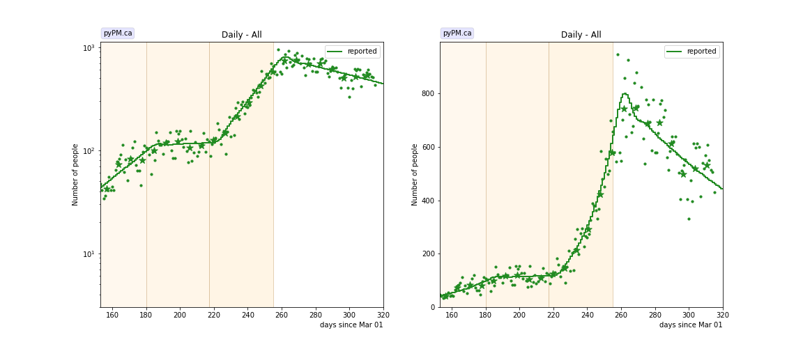

### [Fraser](img/fraser_2_3_0112.pdf)

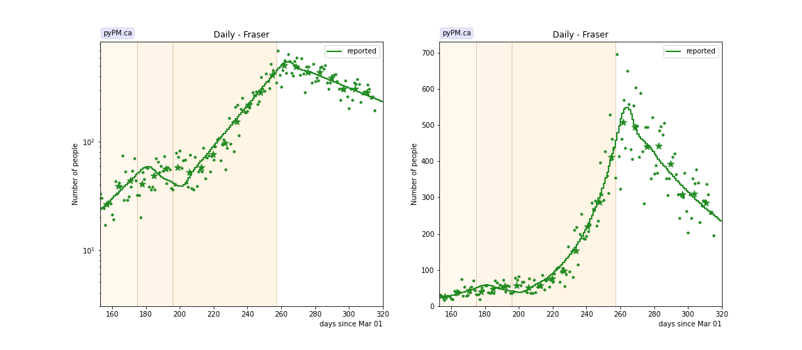

### [Interior](img/interior_2_3_0112.pdf)

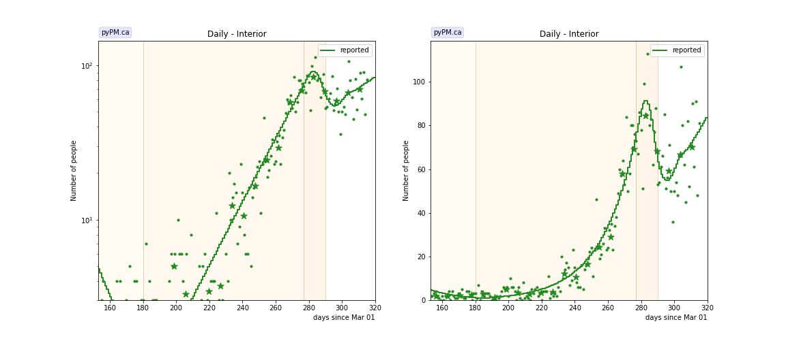

### [Island](img/island_2_3_0112.pdf)

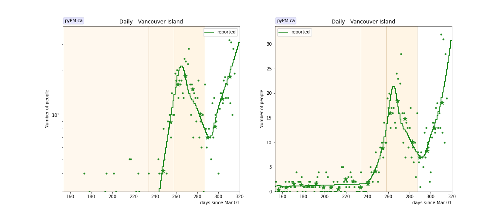

### [Coastal](img/coastal_2_3_0112.pdf)

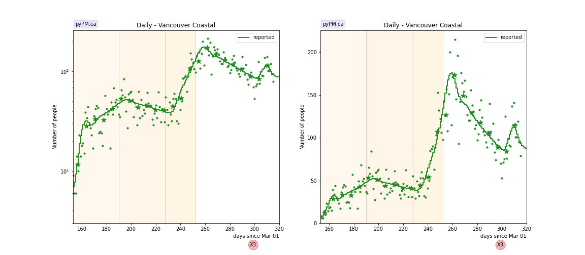

### [Northern](img/northern_2_3_0112.pdf)

## Tables

The tables below are results from the fits to reference model 2.3.

### Daily fractional growth rates (&delta;)

HA| &delta; | day | &delta; | day | &delta; | day | &delta;
---|---|---|---|---|---|---|---
bc| 3.2 +/-  0.3|Aug 28| 0.3 +/-  0.3|Oct 04| 5.1 +/-  0.1|Nov 11|-0.6 +/-  0.3
fraser| 3.6 +/-  0.8|Aug 23|-1.9 +/-  0.9|Sep 13| 4.5 +/-  0.2|Nov 13|-1.0 +/-  0.4
interior|-4.9 +/-  0.7|Aug 28| 4.9 +/-  0.3|Dec 03|-3.7 +/-  0.6|Dec 16| 1.8 +/-  1.1
island| 0.5 +/-  0.6|Oct 21| 11.0 +/-  0.8|Nov 14|-3.6 +/-  0.3|Dec 13| 5.4 +/-  2.0
coastal| 2.2 +/-  0.6|Sep 07|-0.7 +/-  0.5|Oct 15| 6.5 +/-  0.3|Nov 08|-1.3 +/-  0.4
northern| 4.2 +/-  0.5|Sep 09|-4.8 +/-  0.9|Oct 07| 6.3 +/-  0.4|Nov 23| 1.2 +/-  0.4

* &delta;: daily fractional growth rate (in percent per day)
* day: dates when transmission rate changed - resulting in a change in growth rate

## Infection status

The following plots summarize the infection history.
The upper plot shows the daily growth/decline from the fit. Bands show approximate 95% CL intervals.
The lower plot shows the size of the infection: the uncorrected circulating contagious population per
million.

### [BC total](img/bc-summary.pdf)

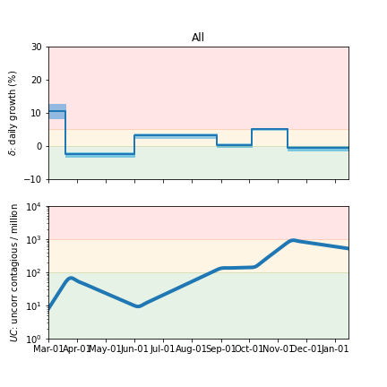

### [Fraser](img/fraser-summary.pdf)

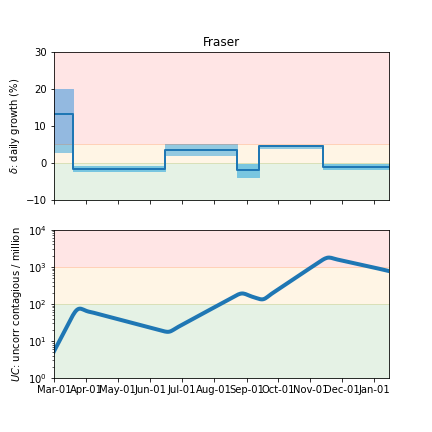

### [Coastal](img/coastal-summary.pdf)

### [Interior](img/interior-summary.pdf)

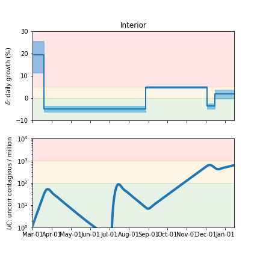

### [Northern](img/northern-summary.pdf)

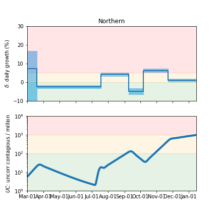

### [Vancouver Island](img/island-summary.pdf)

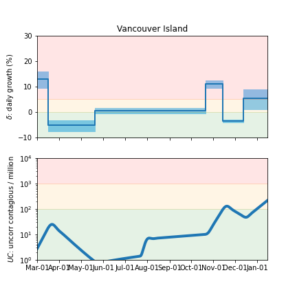

## Forecasts (current and from Dec 24)

The procedure used here to produce the BC forecast intervals has
been used in US forecasts for the past several months and coverage of those intervals have been reasonable.
The forecasts assume that no dramtic changes in policy or behaviour occur over the next several weeks.

In the figures below, the stars represent the weekly data,
the curves represent the model summary and forecast,
with the bands showing the 50%, 80%, and 95% intervals.

Also shown are the forecasts made on Dec 24, 2020.
For those plots, the recent data (not available at the time of the forecast) are overlayed as black stars.
The recent changes in growth rate in Vancouver Island and Northen and Interior regions are apparent.

### [BC total](img/bc-forecast.pdf)

current

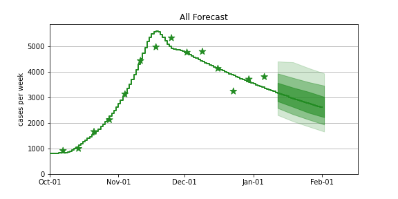

Dec 24 forecast

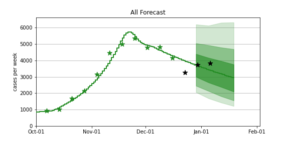

### [Fraser](img/fraser-forecast.pdf)

current

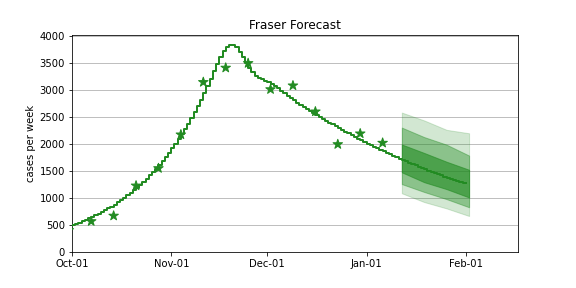

Dec 24 forecast

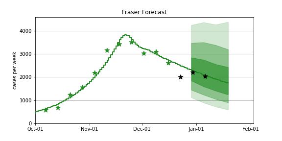

### [Coastal](img/coastal-forecast.pdf)

current

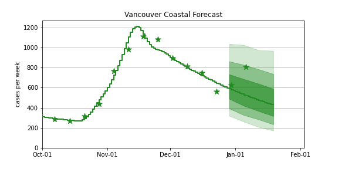

Dec 24 forecast

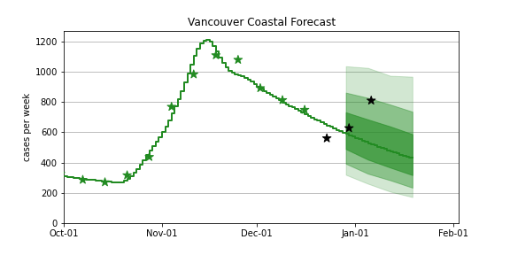

### [Interior](img/interior-forecast.pdf)

current

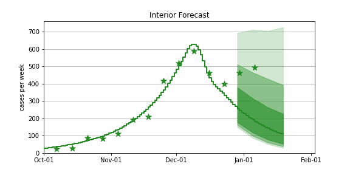

Dec 24 forecast

### [Northern](img/northern-forecast.pdf)

current

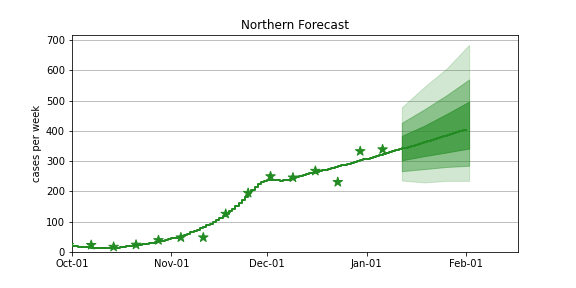

Dec 24 forecast

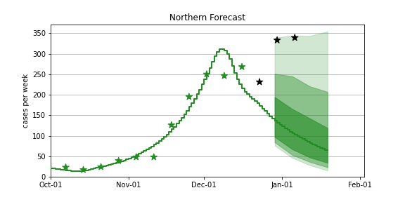

### [Vancouver Island](img/island-forecast.pdf)

current

Dec 24 forecast

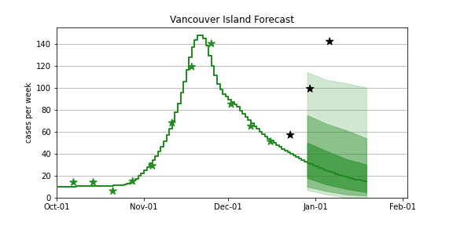

## [return to case studies](../index.md)

