## February 8, 2021 Analysis of BC regional data

The following shows graphs of daily cases and cumulative cases. Data through February 1 are used, with the plots starting on October 1.

Changes in social behaviours and other factors cause transmission rates to change from time to time.
The analysis estimates transition dates from the data.

Since December, Vancouver Island, Coastal, Interior, and Northern health authorities have seen daily cases grow.
Vancouver Island Health Authority has been growing the fastest with about 2-3 % growth per day since early December, 

The points are daily cases, and the stars show weekly averages, to help guide the eye.

At the bottom, forecasts (with forecast intervals) for the coming 4 weeks are shown. As a comparison, the Jan 26 forecasts are compared
to the recent observations.

### [BC total](img/bc_2_3_0208.pdf)

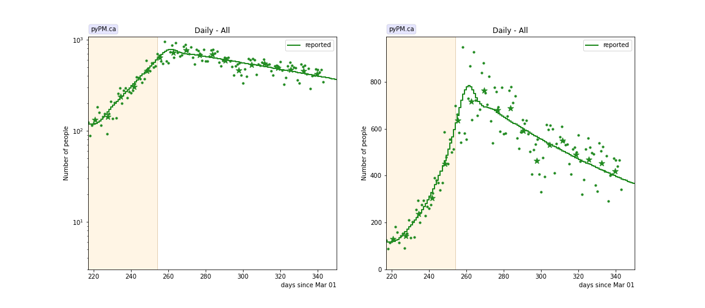

### [Fraser](img/fraser_2_3_0208.pdf)

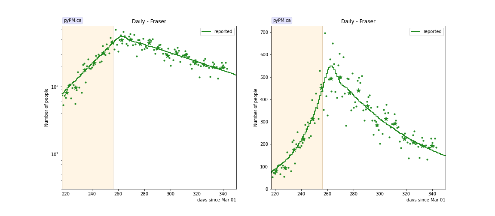

### [Interior](img/interior_2_3_0208.pdf)

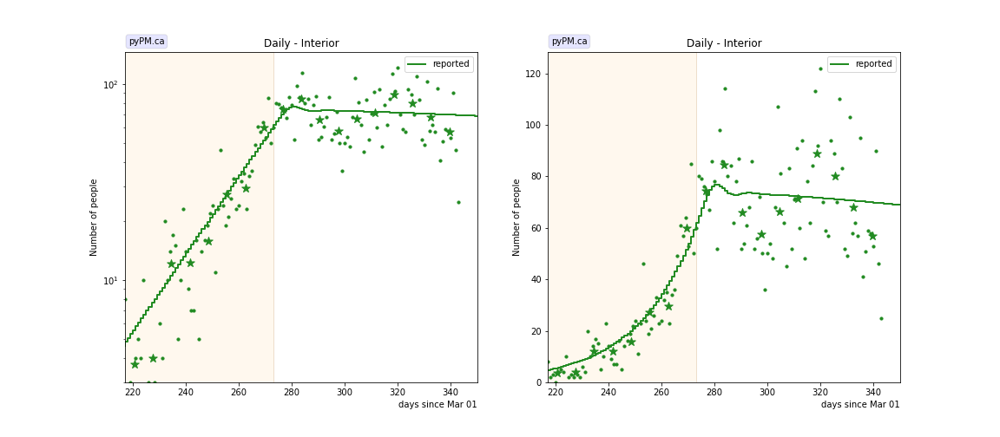

### [Island](img/island_2_3_0208.pdf)

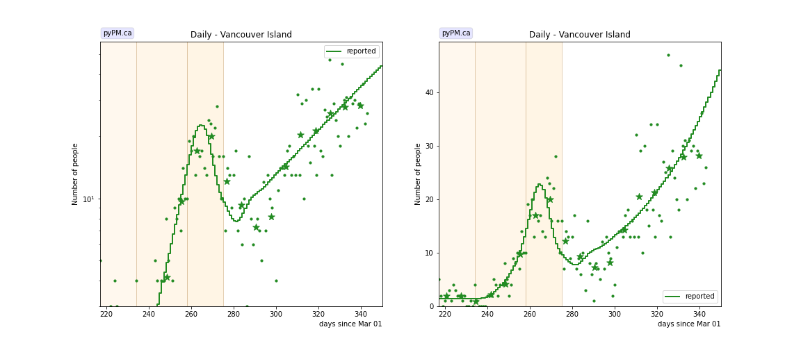

### [Coastal](img/coastal_2_3_0208.pdf)

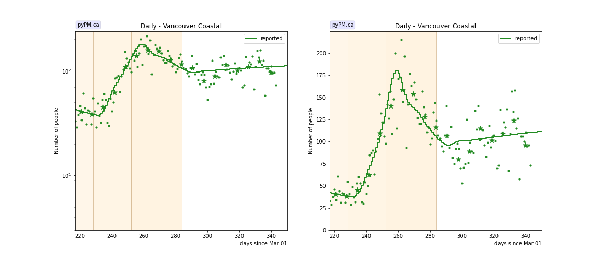

### [Northern](img/northern_2_3_0208.pdf)

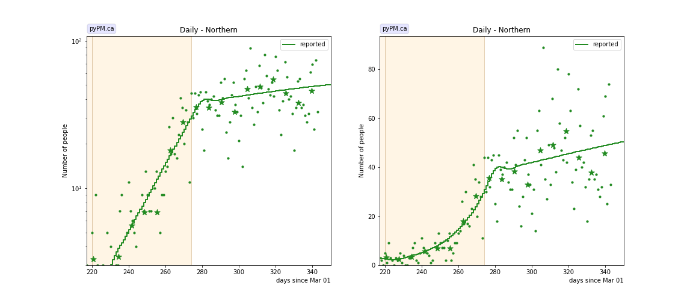

## Tables

The tables below are results from the fits to reference model 2.3.

### Daily fractional growth rates (&delta;)

HA| &delta; | day | &delta; | day | &delta; | day | &delta;
---|---|---|---|---|---|---|---
bc| 0.3 +/-  0.4|Oct 04| 5.2 +/-  0.1|Nov 10|-0.5 +/-  0.2
fraser| 4.7 +/-  0.2|Nov 12|-1.0 +/-  0.2
interior| 4.7 +/-  0.1|Nov 29| 0.1 +/-  0.3
island| 0.4 +/-  0.6|Oct 21| 11.6 +/-  1.2|Nov 14|-6.2 +/-  0.7|Dec 01| 2.6 +/-  0.4
coastal|-0.7 +/-  0.4|Oct 15| 6.7 +/-  0.3|Nov 08|-1.6 +/-  0.3|Dec 10| 0.6 +/-  0.2
northern|-3.6 +/-  1.7|Oct 07| 5.4 +/-  0.4|Nov 30| 0.7 +/-  0.2

* &delta;: daily fractional growth rate (in percent per day)
* day: dates when transmission rate changed - resulting in a change in growth rate

## Infection status

The following plots summarize the infection history.
The upper plot shows the daily growth/decline from the fit. Bands show approximate 95% CL intervals.
The lower plot shows the size of the infection: the uncorrected circulating contagious population per
million.

### [BC total](img/bc-summary.pdf)

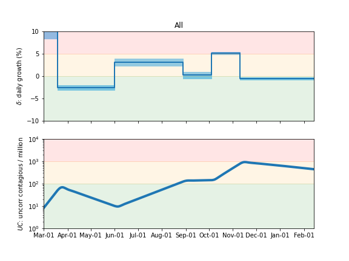

### [Fraser](img/fraser-summary.pdf)

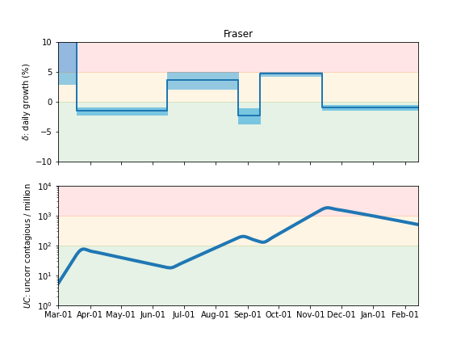

### [Coastal](img/coastal-summary.pdf)

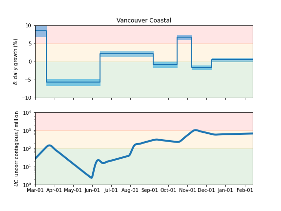

### [Interior](img/interior-summary.pdf)

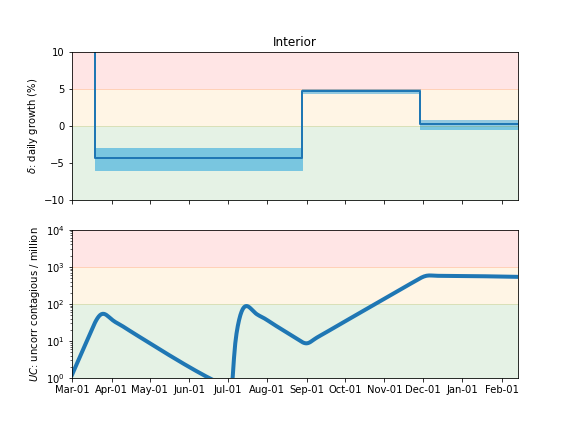

### [Northern](img/northern-summary.pdf)

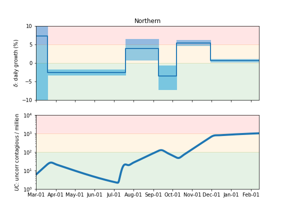

### [Vancouver Island](img/island-summary.pdf)

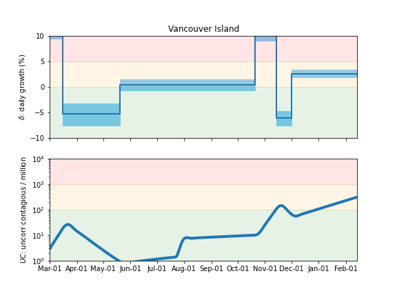

## Forecasts (current and from Jan 26)

The procedure used here to produce the BC forecast intervals has
been used in US forecasts for the past several months and coverage of those intervals have been reasonable.
The forecasts assume that no dramtic changes in policy or behaviour occur over the next several weeks.

In the figures below, the stars represent the weekly data,
the curves represent the model summary and forecast,
with the bands showing the 50%, 80%, and 95% intervals.

Also shown are the forecasts made on Jan 26, 2020.
For those plots, the recent data (not available at the time of the forecast) are overlayed as black stars.

### [BC total](img/bc-forecast.pdf)

current

Jan 26 forecast

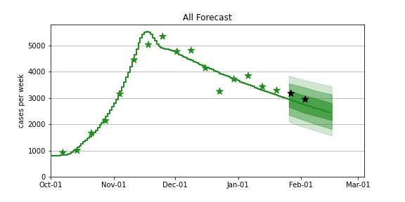

### [Fraser](img/fraser-forecast.pdf)

current

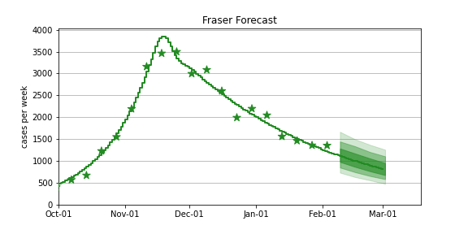

Jan 26 forecast

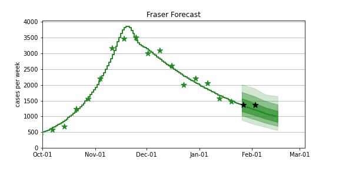

### [Coastal](img/coastal-forecast.pdf)

current

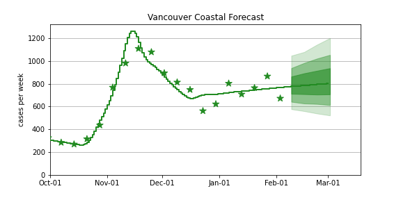

Jan 26 forecast

### [Interior](img/interior-forecast.pdf)

current

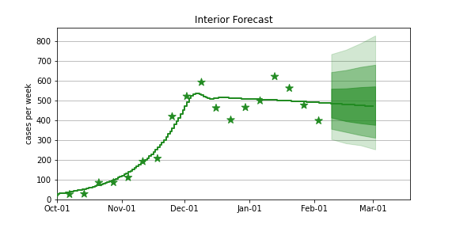

Jan 26 forecast

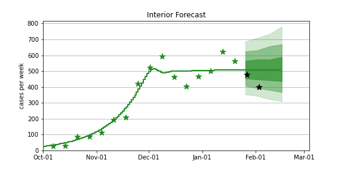

### [Northern](img/northern-forecast.pdf)

current

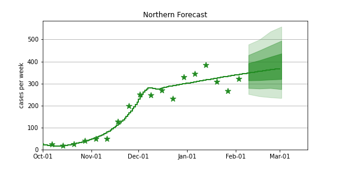

Jan 26 forecast

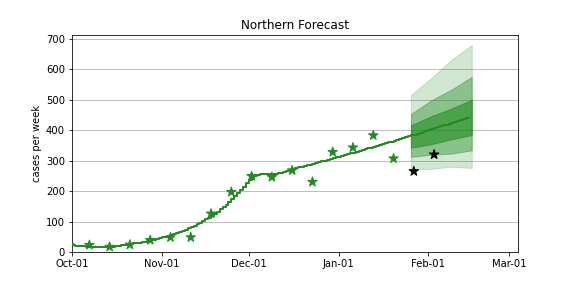

### [Vancouver Island](img/island-forecast.pdf)

current

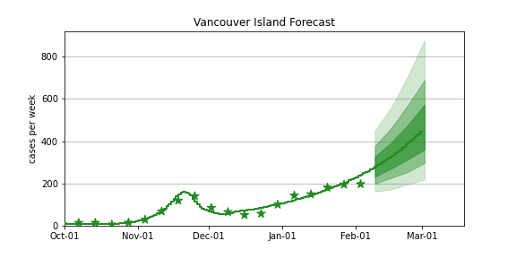

Jan 26 forecast

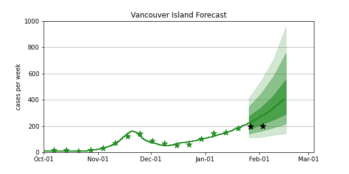

## [return to case studies](../index.md)

