## February 23, 2021 Analysis of BC regional data

The following shows graphs of daily cases and cumulative cases. Data through February 21 are used, with the plots starting on November 1.

The Fraser Health region had see declining daily cases, since mid-November, unlike the other regions
which had steady or growing case numbers.
Starting at the end of January, cases started growing again in the Fraser HA, at about 2 +/- 1 % per day.

The growth in Vancouver Island has stopped, and there is now significant decline in the Interior.
The Coastal and Northern regions remain steady.

The points are daily cases, and the stars show weekly averages, to help guide the eye.

At the bottom, forecasts (with forecast intervals) for the coming 4 weeks are shown. As a comparison, the Feb 8 forecasts are compared
to the recent observations.

In many places, including BC, case data showed large variance around the Christmas period. New for this analysis - the 2 weeks around Christmas-New Years are
not used in the fit - and an overall offset is fit for instead. For some Health Authorities, the offset is very large.

### [BC total](img/bc_2_8_0223.pdf)

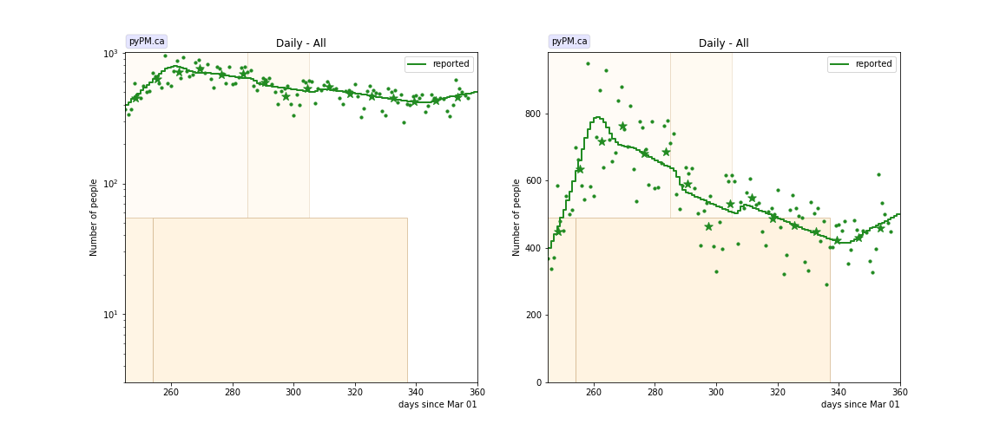

### [Fraser](img/fraser_2_8_0223.pdf)

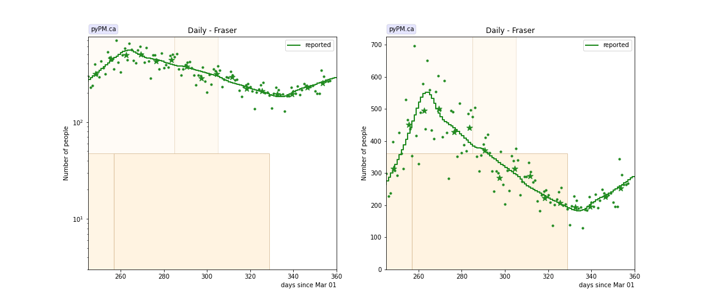

### [Interior](img/interior_2_8_0223.pdf)

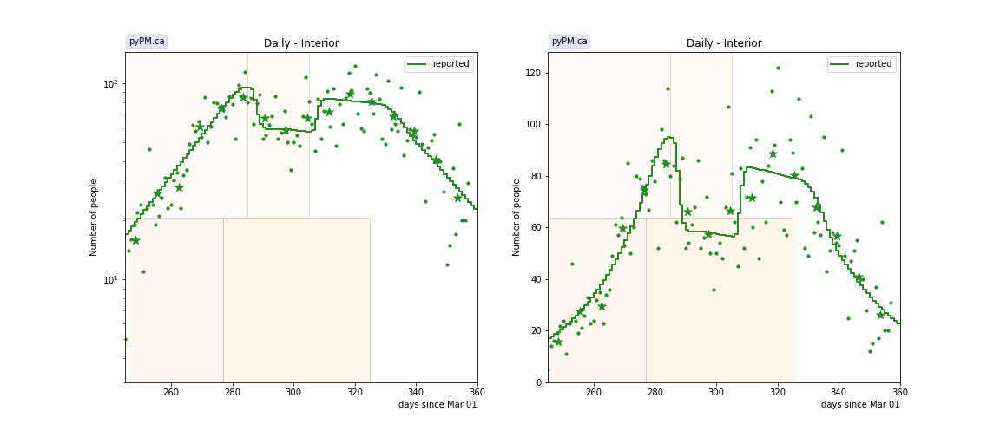

### [Island](img/island_2_8_0223.pdf)

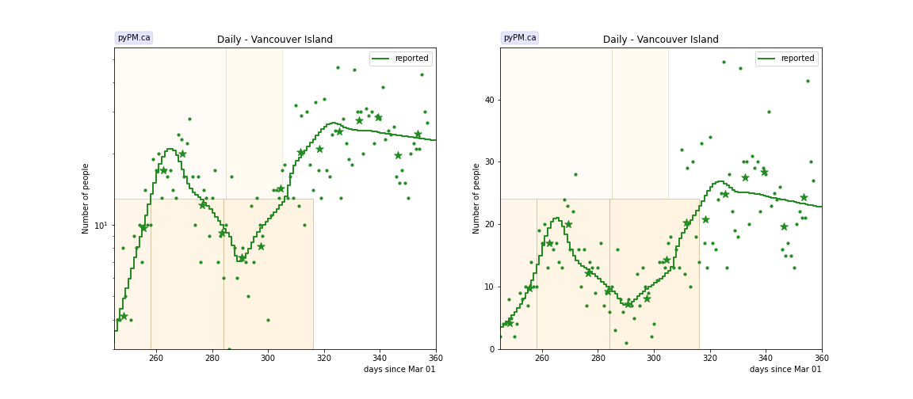

### [Coastal](img/coastal_2_8_0223.pdf)

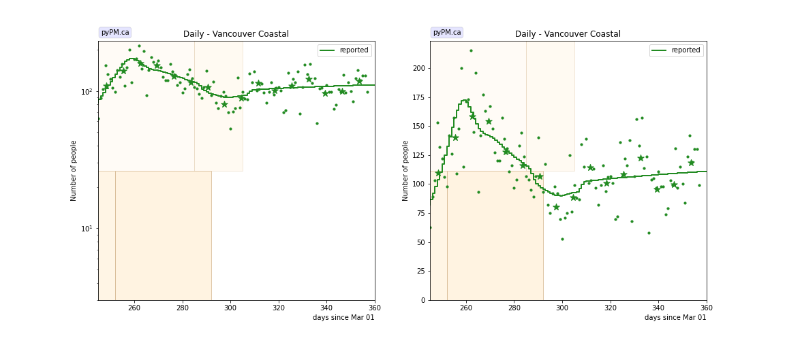

### [Northern](img/northern_2_8_0223.pdf)

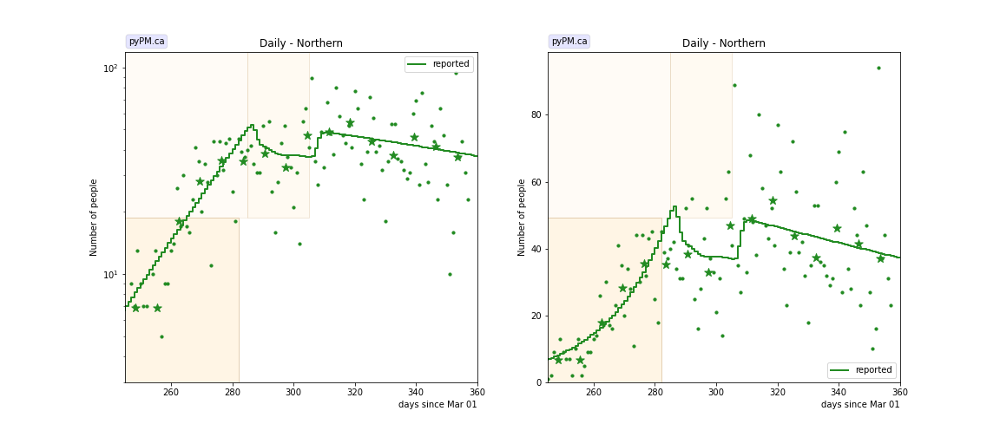

## Tables

The tables below are results from the fits to reference model 2.8.

### Daily fractional growth rates (&delta;)

HA| &delta; | day | &delta; | day | &delta; | day | &delta;
---|---|---|---|---|---|---|---
bc| 5.3 +/-  0.2|Nov 10|-0.4 +/-  0.1|Feb 01| 1.4 +/-  1.0
fraser| 4.5 +/-  0.2|Nov 13|-1.1 +/-  0.1|Jan 24| 2.3 +/-  1.0
interior| 4.9 +/-  0.3|Dec 03|-0.1 +/-  0.2|Jan 20|-3.6 +/-  0.9
island| 10.8 +/-  1.8|Nov 14|-3.2 +/-  0.5|Dec 10| 3.6 +/-  0.5|Jan 11|-0.2 +/-  0.4
coastal| 6.3 +/-  0.4|Nov 08|-1.0 +/-  0.3|Dec 18| 0.5 +/-  0.3
northern| 5.2 +/-  0.5|Dec 08|-0.2 +/-  0.5

* &delta;: daily fractional growth rate (in percent per day)
* day: dates when transmission rate changed - resulting in a change in growth rate

## Forecasts (current and from Feb 8)

The procedure used here to produce the BC forecast intervals has
been used in US forecasts for the past several months and coverage of those intervals have been reasonable.
The forecasts assume that no dramtic changes in policy or behaviour occur over the next several weeks.

In the figures below, the stars represent the weekly data,
the curves represent the model summary and forecast,
with the bands showing the 50%, 80%, and 95% intervals.

Also shown are the forecasts made on Feb 8, 2022.
For those plots, the recent data (not available at the time of the forecast) are overlayed as black stars.
The forecasts of Feb 8 did not accurately pick up the recent trends.

### [BC total](img/bc-forecast.pdf)

current

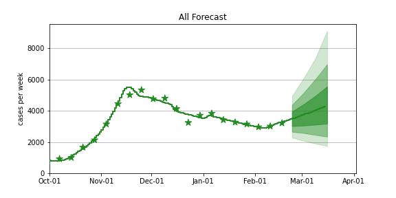

Feb 8 forecast

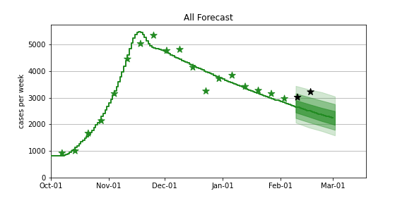

### [Fraser](img/fraser-forecast.pdf)

current

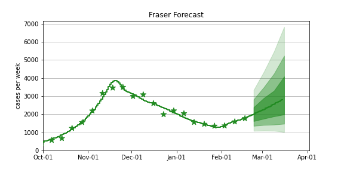

Feb 8 forecast

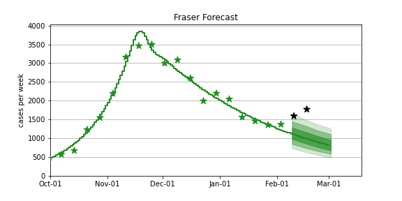

### [Coastal](img/coastal-forecast.pdf)

current

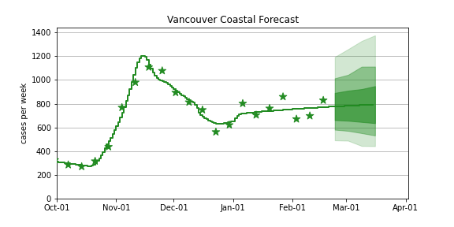

Feb 8 forecast

### [Interior](img/interior-forecast.pdf)

current

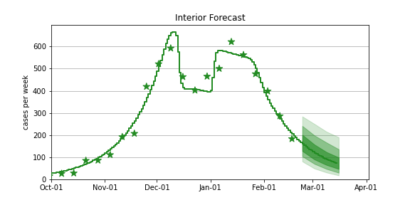

Feb 8 forecast

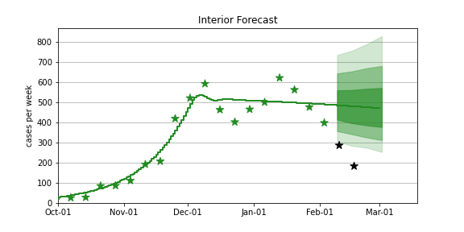

### [Northern](img/northern-forecast.pdf)

current

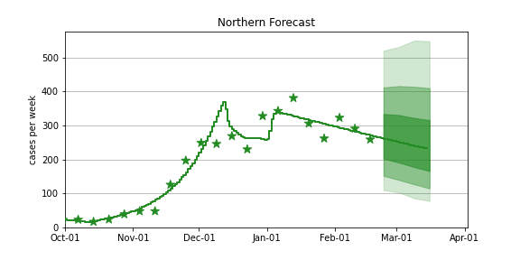

Feb 8 forecast

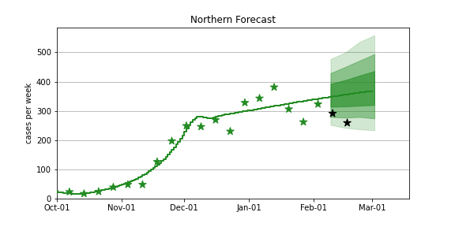

### [Vancouver Island](img/island-forecast.pdf)

current

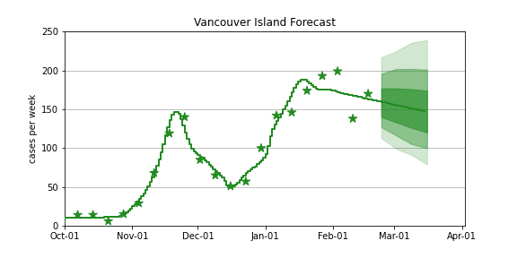

Feb 8 forecast

## [return to case studies](../index.md)

