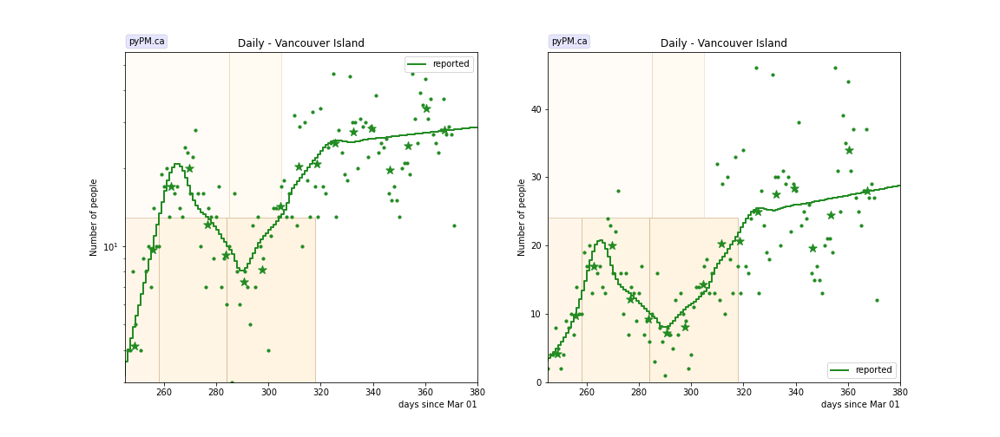
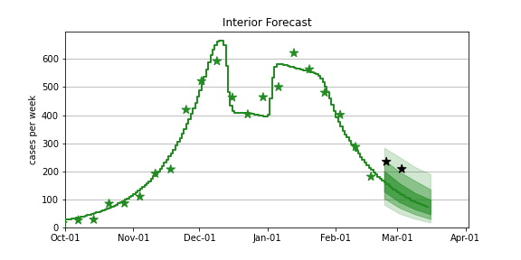
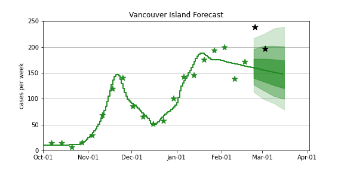

## March 9, 2021 Analysis of BC regional data

The following shows graphs of daily cases and cumulative cases. Data through March 7 are used,
with the plots starting on November 1.

The Fraser Health region had see declining daily cases, since mid-November, unlike the other regions
which had steady or growing case numbers.
Starting in mid-January, cases started growing again in the Fraser HA, at about 2 % per day.

The points are daily cases, and the stars show weekly averages, to help guide the eye.

At the bottom, forecasts (with forecast intervals) for the coming 4 weeks are shown. As a comparison,
the Feb 23 forecasts are compared
to the recent observations.

In many places, including BC, case data showed large variance around the Christmas period. New for this analysis - the 2 weeks around Christmas-New Years are
not used in the fit - and an overall offset is fit for instead. For some Health Authorities, the offset is very large.

### [BC total](img/bc_2_8_0309.pdf)

### [Fraser](img/fraser_2_8_0309.pdf)

### [Interior](img/interior_2_8_0309.pdf)

### [Island](img/island_2_8_0309.pdf)

### [Coastal](img/coastal_2_8_0309.pdf)

### [Northern](img/northern_2_8_0309.pdf)

## Tables

The tables below are results from the fits to reference model 2.8.

### Daily fractional growth rates (&delta;)

HA| &delta; | day | &delta; | day | &delta; | day | &delta;
---|---|---|---|---|---|---|---
bc| 5.3 +/-  0.2|Nov 10|-0.5 +/-  0.1|Jan 27| 1.1 +/-  0.3
fraser| 4.6 +/-  0.1|Nov 13|-1.2 +/-  0.1|Jan 18| 1.7 +/-  0.3
interior| 4.9 +/-  0.2|Dec 03| 0.2 +/-  0.2|Jan 10|-2.4 +/-  0.4
island| 10.7 +/-  1.5|Nov 14|-3.0 +/-  0.7|Dec 10| 3.1 +/-  0.5|Jan 13| 0.4 +/-  0.3
coastal| 6.2 +/-  0.5|Nov 08|-0.9 +/-  0.2|Dec 27| 0.8 +/-  0.2
northern| 5.3 +/-  0.3|Dec 06|-0.0 +/-  0.2

* &delta;: daily fractional growth rate (in percent per day)
* day: dates when transmission rate changed - resulting in a change in growth rate

## Forecasts (current and from Feb 23)

The procedure used here to produce the BC forecast intervals has
been used in US forecasts for the past several months and coverage of those intervals have been reasonable.
The forecasts assume that no dramtic changes in policy or behaviour occur over the next several weeks.

In the figures below, the stars represent the weekly data,
the curves represent the model summary and forecast,
with the bands showing the 50%, 80%, and 95% intervals.

Also shown are the forecasts made on Feb 23, 2022.
For those plots, the recent data (not available at the time of the forecast) are overlayed as black stars.

### [BC total](img/bc-forecast.pdf)

current

Feb 23 forecast

### [Fraser](img/fraser-forecast.pdf)

current

Feb 23 forecast

### [Coastal](img/coastal-forecast.pdf)

current

Feb 23 forecast

### [Interior](img/interior-forecast.pdf)

current

Feb 23 forecast

### [Northern](img/northern-forecast.pdf)

current

Feb 23 forecast

### [Vancouver Island](img/island-forecast.pdf)

current

Feb 23 forecast

## [return to case studies](../index.md)

