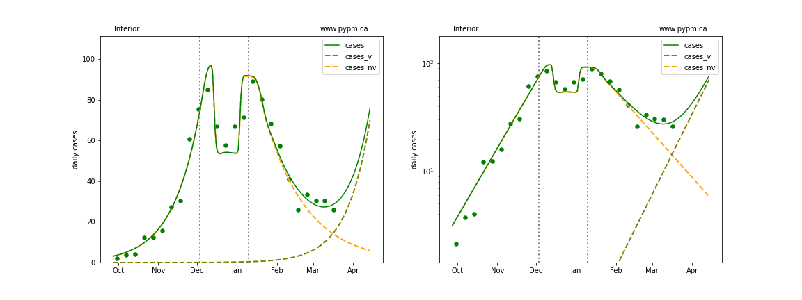

## March 24, 2021 Analysis of BC regional data

The following shows graphs of daily cases on linear and log scale. Data through March 23 are used,
with the plots starting on October 1.

The variant B.1.1.7 will become the dominant source of cases in the coming weeks.
Unfortunately the BC Government does not make publicly available their data necessary to estimate the
current fraction of cases from B.1.1.7 and the growth rate advantage that it has over the other strains.
Time series data on number of samples screened and number of samples identified as B.1.1.7, such as from
[US states](../usa20210321) yield precise estimates with which good forecasts can be made.

In absense of genomic data, the curves below illustrate model fits assuming
growth advantage of 8.5% per day.
The current fraction of cases due to B.1.1.7 is left as a fit parameter,
and values between 10% to 60% are found for the diferent regions.
As such, **these are not forecasts**, since the BC government does not provide data to allow us to estimate the
critical parameters for B.1.1.7 in the province, nor do they report these critical parameters.

The dashed curves illustrate how cases from the variant (B.1.1.7) overtake the cases from the original strains.

For Vancouver Island, no variant has been included, since there is no indication of
recent change to growth in cases.

### [BC total](img/bc_2_8_0324.pdf)

### [Fraser](img/fraser_2_8_0324.pdf)

### [Interior](img/interior_2_8_0324.pdf)

### [Island](img/island_2_8_0324.pdf)

### [Coastal](img/coastal_2_8_0324.pdf)

### [Northern](img/northern_2_8_0324.pdf)

## Tables

The tables below are results from the fits to reference model 2.8.

### Daily fractional growth rates (&delta;)

HA| &delta; | day | &delta; | day | &delta; | day | &delta;
---|---|---|---|---|---|---|---
bc| 5.3 +/-  0.2|Nov 10|-0.5 +/-  0.1|Jan 27| 1.1 +/-  0.3
fraser| 4.6 +/-  0.1|Nov 13|-1.2 +/-  0.1|Jan 18| 1.7 +/-  0.3
interior| 4.9 +/-  0.2|Dec 03| 0.2 +/-  0.2|Jan 10|-2.4 +/-  0.4
island| 10.7 +/-  1.5|Nov 14|-3.0 +/-  0.7|Dec 10| 3.1 +/-  0.5|Jan 13| 0.4 +/-  0.3
coastal| 6.2 +/-  0.5|Nov 08|-0.9 +/-  0.2|Dec 27| 0.8 +/-  0.2
northern| 5.3 +/-  0.3|Dec 06|-0.0 +/-  0.2

* &delta;: daily fractional growth rate (in percent per day)
* day: dates when transmission rate changed - resulting in a change in growth rate

## Forecasts (current and from Feb 23)

The procedure previously used to produce the BC forecast intervals has
been used in US forecasts for the past several months and coverage of those intervals have been reasonable.
The forecasts assume that no dramtic changes in policy or behaviour occur over the next several weeks.

It is no longer possible to produce useful forecasts for BC, because the province does not release
data necessary to estimate the critical parameters for the B.1.1.7 variant, and that variant will
be determining the course of cases in the coming weeks.

The figures below show forecats made on Feb 23, 2021.
The stars represent the weekly data,
the curves represent the model summary and forecast,
with the bands showing the 50%, 80%, and 95% intervals.
The recent data (not available at the time of the forecast) are overlayed as black stars.

### [BC total](img/bc-forecast.pdf)

Feb 23 forecast

### [Fraser](img/fraser-forecast.pdf)

Feb 23 forecast

### [Coastal](img/coastal-forecast.pdf)

Feb 23 forecast

### [Interior](img/interior-forecast.pdf)

Feb 23 forecast

### [Northern](img/northern-forecast.pdf)

Feb 23 forecast

### [Vancouver Island](img/island-forecast.pdf)

Feb 23 forecast

## [return to case studies](../index.md)

