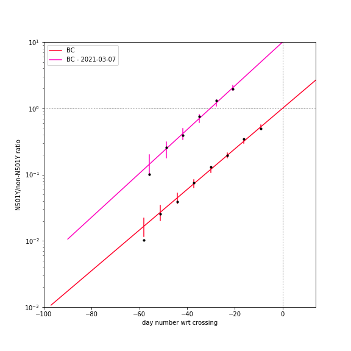
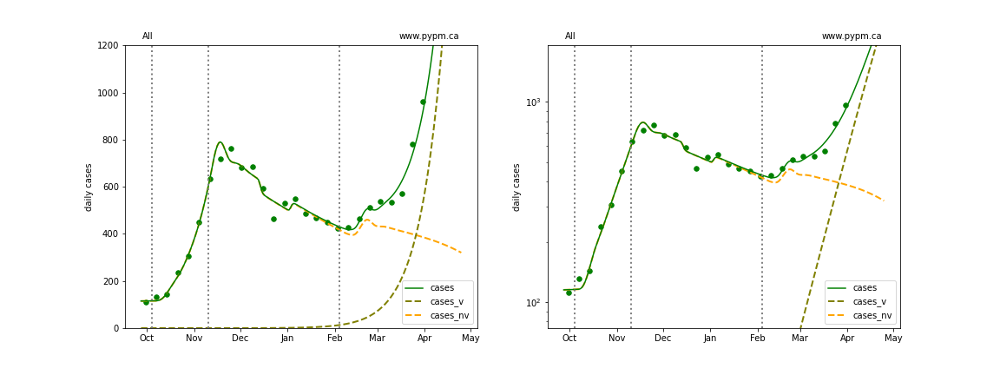
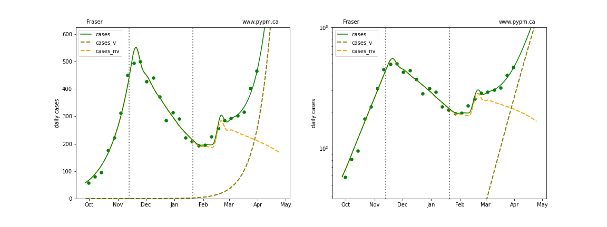
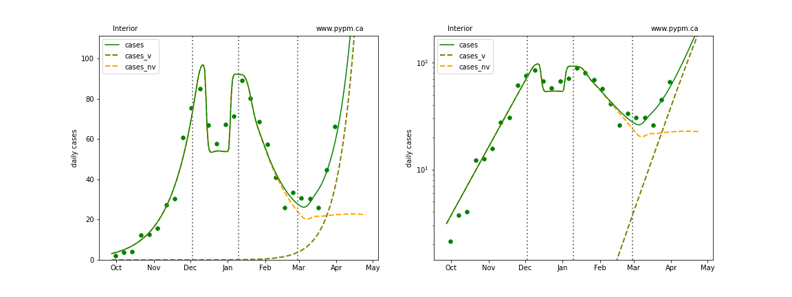
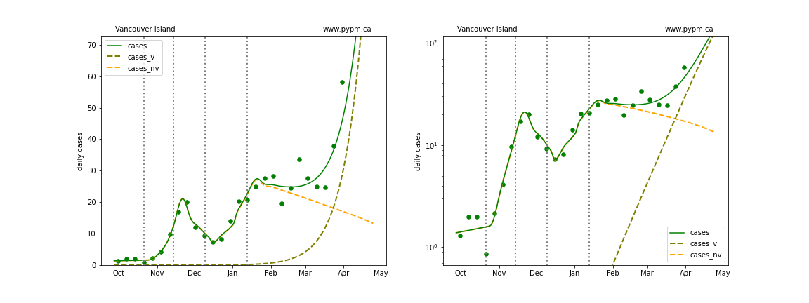
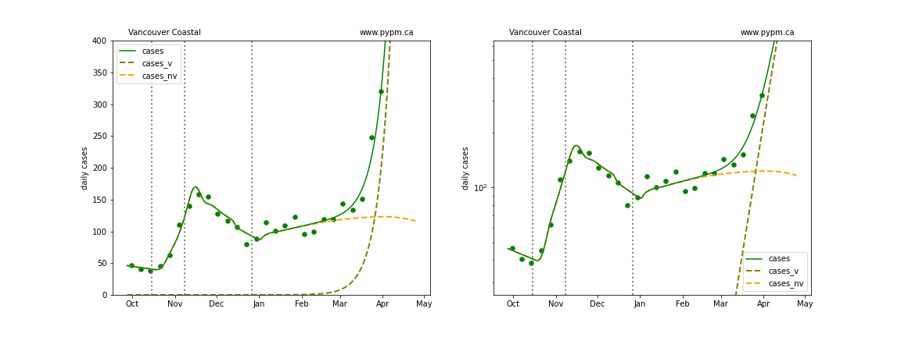
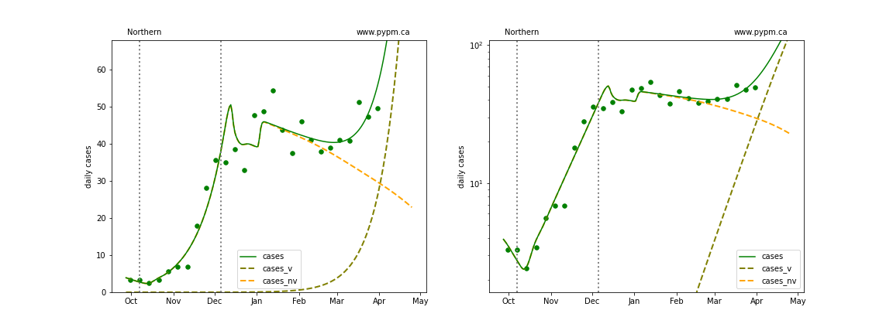

## April 6, 2021 Analysis of BC regional data

The following shows graphs of daily cases on linear and log scale. Data through April 5 are used,
with the plots starting on October 1.

The variant B.1.1.7 has become the dominant source of cases.
The overall growth advantage is measured by fitting genomic data, as shown in the figure below.
The fit with and without the last 2 weeks of data are compared.

fit | s | w |f_v (Apr 6)
---|---|---|---
BC|0.071 $\pm$ 0.002|0.000 $\pm$ 0.001|0.667 $\pm$ 0.011
BC - 2021-03-07|0.076 $\pm$ 0.003|0.000 $\pm$ 0.001|0.717 $\pm$ 0.026

The fits below assume a growth advantage of 7.1% per day, except for Vancouver Coastal, where 11% is assumed.

The dashed curves illustrate how cases from the variant (B.1.1.7) overtake the cases from the original strains.

An outbreak in cases for Fraser and overall BC in February is included to model the "Trivia Night" event
that caused a large number of infections in Vancouver.

### [BC total](img/bc_2_8_0406.pdf)

### [Fraser](img/fraser_2_8_0406.pdf)

### [Interior](img/interior_2_8_0406.pdf)

### [Island](img/island_2_8_0406.pdf)

### [Coastal](img/coastal_2_8_0406.pdf)

### [Northern](img/northern_2_8_0406.pdf)

## [return to case studies](../index.md)

