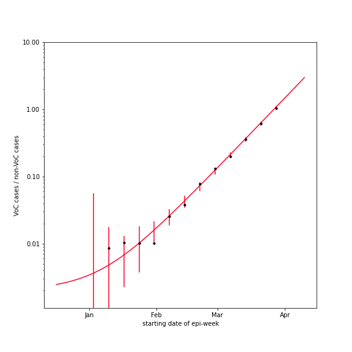
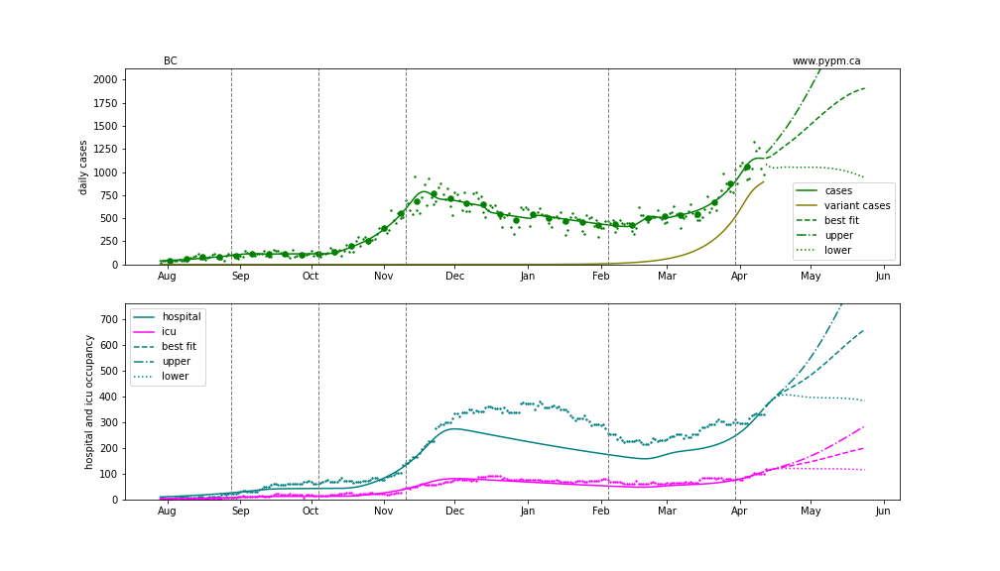
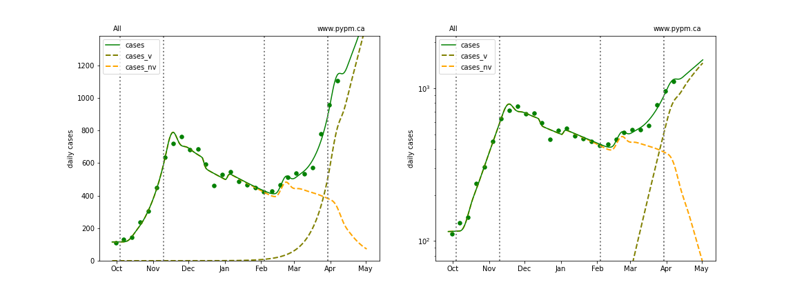
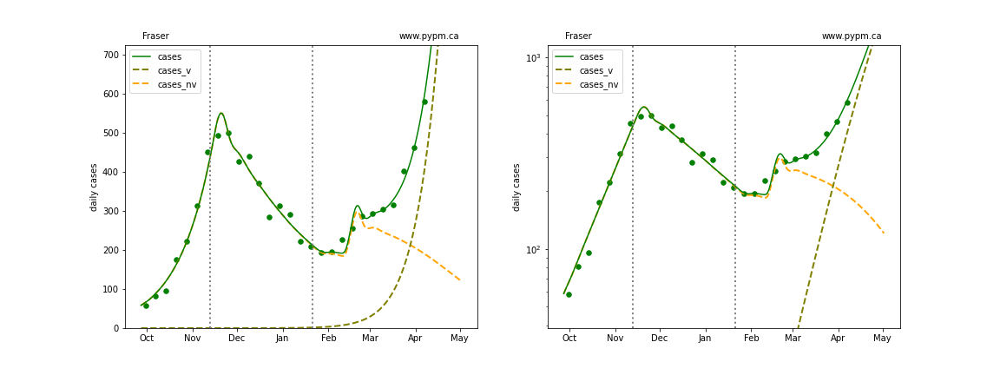
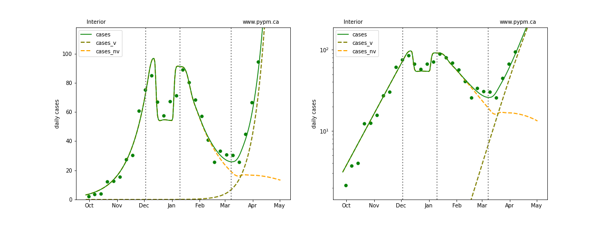
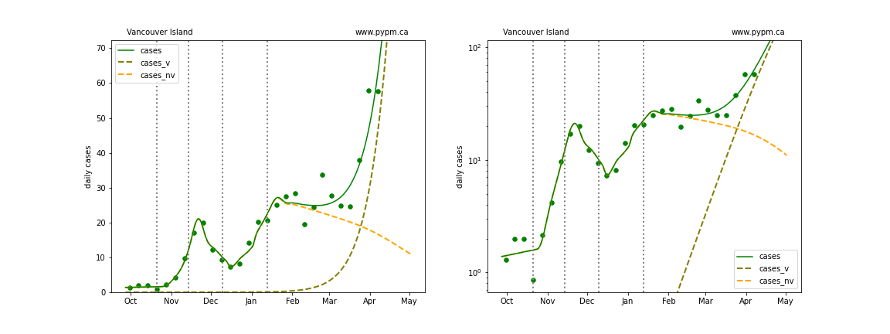
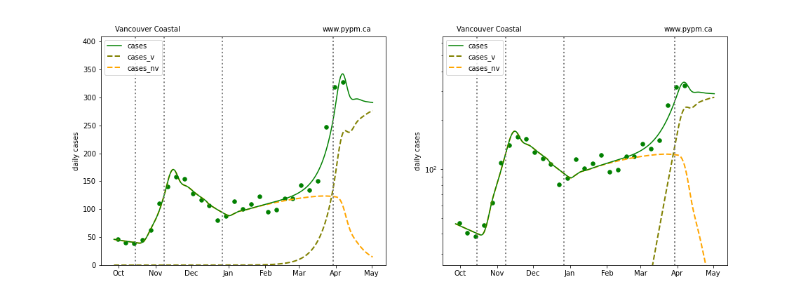
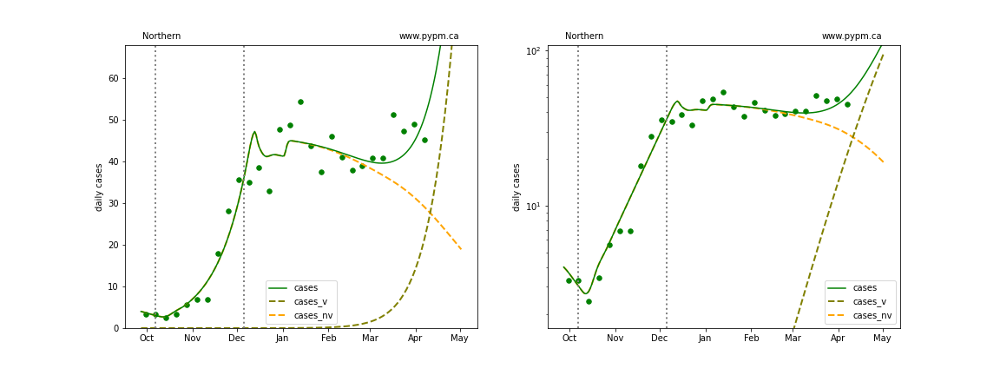

## April 13, 2021 Analysis of BC regional data

The following shows graphs of daily cases on linear and log scale. Data through April 11 are used,
with the plots starting on October 1.

The variant B.1.1.7 has become the dominant source of cases in BC. Combined with the P.1, these variants of concern
account for about 75% of cases this week.
The overall growth advantage is measured by fitting genomic data, as shown in the figure below.

fit | s | w |f_v (Apr 10)
---|---|---|---
BC|0.078 $\pm$ 0.002|0.002 $\pm$ 0.001|0.75 $\pm$ 0.01

The fits below assume a growth advantage of about 7.8% per day, except for Vancouver Coastal, where 11% is assumed.

The dashed curves illustrate how cases from the variants overtake the cases from the original strains.

An outbreak in cases for Fraser and overall BC in February is included to model the "Trivia Night" event
that caused a large number of infections in Vancouver.

A change in transmission rate on March 30 is included in the fits to BC and the Vancouver Coastal HA, to account for the
"circuit breaker" restrictions brought into force.
It is too early to measure its effect in data: the fits show examples of possible trajecties.
The drop in cases over the last 5 days in Vancouver Coastal HA is too quick to be due to the change in health policy which
may result in the effect for the province to be over-estimated.

### BC projection with transmission rate change estimated from data

### [BC total](img/bc_2_8_0413.pdf)

### [Fraser](img/fraser_2_8_0413.pdf)

### [Interior](img/interior_2_8_0413.pdf)

### [Island](img/island_2_8_0413.pdf)

### [Coastal](img/coastal_2_8_0413.pdf)

### [Northern](img/northern_2_8_0413.pdf)

## [return to case studies](../index.md)

