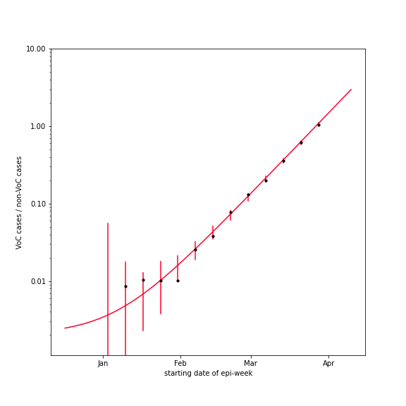
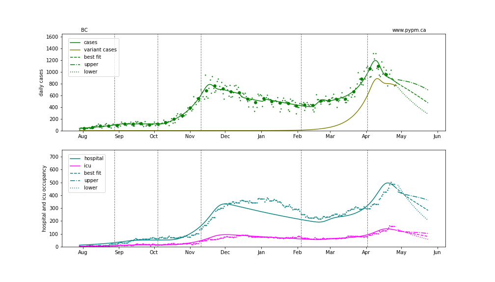
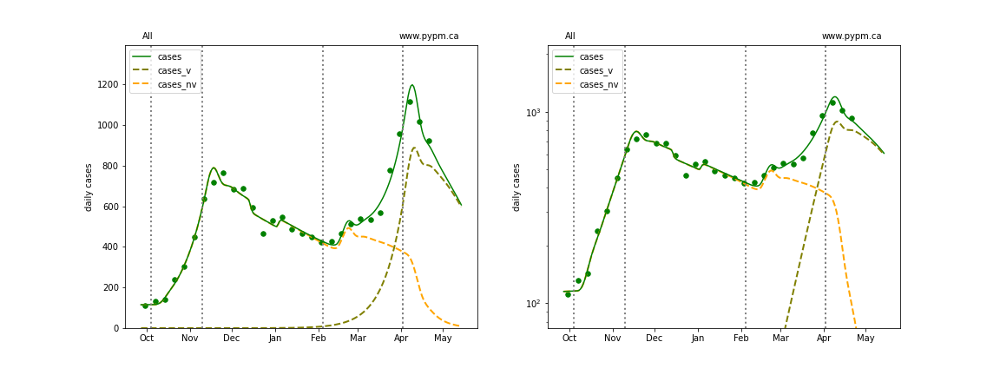
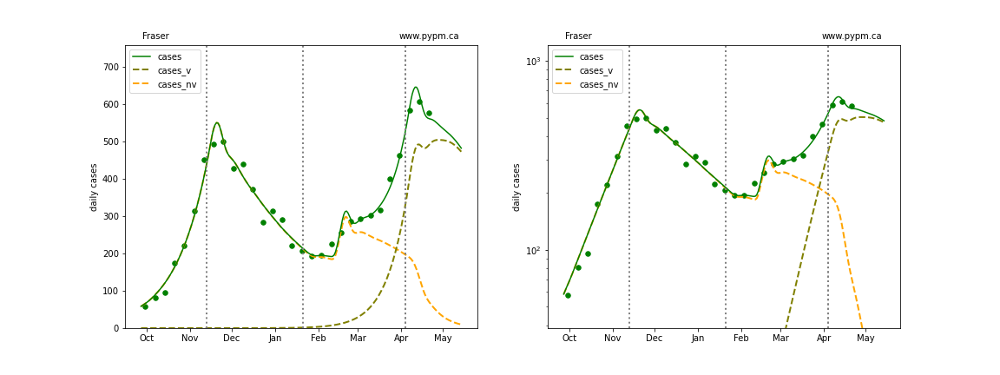
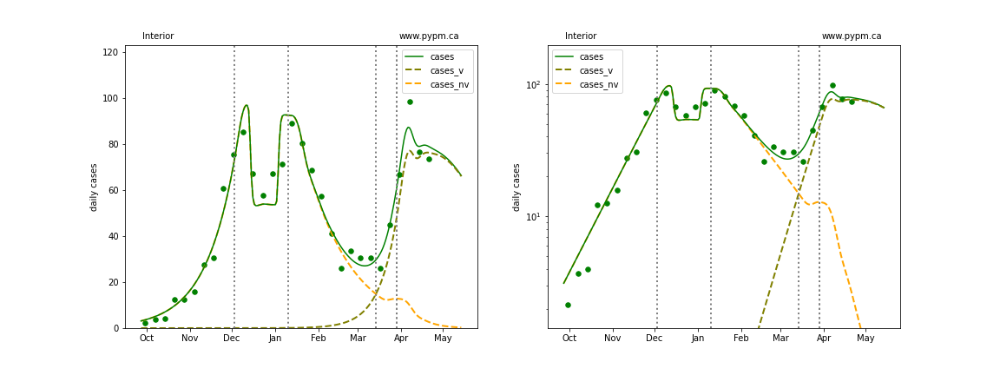
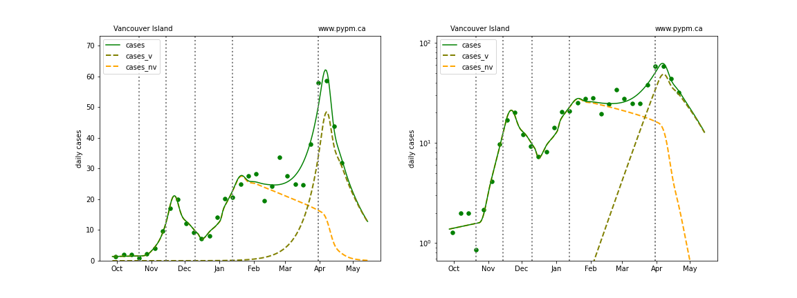
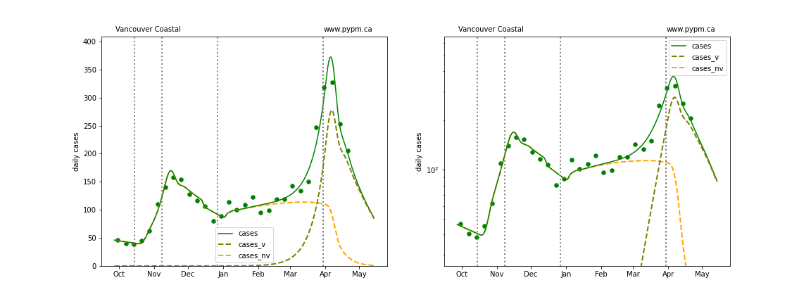
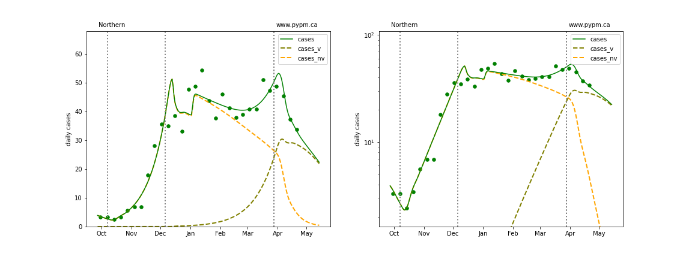

## April 29, 2021 Analysis of BC regional data

The following shows graphs of daily cases on linear and log scale. Data through April 27 are used,
with the plots starting on October 1.

The variant B.1.1.7 has become the dominant source of cases in BC.
The overall growth advantage is measured by fitting genomic data, as shown in the figure below.
Note that access to suitable genomic data for fitting is limited, so this figure has not been
updated in the past 2 weeks.

fit | s | w |f_v (Apr 10)
---|---|---|---
BC|0.078 +/- 0.002|0.002 +/- 0.001|0.75 +/- 0.01

The fits below assume a growth advantage of about 7.8% per day.

The dashed curves illustrate how cases from the variants overtake the cases from the original strains.

An outbreak in cases for Fraser and overall BC in February is included to model the "Trivia Night" event
that caused a large number of infections in Vancouver.

A change in transmission rate at the end of March is included in the fits, to account for the
"circuit breaker" restrictions brought into force.
The transition date is fit for each region individually.
All health authorities now show significant decline in case rates, except Fraser, where decline or
steady case rates are both consistent with data.

### BC projection with transmission rate change estimated from data

### [BC total](img/bc_2_8_0429.pdf)

### [Fraser](img/fraser_2_8_0429.pdf)

### [Interior](img/interior_2_8_0429.pdf)

### [Island](img/island_2_8_0429.pdf)

### [Coastal](img/coastal_2_8_0429.pdf)

### [Northern](img/northern_2_8_0429.pdf)

## Forecasts

The following shows the forecast for each Health Authority.

## [return to case studies](../index.md)

