## March 11, 2021 Analysis of BC regional data

The growth advantage of Variants of Concern are measured by fitting genomic data, as shown in the figure below and reported in the table.
The selection coefficient (s0) is shown, and for
Fraser and Coastal HA have enough data to measure the advantage after the additional health measures were brought in on March 30 (s1).
The date, d0, is the date that the VoC became dominant, and d1 is the estimated number of days after that date when the
growth advantage changes.

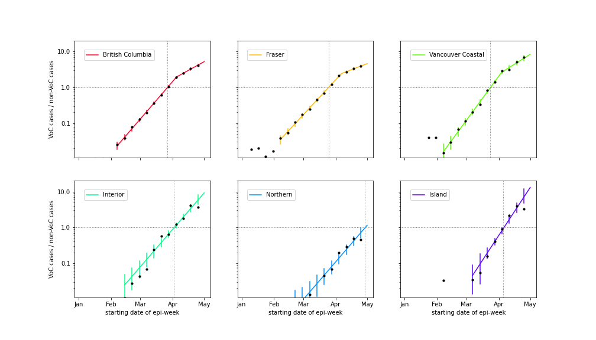

region | s0 | s1 | d0 | d1
---|---|---|---|---
British Columbia|0.078 +/- 0.001|0.037 +/- 0.003|Mar 30|8.6 +/- 1.0
Fraser|0.073 +/- 0.001|0.026 +/- 0.004|Mar 28|12.2 +/- 1.1
Vancouver Coastal|0.092 +/- 0.002|0.042 +/- 0.004|Mar 27|10.5 +/- 1.1
Interior|0.078 +/- 0.003|-|Apr 05|-
Northern|0.078 +/- 0.005|-|May 02|-
Island|0.103 +/- 0.005|-|Apr 08|-

The dashed curves illustrate how cases from the variants overtake the cases from the original strains.

An outbreak in cases for Fraser and overall BC in February is included to model the "Trivia Night" event
that caused a large number of infections in Vancouver.

A change in transmission rate at the end of March is included in the fits, to account for the
"circuit breaker" restrictions brought into force.
The transition date is fit for each region individually.
All health authorities now show significant decline in case rates, except Fraser, where decline or
steady case rates are both consistent with data.

## Model fits

The following shows graphs of daily cases on linear and log scale. Data through May 10 are used,
with the plots starting on October 1.

### [BC total](img/bc_2_8_0511.pdf)

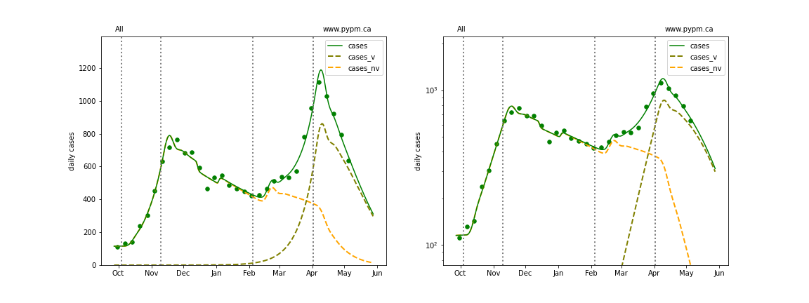

### [Fraser](img/fraser_2_8_0511.pdf)

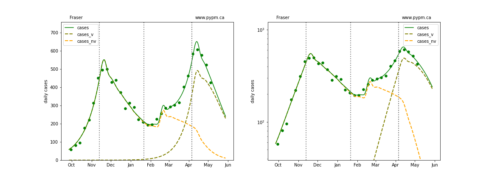

### [Interior](img/interior_2_8_0511.pdf)

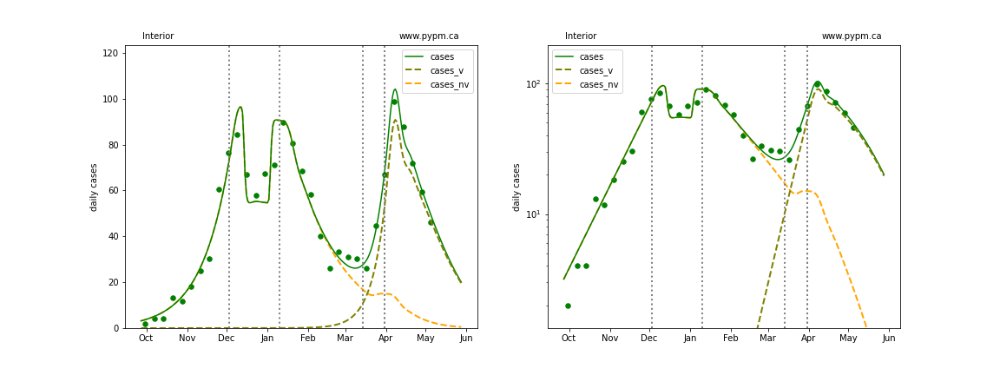

### [Island](img/island_2_8_0511.pdf)

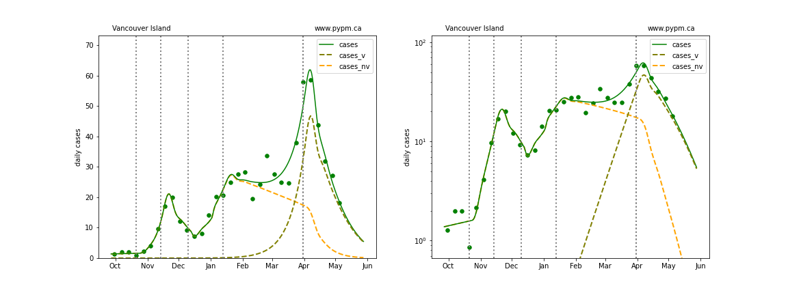

### [Coastal](img/coastal_2_8_0511.pdf)

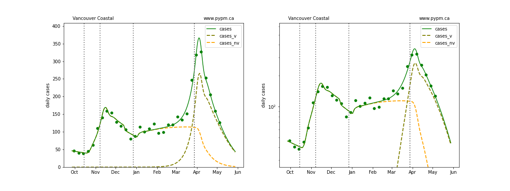

### [Northern](img/northern_2_8_0511.pdf)

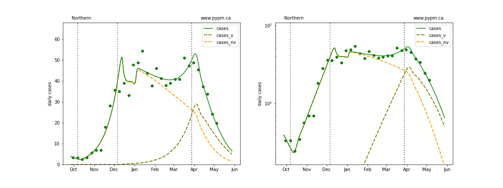

## Forecasts

The following plots shows the near term forecast for each Health Authority (assuming constant transmission rate).

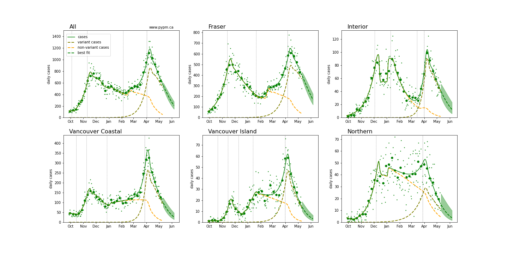

The following plots shows the April 30 forecast for each Health Authority, along
with the data collected after the forecast (red dots).

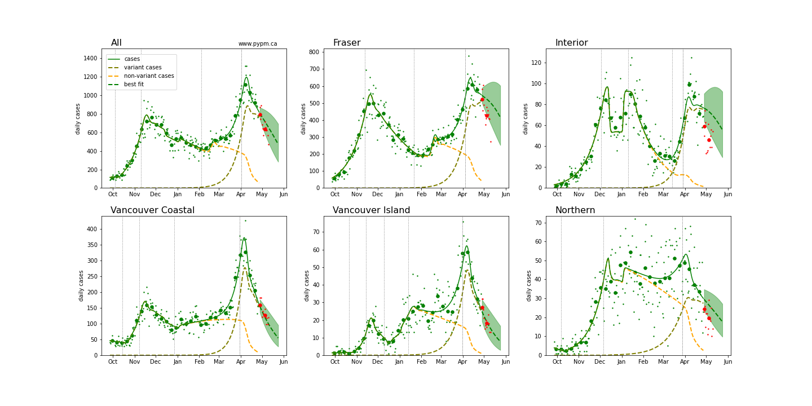

### BC projection for removal of "circuit breaker" measures

This long range projection assumes that on May 25 the additional measures introduced on March 30 are rescinded.
The nominal vaccination assumptions are that the rate of 1st doses grows to 45,000/day on May 17 (given to all ages
and in proportion to HA populations until 75% of the population is vaccinated) and ultimate 1st dose effectiveness is 90%.
This is compared to a low vaccination scenario where the rate of 1st doses remains at 35,000/day until 65% of the
population is vaccinated, and ultimate 1st dose effectiveness is 80%.

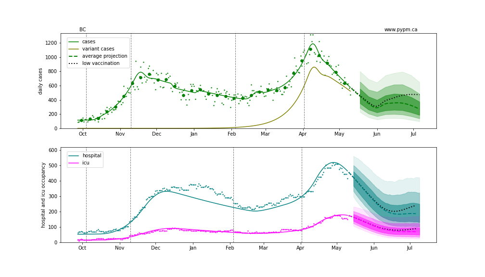

Some of the internal workings of the model are illustrated in the figure below.
The daily growth rate (delta) depends on the product of the transmission rate (alpha) and the susceptible fraction (S/N). 
The product is shown by the green curves and the grey horizontal lines show the growth rate for a few values.
In the nominal vaccination scenario, growth becomes negative in mid-June.

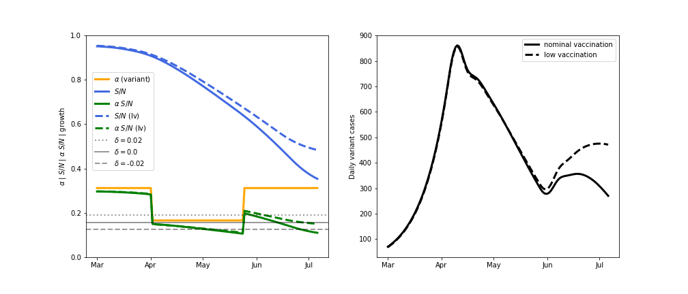

## [return to case studies](../index.md)

