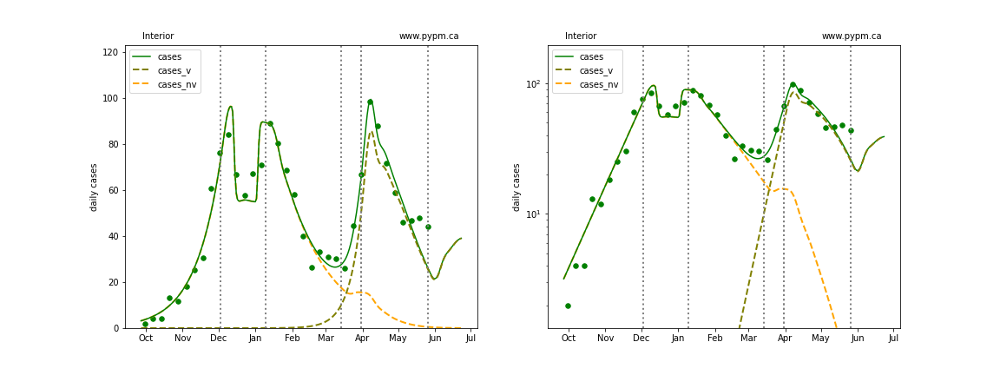
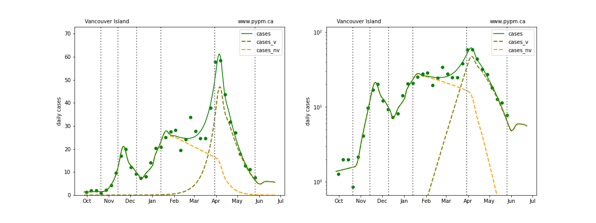

## May 28, 2021 Analysis of BC regional data

The growth advantage of Variants of Concern are measured by fitting genomic data, as shown in the figure below and reported in the table.
The selection coefficient (s0) is shown, and for
Fraser and Coastal HA have enough data to measure the advantage after the additional health measures were brought in on March 30 (s1).
The date, d0, is the date that the VoC became dominant, and d1 is the estimated number of days after that date when the
growth advantage changes.

region | s0 | s1 | d0 | d1
---|---|---|---|---
British Columbia|0.079 +/- 0.001|0.026 +/- 0.001|Mar 29|10.3 +/- 0.5
Fraser|0.073 +/- 0.001|0.018 +/- 0.002|Mar 28|13.1 +/- 0.6
Vancouver Coastal|0.093 +/- 0.002|0.046 +/- 0.003|Mar 27|9.6 +/- 1.1
Interior|0.081 +/- 0.004|0.031 +/- 0.007|Apr 03|15.6 +/- 2.4
Northern|0.067 +/- 0.003|-|May 06|-
Island|0.127 +/- 0.008|0.008 +/- 0.010|Apr 07|10.1 +/- 1.5

The dashed curves illustrate how cases from the variants overtook the cases from the original strains.

An outbreak in cases for Fraser and overall BC in February is included to model the "Trivia Night" event
that caused a large number of infections in Vancouver.

A change in transmission rate at the end of March is included in the fits, to account for the
"circuit breaker" restrictions brought into force.
The transition date is fit for each region individually.
All health authorities now show significant decline in case rates, except Fraser, where decline or
steady case rates are both consistent with data.

## Model fits

The following shows graphs of daily cases on linear and log scale. Data through May 27 are used,
with the plots starting on October 1.

### [BC total](img/bc_2_9_0528.pdf)

### [Fraser](img/fraser_2_9_0528.pdf)

### [Interior](img/interior_2_9_0528.pdf)

### [Island](img/island_2_9_0528.pdf)

### [Coastal](img/coastal_2_9_0528.pdf)

### [Northern](img/northern_2_9_0528.pdf)

## Forecasts

The following plots shows the near term forecast for each Health Authority (assuming constant transmission rate).

The following plots shows the April 30 forecast for each Health Authority, along
with the data collected after the forecast (red dots).

### BC projection include B.1.617.2 variant

This long range projection includes the relaxation on May 25 of the additional measures introduced on March 30.
The nominal vaccination assumptions are that the rate of 1st doses continues at 52,000/day (given to all ages
and in proportion to HA populations until 75% of the population is vaccinated) and ultimate 1st dose effectiveness is 90%.

Notable is the possible effect of the B.1.617.2 variant of concern.
Measurements of its growth advantage over the currently dominant B.1.1.7 strain have large uncertainty, so three possible values
are considered (9, 7, and 5) % per day.

Some of the internal workings of the model are illustrated in the figure below.
The daily growth rate (delta) depends on the product of the transmission rate (alpha) and the susceptible fraction (S/N). 
The product is shown by the olive curve (for B.1.1.7) and the red curves (for B.1.617.2 for different growth advantages)
and the grey horizontal lines show the growth rate for a few values.
In the nominal vaccination scenario, growth becomes negative in mid-June for B.1.1.7, but continues to be positive
for B.1.617.2 for some cases.

## [return to case studies](../index.md)

