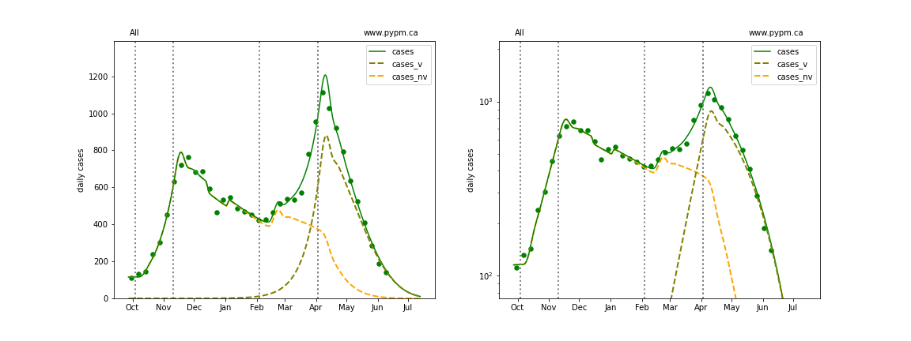
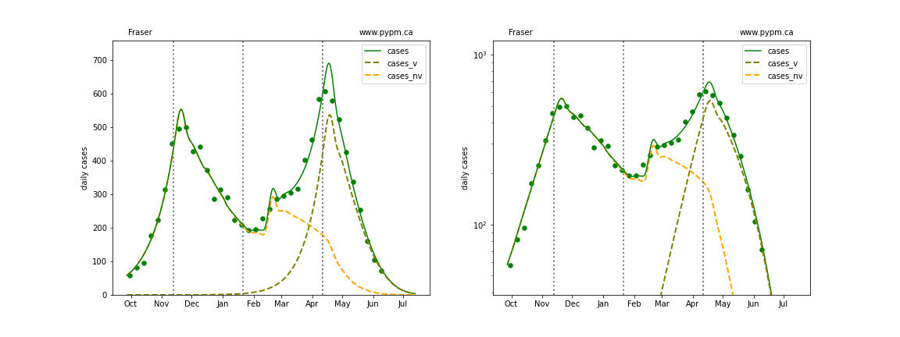
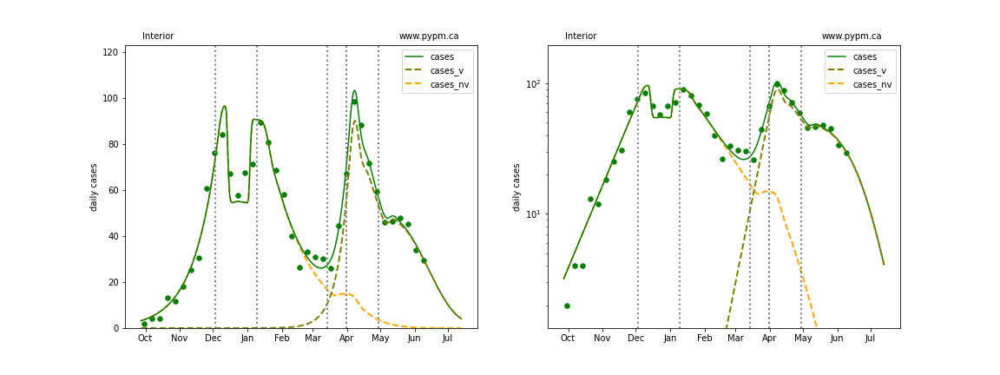
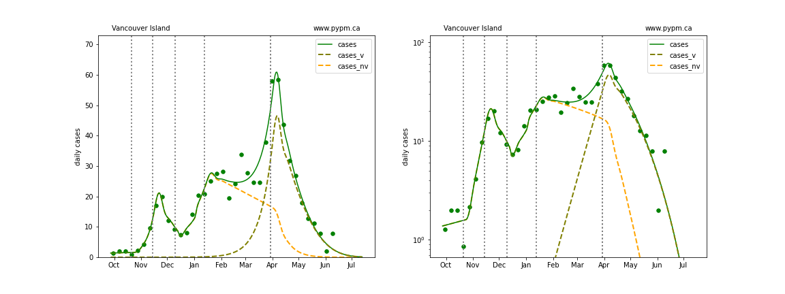
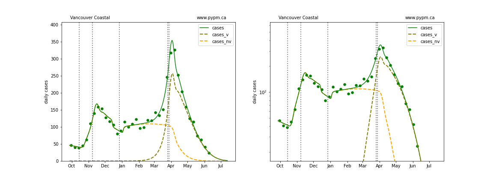
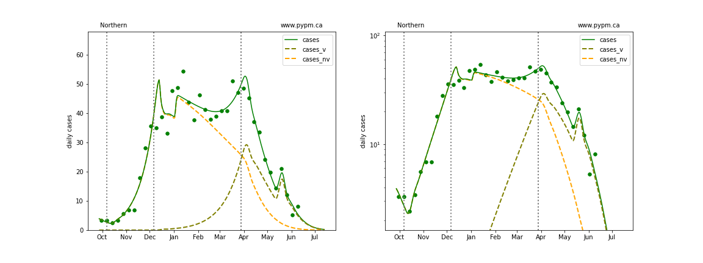
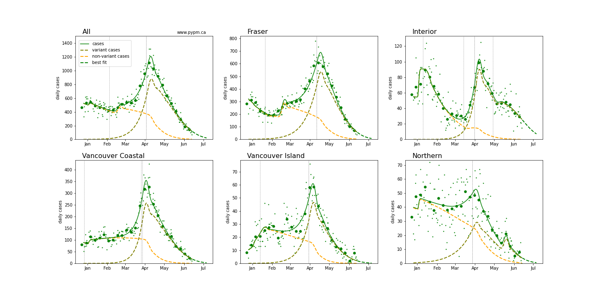
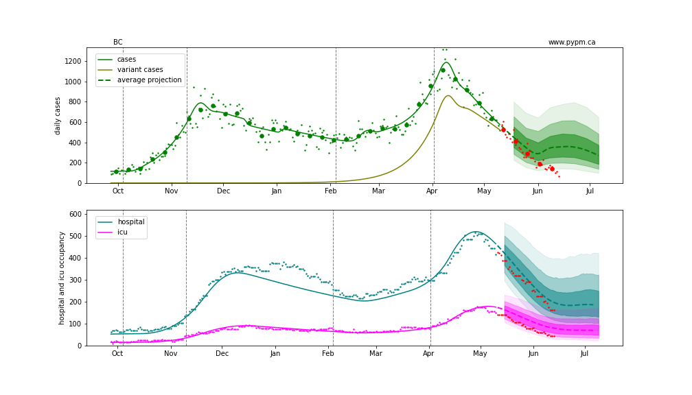
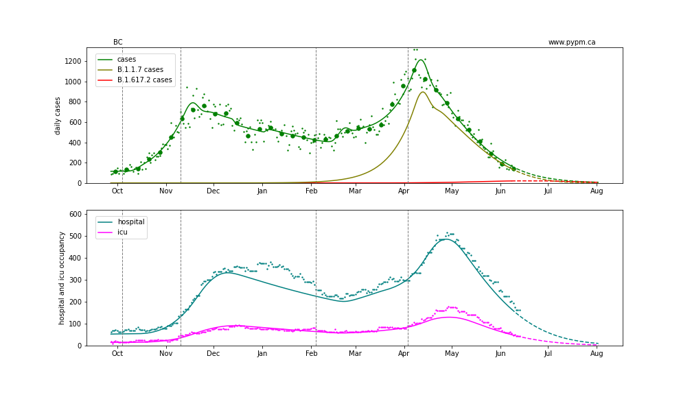
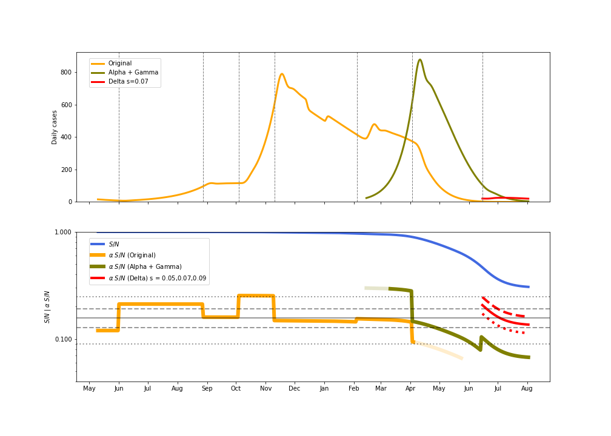

## June 14, 2021 Analysis of BC regional data

The growth advantage of Variants of Concern are measured by fitting genomic data, but there are
issues with the current data source, so look at the May 28 BC study for the last genomic data fit.

The dashed curves illustrate how cases from the variants overtook the cases from the original strains.

A change in transmission rate at the end of March is included in the fits, to account for the
"circuit breaker" restrictions brought into force.
The transition date is fit for each region individually.

## Model fits

The following shows graphs of daily cases on linear and log scale. Data through June 13 are used,
with the plots starting on October 1.

### [BC total](img/bc_2_9_0614.pdf)

### [Fraser](img/fraser_2_9_0614.pdf)

### [Interior](img/interior_2_9_0614.pdf)

### [Island](img/island_2_9_0614.pdf)

### [Coastal](img/coastal_2_9_0614.pdf)

### [Northern](img/northern_2_9_0614.pdf)

## Forecasts

The following plots shows the near term forecast for each Health Authority (assuming constant transmission rate)
and without including the delta variant.

The following plots shows the May 14 forecast that assumed the circuit breaker restrictions would be lifted on May 25.
The forecast predicted a short period of growth due to alpha for the first half of June, which was not seen, as shown by the
data collected after the forecast (red dots).

### BC projection including B.1.617.2 variant

The vaccination assumptions are that the rate of 1st doses continues at 45,000/day (given to all ages
and in proportion to HA populations until 75% of the population is vaccinated) and ultimate 1st dose effectiveness is 90%.

Given the current environment following May 25 shows continual decline in cases, the effect of the B.1.617.2 variant of concern (delta)
is much less than the May 28 forecast.

Some of the internal workings of the model are illustrated in the figure below.
The daily growth rate (delta) depends on the product of the transmission rate (alpha) and the susceptible fraction (S/N). 
The product is shown by the olive curve (for B.1.1.7) and the red curves (for B.1.617.2 for different growth advantages)
and the grey horizontal lines show the growth rate for a few
values: 0% (solid line) + and - 2% per day (dashed lines)
and + and -5% per day (dotted lines).

## [return to case studies](../index.md)

