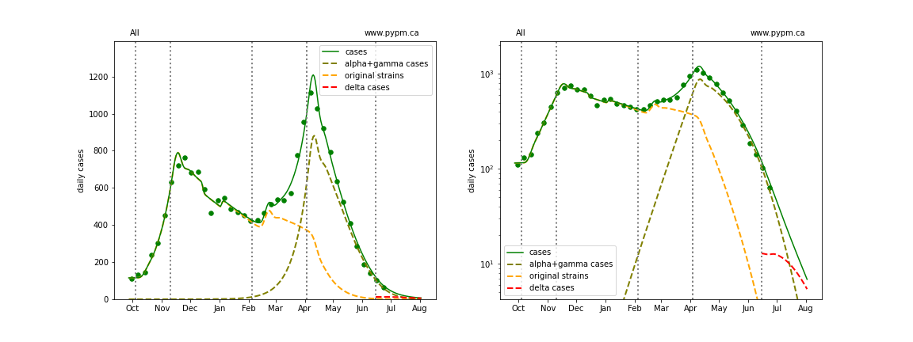
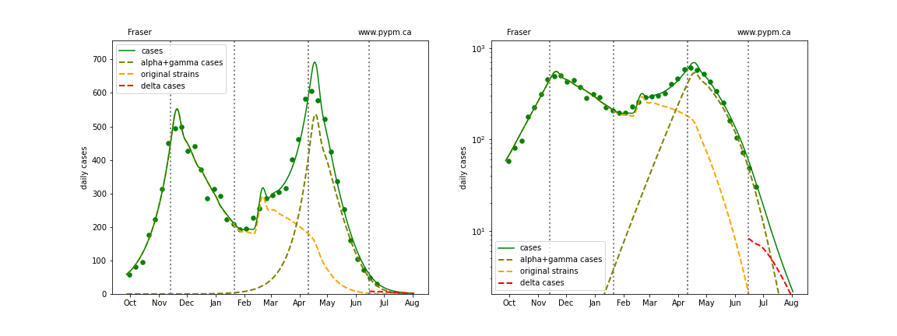
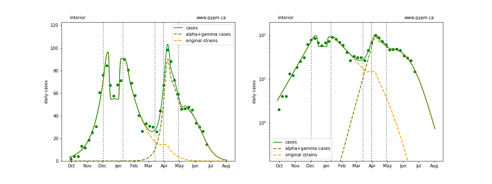
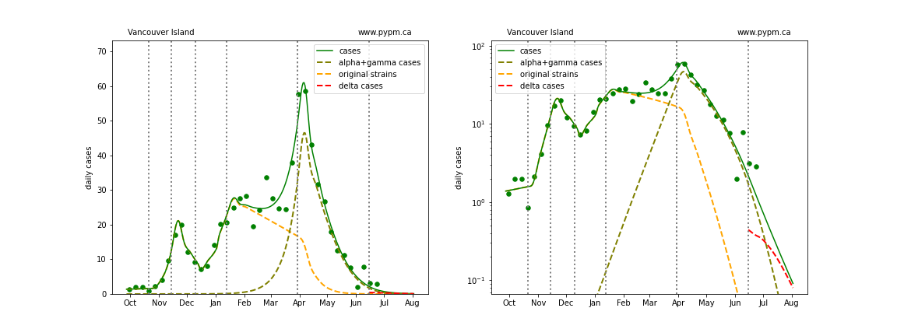
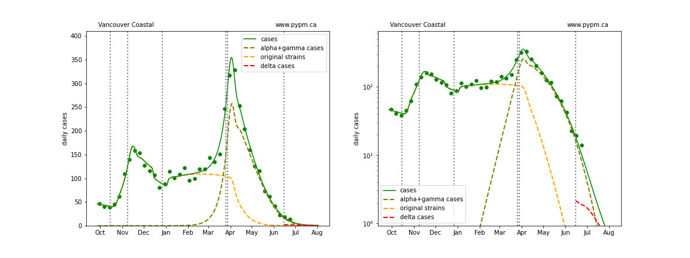
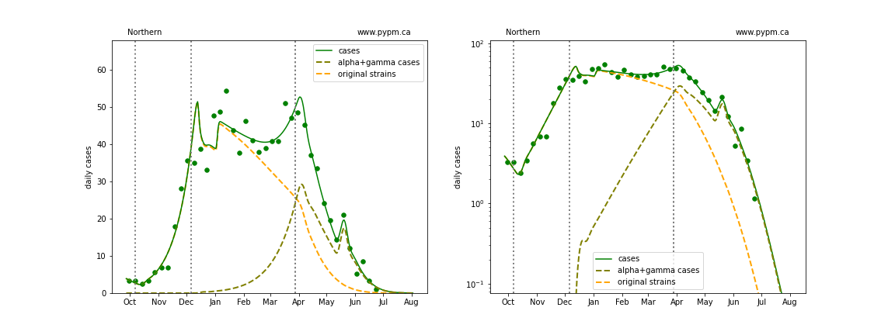
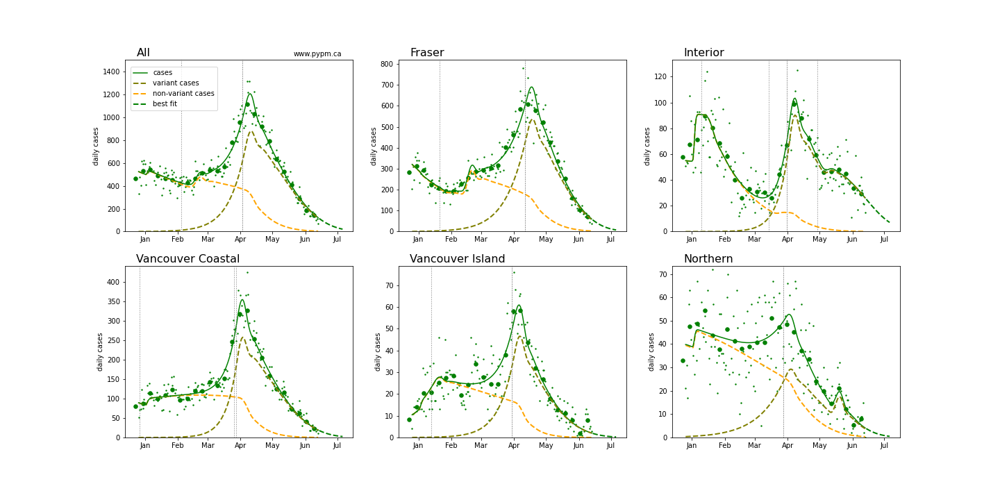
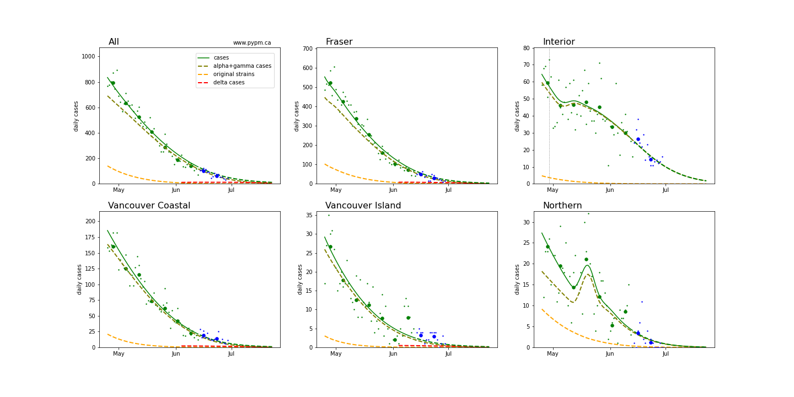
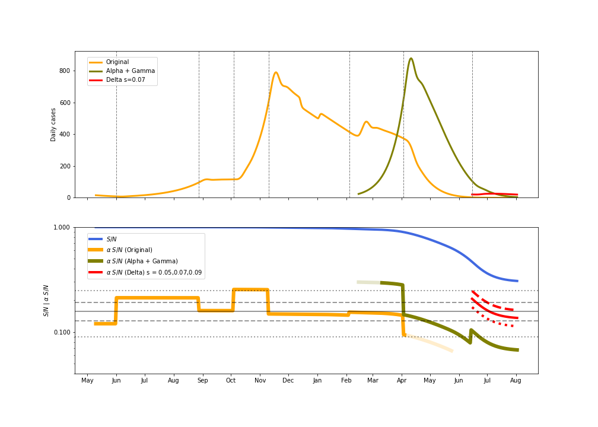

## June 14 - July 2, 2021 Analysis of BC regional data

The growth advantage of Variants of Concern are measured by fitting genomic data, but there are
issues with the current data source, so look at the May 28 BC study for the last genomic data fit.

The dashed curves illustrate how cases from the variants overtook the cases from the original strains.

A change in transmission rate at the end of March is included in the fits, to account for the
"circuit breaker" restrictions brought into force.
The transition date is fit for each region individually.

## June 14 Model fits 

The following shows graphs of daily cases on linear and log scale. Data through June 13 were used
to fit the model, and data up to July 1 are included in the plots.

### [BC total](img/bc_2_9_0702.pdf)

### [Fraser](img/fraser_2_9_0702.pdf)

### [Interior](img/interior_2_9_0702.pdf)

### [Island](img/island_2_9_0702.pdf)

### [Coastal](img/coastal_2_9_0702.pdf)

### [Northern](img/northern_2_9_0702.pdf)

## Forecasts

The following plots shows the near term forecasts from June 14 for each Health Authority (assuming constant transmission rate)
and without including the delta variant.

The plots below include data from June 14-July 1 (blue dots) to show that the decline in cases
followed the model forecasts that assumed constant transmission rates.
The delta variant is included, with the prevalence taken from recent genomic data and the growth advantage assumed to be 7% per day.

Some of the internal workings of the model are illustrated in the figure below.
The daily growth rate (delta) depends on the product of the transmission rate (alpha) and the susceptible fraction (S/N). 
The product is shown by the olive curve (for B.1.1.7) and the red curves (for B.1.617.2 for different growth advantages)
and the grey horizontal lines show the growth rate for a few
values: 0% (solid line) + and - 2% per day (dashed lines)
and + and -5% per day (dotted lines).

## [return to case studies](../index.md)

