## June 14 - July 26, 2021 Analysis of BC regional data

This page shows results of analyses reported in our regular [BC COVID-19 Modelling Group](https://bccovid-19group.ca/) reports.

The growth advantage of Variants of Concern are measured by fitting genomic data, but there are
issues with the current data source, so look at the May 28 BC study for the last genomic data fit.

## June 14 Model fits - (reference for decline phase)

The following shows graphs of daily cases on linear and log scale. Data only through June 13 were used
to fit the model, but data up to July 1 were included in the plots.

The dashed curves illustrate how cases from the variants overtook the cases from the original strains, and
note the hypothesized introduction of delta at a low level and low rate of growth, consistent with
what was known at that time.

A change in transmission rate at the end of March is included in the fits, to account for the
"circuit breaker" restrictions brought into force.
The transition date is fit for each region individually.

### [BC total](img/bc_2_9_0702.pdf)

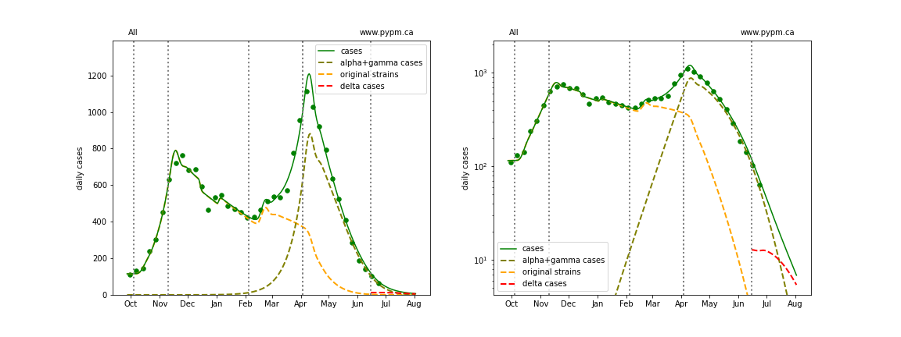

### [Fraser](img/fraser_2_9_0702.pdf)

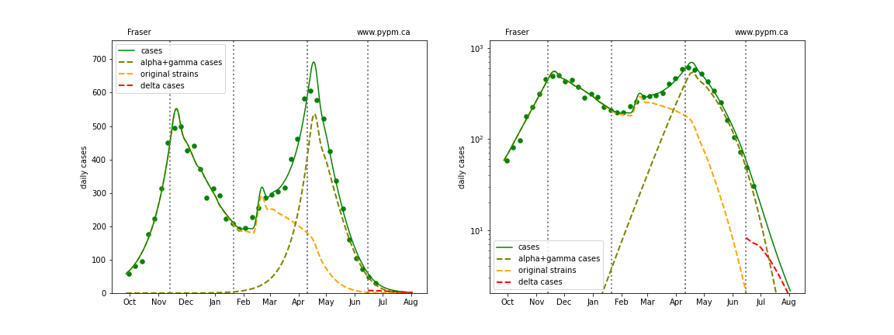

### [Interior](img/interior_2_9_0702.pdf)

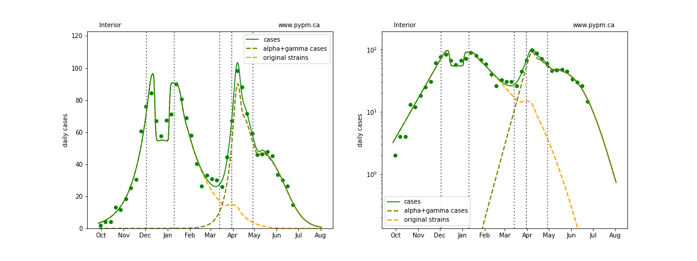

### [Island](img/island_2_9_0702.pdf)

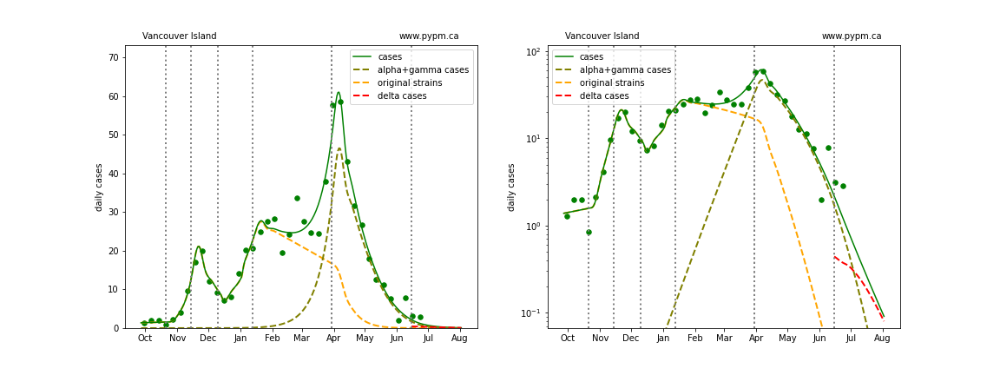

### [Coastal](img/coastal_2_9_0702.pdf)

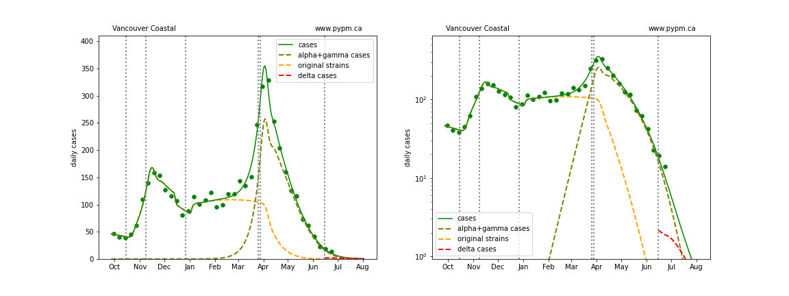

### [Northern](img/northern_2_9_0702.pdf)

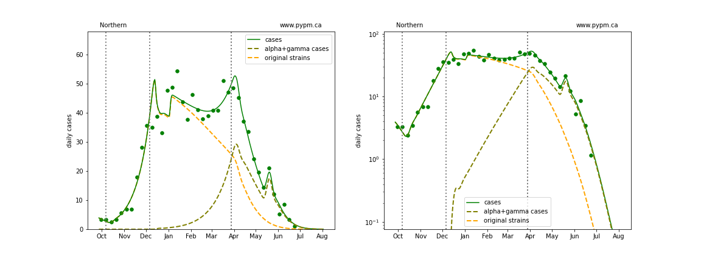

## June 14 forecasts compared with recent data

Until recently the decline in case rates followed the model projection.
To see this more clearly, we zoom into the last few months.
The blue dots are data collected after the model projection, and in the last few weeks, the case rates
are seen to depart from the projection.

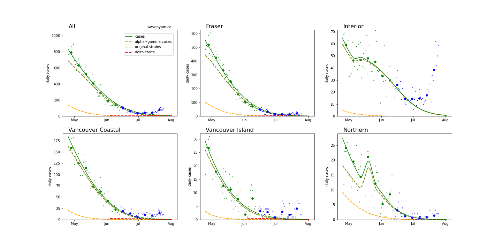

This case be seen more clearly using log-scale:

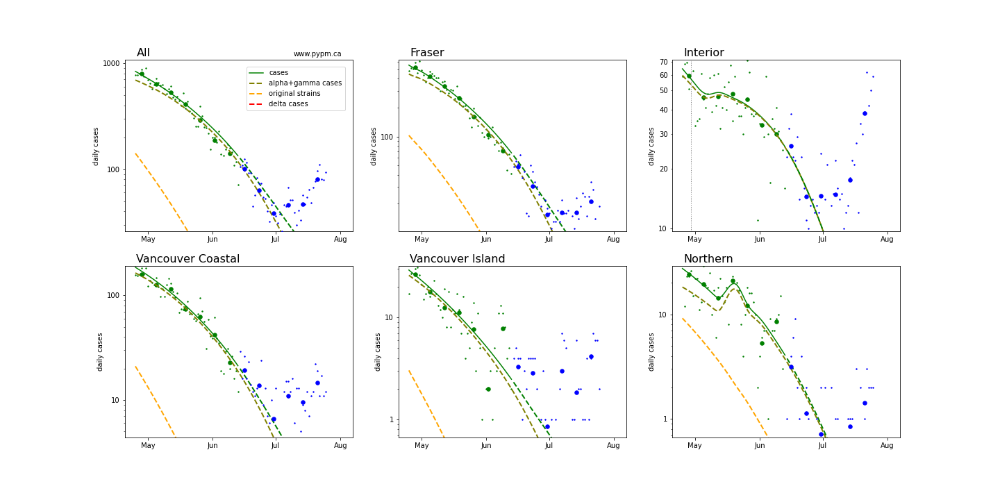

## Model interpretation of recent departure from case rate decline

In recent weeks many European nations have experienced similar transition to rapid growth and
several have been able to reduce or turn the growth around.
In the US, most states had recently been in a long period of steady decline,
but now all states are currently experiencing rapid growth.
Model fits to EU and US states can be found [here](../index.md).

The figure below shows the result of an approach 
used for fitting the recent rise in European nations.
The parameters for the second strain are adjusted to fit the data, without imposing the constraint that the
growth advantage of delta over alpha be about 9% per day (as measured by genomic data).
This allows for a greater swing in growth rates from the alpha+gamma phase (decline) to delta phase (growth), possibly accounting for
changes in social behaviour during the transition.
The model fits for each dataset suggest that a transition to rapid growth is underway.

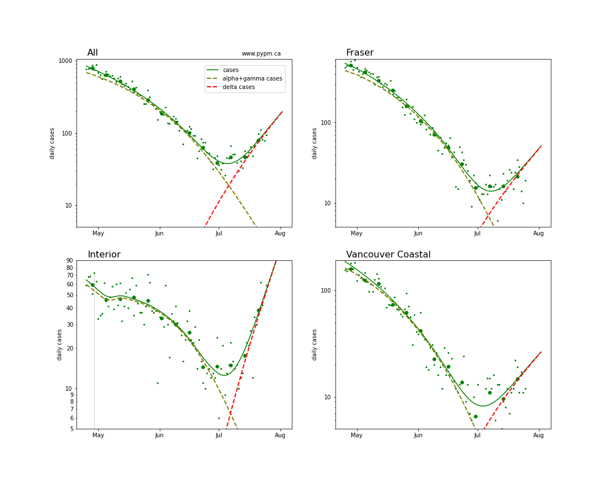

The table below indicates the growth rates before and after the transition to rapid growth

Region | alpha+gamma growth | delta growth | growth swing
---|---|---|---
BC | -9% / day | +9% / day | +18% / day
Fraser | -11% / day | +8% / day | +19% / day
Interior | -8% / day | +12% / day | +20% / day
Coastal | -11% / day | +6% / day | +17% / day

The swings from decline to growth of almost 20% per day are similar to the pattern seen in several European nations and
in US states.

With another week of data, the data should make it clear if these growth rates are being sustained.

## Hospitalization projections

The figure below shows unfitted projections for hospital and ICU occupancy, assuming the growth in case rates from the figure above.
Recently, the occupancy is higher per case than in months previously, which could be due to longer-term hospitalizations and/or
due to reduced testing.
It can be seen in the graphs that growth in hospital occupancy will be delayed compared to the growth in cases.

The plots are shown in linear and log-scale.

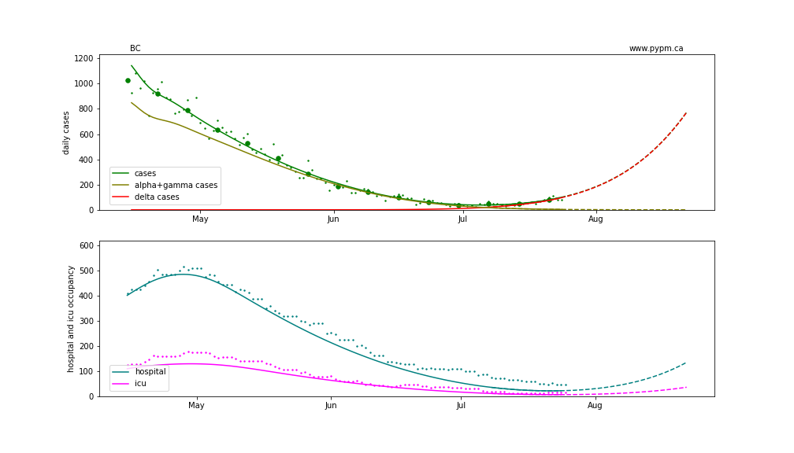

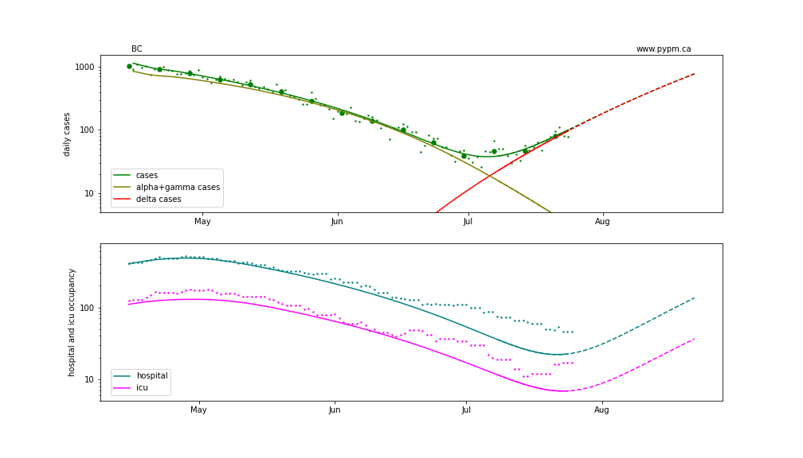

## [return to case studies](../index.md)

