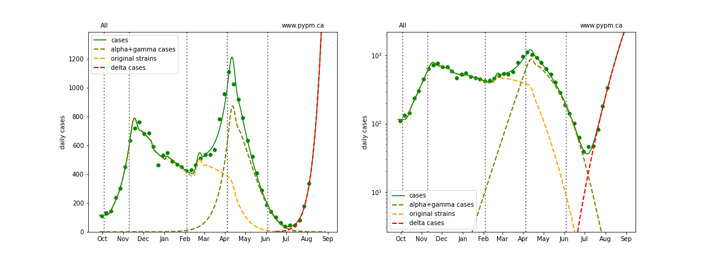
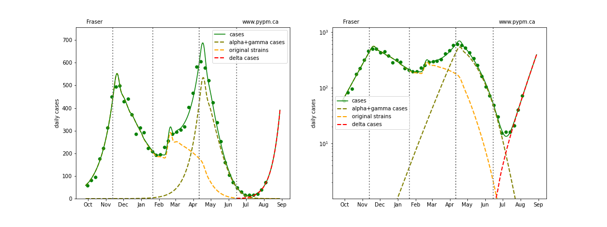
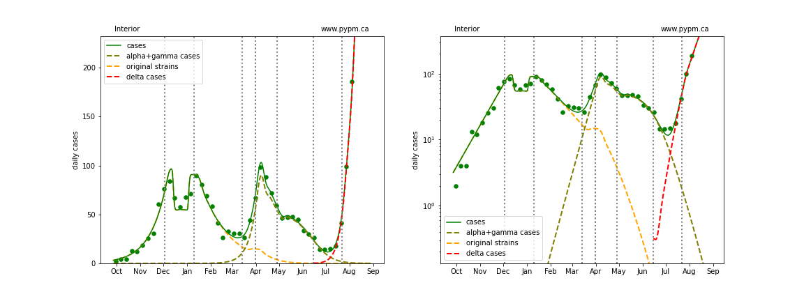
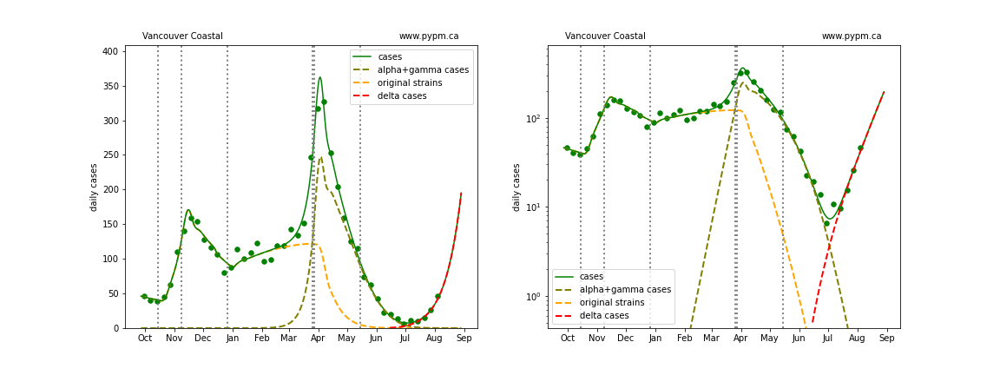
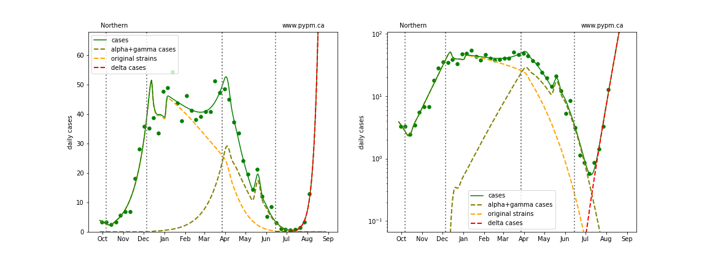
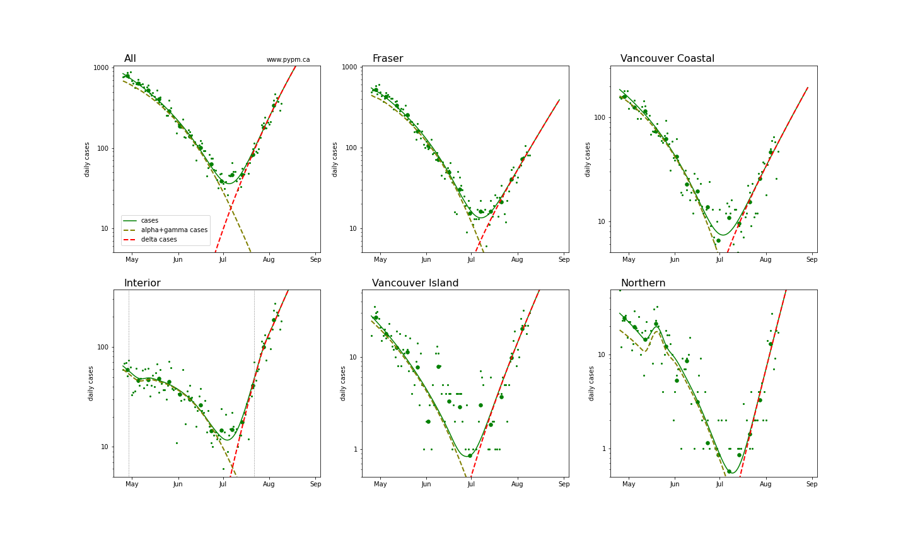
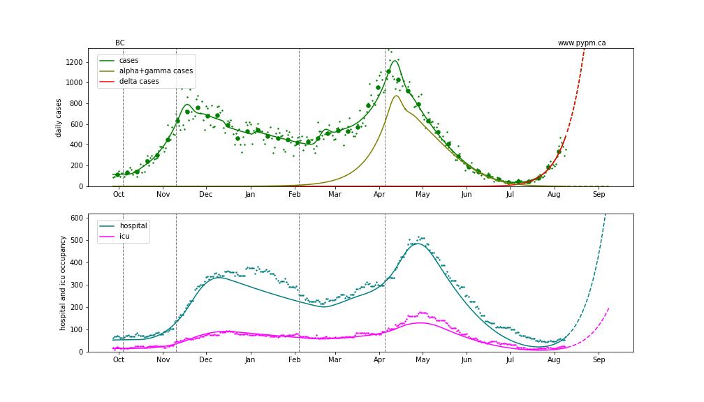

## August 10, 2021 Analysis of BC regional data

This page shows results of analyses reported in our regular [BC COVID-19 Modelling Group](https://bccovid-19group.ca/) reports.

## Fits to each health authority case data

All health authorities are experiencing rapid growth in cases due to the delta variant.

The following shows graphs of daily cases on linear and log scale.

The dashed curves illustrate how cases from the variants overtook the cases from the original strains, and
note the hypothesized introduction of delta at a low level and low rate of growth, consistent with
what was known at that time.

A change in transmission rate at the end of March is included in the fits, to account for the
"circuit breaker" restrictions brought into force.
The transition date is fit for each region individually.

A transition is included for the Interior, since there appears to be a slight reduction in growth rate recently,
possibly the result of additional health measures brought into force.

### [BC total](img/bc_2_9_0810.pdf)

### [Fraser](img/fraser_2_9_0810.pdf)

### [Interior](img/interior_2_9_0810.pdf)

### [Island](img/island_2_9_0810.pdf)

### [Coastal](img/coastal_2_9_0810.pdf)

### [Northern](img/northern_2_9_0810.pdf)

## Recent transition to growth

The recent transition to rapid growth is seen more clearly in the plot below.

The table below indicates the growth rates for each region for recent analyses

Region | July 28 | Aug 3 | Aug 10
---|---|---|---
BC | +9% / day | +9% / day | +9% / day
Fraser | +8% / day | +7% / day | +8% / day
Interior | +12% / day | +11% / day | +8% / day
Coastal | +6% / day | +6% / day | +7% / day
Island | - | +7% / day | +9% / day
Northern | - | +14% / day | +15% / day

The growth rates are consistent from week to week, except for the slight reduction in Interior.
Growth appears to be sustained in all regions.

## Hospitalization projections

The figure below shows unfitted projections for hospital and ICU occupancy, assuming the growth in case rates from the figure above.
It can be seen in the graphs that growth in hospital occupancy will be delayed compared to the growth in cases.

The plots are shown in linear and log-scale.

## [return to case studies](../index.md)

