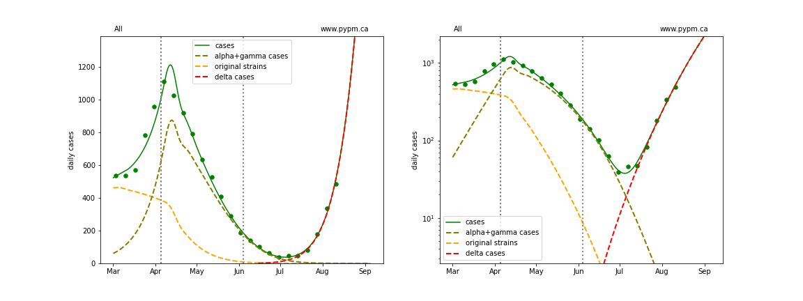
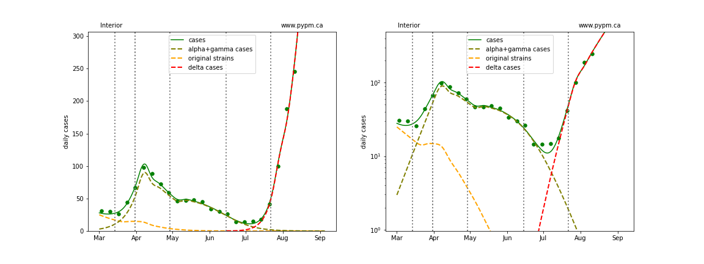

## August 16, 2021 Analysis of BC regional data

This page shows results of analyses reported in our regular [BC COVID-19 Modelling Group](https://bccovid-19group.ca/) reports.

## Fits to each health authority case data

All health authorities are experiencing rapid growth in cases due to the delta variant.

The following shows graphs of daily cases on linear and log scale.

The dashed curves illustrate how cases from the variants overtook the cases from the original strains, and
note the hypothesized introduction of delta at a low level and low rate of growth, consistent with
what was known at that time.

A change in transmission rate at the end of March is included in the fits, to account for the
"circuit breaker" restrictions brought into force.
The transition date is fit for each region individually.

A transition is included for the Interior, since there appears to be a slight reduction in growth rate recently,
possibly the result of additional health measures brought into force in late July.

### [BC total](img/bc_2_9_0816.pdf)

### [Fraser](img/fraser_2_9_0816.pdf)

### [Interior](img/interior_2_9_0816.pdf)

### [Island](img/island_2_9_0816.pdf)

### [Coastal](img/coastal_2_9_0816.pdf)

### [Northern](img/northern_2_9_0816.pdf)

## Recent transition to growth

The recent transition to rapid growth is seen more clearly in the plot below.

The table below indicates the growth rates for each region for recent analyses

Region | July 28 | Aug 3 | Aug 10 | Aug 16
---|---|---|---
BC | +9% / day | +9% / day | +9% / day | +8% / day
Fraser | +8% / day | +7% / day | +8% / day | +7% / day
Interior | +12% / day | +11% / day | +8% / day | +6% / day
Coastal | +6% / day | +6% / day | +7% / day | +7% / day
Island | - | +7% / day | +9% / day | +9% / day
Northern | - | +14% / day | +15% / day | +14% / day

The growth rates are consistent from week to week, except for the reduction in Interior.
Growth appears to be sustained in all regions.
With growing immunity, the model predicts decling growth rates of about 0.3%/day per week.

## Hospitalization projections

The figure below shows unfitted projections for hospital and ICU occupancy, assuming the growth in case rates from the figure above.
It can be seen in the graphs that growth in hospital occupancy will be delayed compared to the growth in cases.
The rise in hospitalization due to the recent growth of delta is following at the expected level.

The plots are shown in linear and log-scale.

## Longer term projections

The following longer term projections were produced for the [BC COVID-19 Modelling Group](https://bccovid-19group.ca/)
[8th report](https://bccovid-19group.ca/post/2021-08-18-report/).

### [No action taken projection](img/bc_2_9_0816_linear_proj_long.pdf)

This shows the projection for the BC situation, assuming no change to
current behaviour is made in the coming months. No capacity limits are imposed.
These are therefore not forecasts, since one would expect measures would come
into force before reaching capacity limits.

If transmission
continued at
present rate, daily
cases would dwarf
the previous record
of April 2021.
Infection rates
eventually decline
due to the herd
effect.

In this scenario,
hospital and ICU
demands would
exceed available
capacity (including
surge beds).

### [Rapid and broad expansion of vaccination](img/bc_2_9_0816_vacc_linear_proj_long.pdf)

A very optimistic expansion of vaccination to 90% of total population is assumed.
This is particularly difficult since vaccination of children under 12 is not yet approved.
Even with rapid rollout (additional 20,000 first doses per day assumed), vaccine immunity
grows slowly. On its own, it is insufficient to avoid a potential crisis.

### [Measures and vaccination expansion](img/bc_2_9_0816_vacc_plus_linear_proj_long.pdf)

In this example,
measures enacted
August 23 week stop the
growth of delta,
while vaccine
immunity builds.
Measures are
rescinded after six
weeks.

While demands
exceed previous
levels, they are
reduced compared
to the vaccination
only scenario.

## [return to case studies](../index.md)

