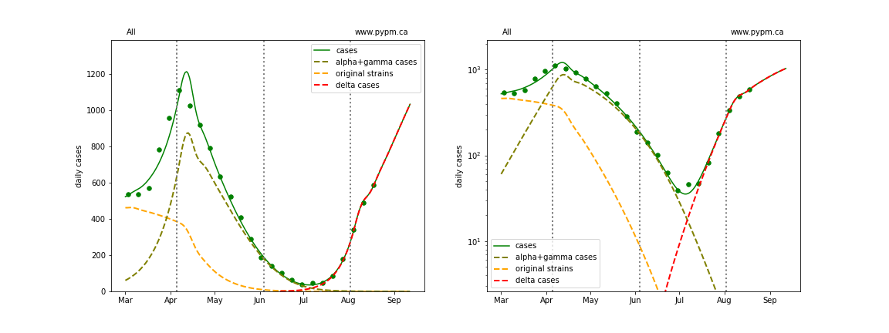
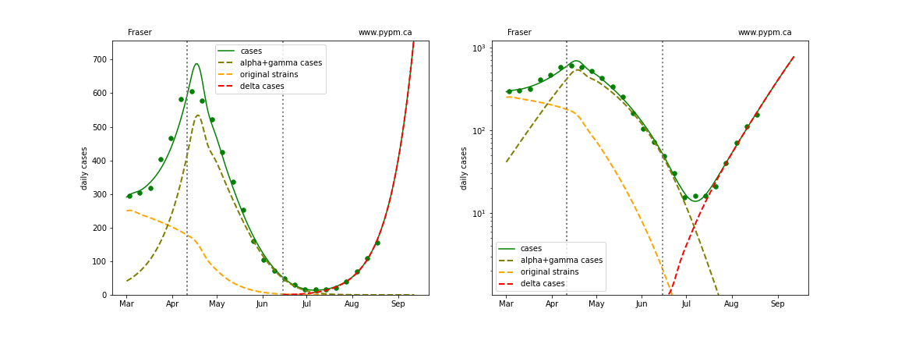
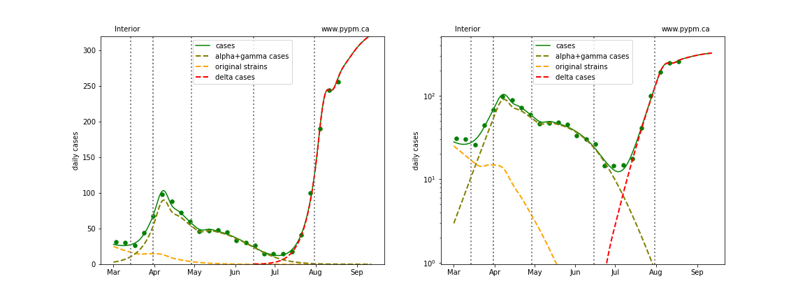
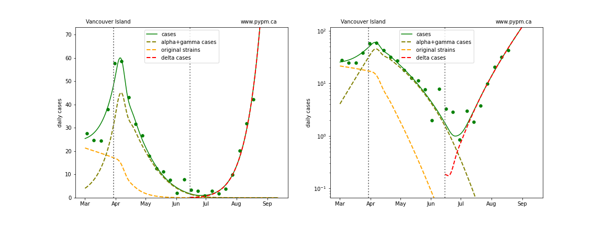
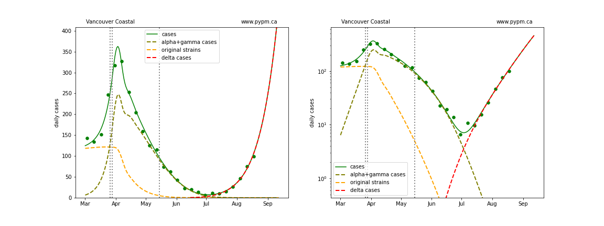
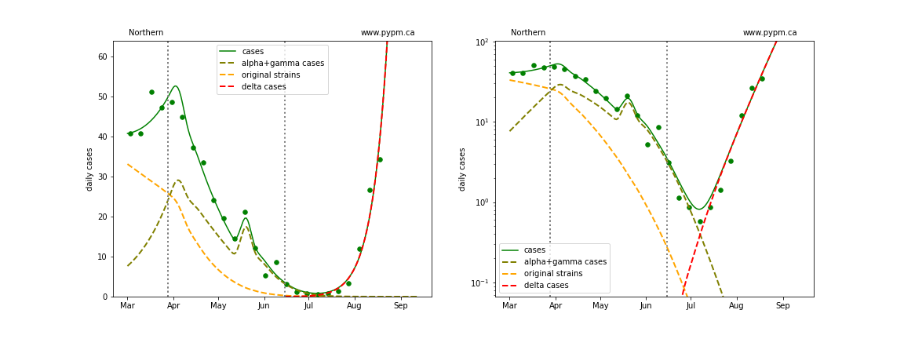
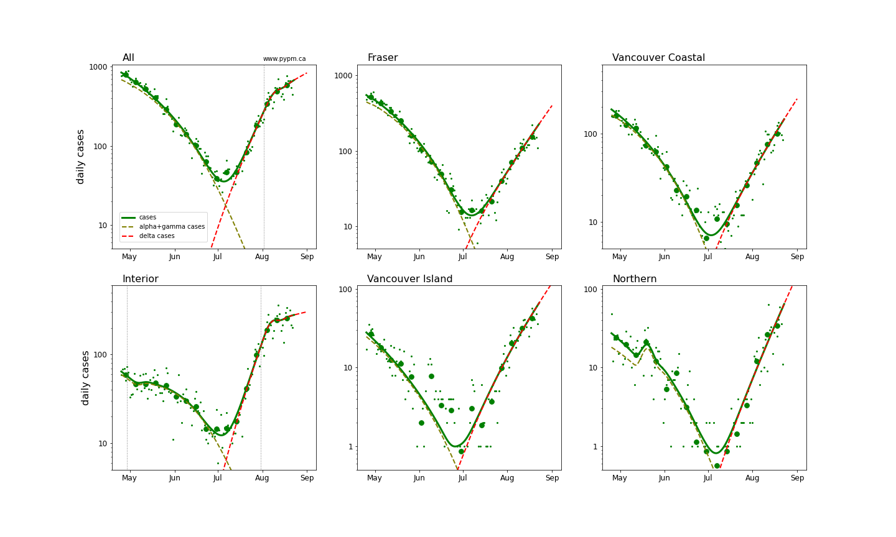
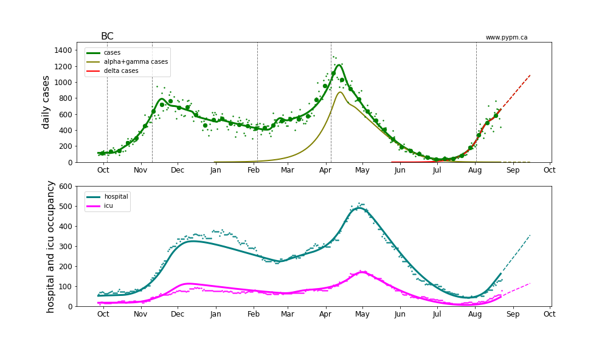
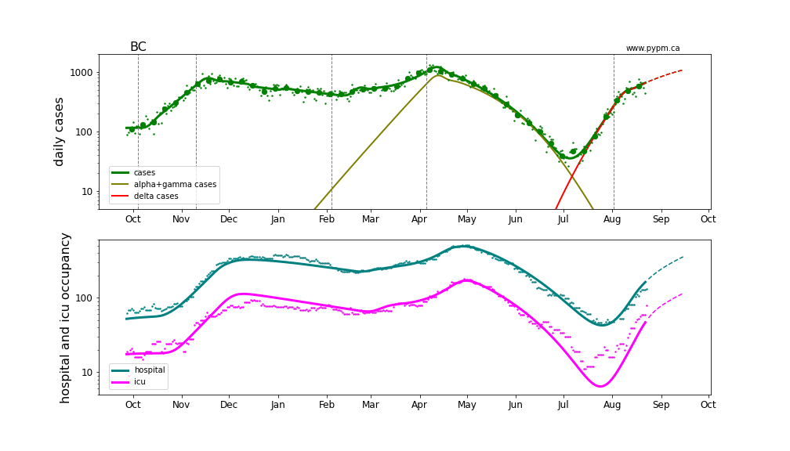

## August 24, 2021 Analysis of BC regional data

This page shows results of analyses reported in our regular [BC COVID-19 Modelling Group](https://bccovid-19group.ca/) reports.

## Fits to each health authority case data

All health authorities are experiencing rapid growth in cases due to the delta variant.

The following shows graphs of daily cases on linear and log scale.

The dashed curves illustrate how cases from the variants overtook the cases from the original strains, and
note the hypothesized introduction of delta at a low level and low rate of growth, consistent with
what was known at that time.

A change in transmission rate at the end of March is included in the fits, to account for the
"circuit breaker" restrictions brought into force.
The transition date is fit for each region individually.

A transition is included for the Interior, since there appears to be a slight reduction in growth rate recently,
likely the result of additional health measures brought into force in late July.
This is also apparent in the overall BC case history, so a transition is also included.
The transition dates are found by optimizing goodness of fit.

### [BC total](img/bc_2_9_0824.pdf)

### [Fraser](img/fraser_2_9_0824.pdf)

### [Interior](img/interior_2_9_0824.pdf)

### [Island](img/island_2_9_0824.pdf)

### [Coastal](img/coastal_2_9_0824.pdf)

### [Northern](img/northern_2_9_0824.pdf)

## Recent transition to growth

The recent transition to rapid growth is seen more clearly in the plot below.

The table below indicates the growth rates for each region for recent analyses

Region | July 28 | Aug 3 | Aug 10 | Aug 16 | Aug 24
---|---|---|---
BC | +9% / day | +9% / day | +9% / day | +8% / day | +3% / day
Fraser | +8% / day | +7% / day | +8% / day | +7% / day | +7% / day
Interior | +12% / day | +11% / day | +8% / day | +6% / day | +1% / day
Coastal | +6% / day | +6% / day | +7% / day | +7% / day | +6% / day
Island | - | +7% / day | +9% / day | +9% / day | +7% / day
Northern | - | +14% / day | +15% / day | +14% / day | +10% / day

The growth rates are consistent from week to week, except for the reduction in Interior,
which also affects the overall growth.
Growth appears to be sustained in the other regions.
If that continues, then the growth rate for the province will return to 7-8%/day when the other
regions start to produce the most cases.
With growing immunity, the model predicts decling growth rates of about 0.3%/day per week.

## Hospitalization projections

The figure below shows unfitted projections for hospital and ICU occupancy, assuming the growth in case rates from the figure above.
It can be seen in the graphs that growth in hospital occupancy will be delayed compared to the growth in cases.
The rise in hospitalization due to the recent growth of delta is following at the expected level.

The plots are shown in linear and log-scale.

## [return to case studies](../index.md)

