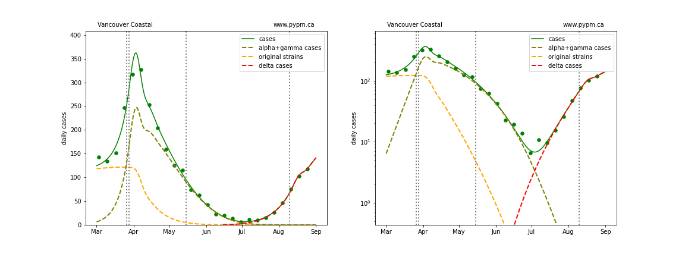

## August 30, 2021 Analysis of BC regional data

This page shows results of analyses reported in our regular [BC COVID-19 Modelling Group](https://bccovid-19group.ca/) reports.

## Fits to each health authority case data

The public health measures brought into force for the Interior Health Authority in late July have successfuly
reduced the growth rate to nearly zero.
The growth rates in the other regions have also reduced significantly.
The full effect of the province-wide mask mandate instituted in August 25 is not yet seen, given the
time-lag from infection to reported case.
As a result, we expect to see growth rates to decline further in the coming days.

The following shows graphs of daily cases on linear and log scale.

The dashed curves illustrate how cases from the variants overtook the cases from the original strains, and
note the hypothesized introduction of delta at a low level and low rate of growth, consistent with
what was known at that time.

### [BC total](img/bc_2_9_0830.pdf)

### [Fraser](img/fraser_2_9_0830.pdf)

### [Interior](img/interior_2_9_0830.pdf)

### [Island](img/island_2_9_0830.pdf)

### [Coastal](img/coastal_2_9_0830.pdf)

### [Northern](img/northern_2_9_0830.pdf)

## Recent transition to growth

The recent transition to rapid growth is seen more clearly in the plot below.

The table below indicates the growth rates for each region for recent analyses

Region | July 28 | Aug 3 | Aug 10 | Aug 16 | Aug 24 | Aug 30
---|---|---|---|---|---|---
BC | +9% / day | +9% / day | +9% / day | +8% / day | +3% / day | +2% / day
Fraser | +8% / day | +7% / day | +8% / day | +7% / day | +7% / day | +3% / day
Interior | +12% / day | +11% / day | +8% / day | +6% / day | +1% / day | 0% / day
Coastal | +6% / day | +6% / day | +7% / day | +7% / day | +6% / day | +2% / day
Island | - | +7% / day | +9% / day | +9% / day | +7% / day | +4% / day
Northern | - | +14% / day | +15% / day | +14% / day | +10% / day | +5% / day

The growth rates were roughly consistent from week to week prior to this report,
except for the significant reduction in Interior,
which also affects the overall growth.
The decline in growth rates is now apparent in all regoins.
The low case rates in Northern and Vancouver Island HA leads to larger variance of the
growth rate estimators.

## Hospitalization projections

The figure below shows unfitted projections for hospital and ICU occupancy, assuming the growth in case rates from the figure above.
It can be seen in the graphs that growth in hospital occupancy will be delayed compared to the growth in cases.
The rise in hospitalization due to the recent growth of delta is apparent, although the ICU occupancy is somewhat higher and
the overall hospitalization is somewhat lower.

The plots are shown in linear and log-scale.

## [return to case studies](../index.md)

