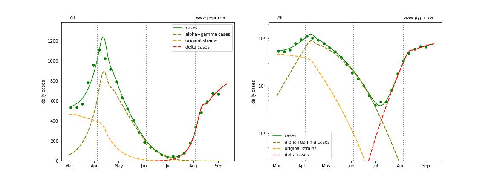
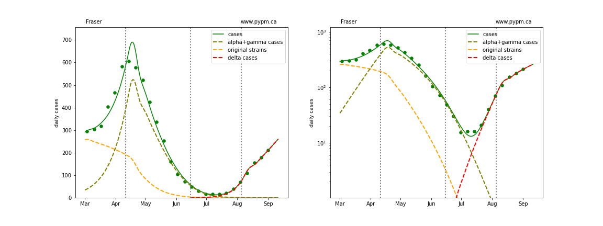
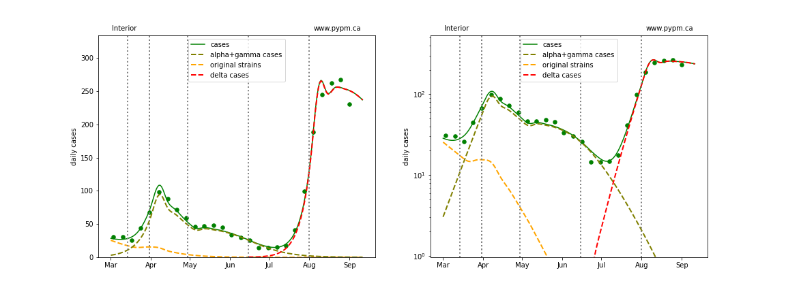
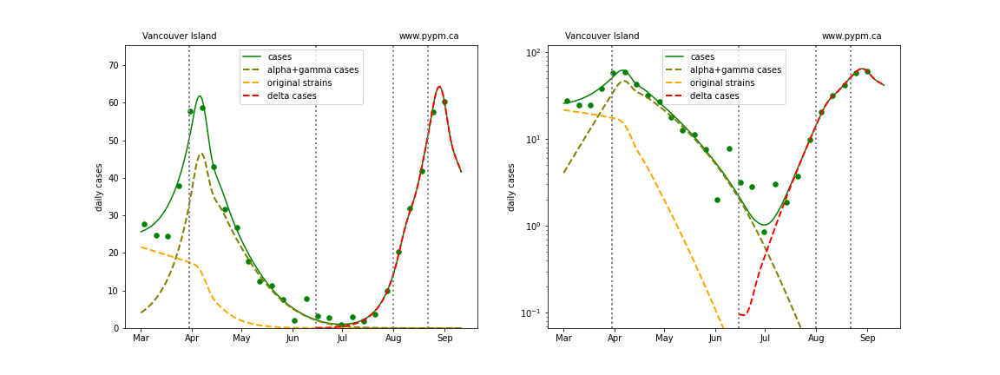
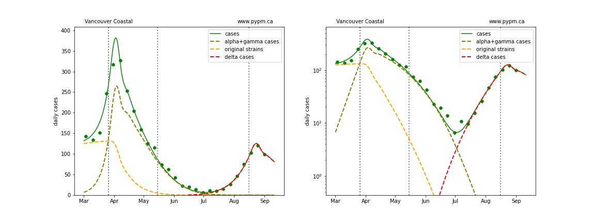
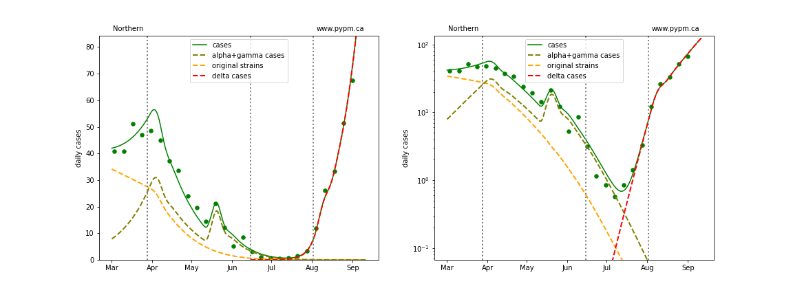

## September 7, 2021 Analysis of BC regional data

This page shows results of analyses
reported in our regular [BC COVID-19 Modelling Group](https://bccovid-19group.ca/) reports.

## Fits to each health authority case data

The public health measures brought into force for the Interior Health Authority in late July have successfuly
reduced the growth rate to nearly zero.
The growth rates in the other regions have also reduced significantly.

The effect of the province-wide mask mandate instituted on August 25 may not be influencing the
growth rate of reported cases.
As usual, transmission rates estimates have large uncertainty soon after changes.
Another week of data will improve the estimates substantially.
Hospitalization projections are not included in this analysis, since growth rates are not yet established.

The following shows graphs of daily cases on linear and log scale.
The curves show the best fit at this time, the table below shows uncertainty in the growth rate estimates.

### [BC total](img/bc_2_9_0907.pdf)

### [Fraser](img/fraser_2_9_0907.pdf)

### [Interior](img/interior_2_9_0907.pdf)

### [Island](img/island_2_9_0907.pdf)

### [Coastal](img/coastal_2_9_0907.pdf)

### [Northern](img/northern_2_9_0907.pdf)

## Summary of growth rates estimates

The table below indicates the growth rates (shown as percent per day)
for each region for recent analyses.
The trend to reduced growth rates is evident.
Typical uncertainty (68% CL) is a 1%/day, but for the current estimates, the uncertainties are
larger, so are included in the table.

Region | July 28 | Aug 3 | Aug 10 | Aug 16 | Aug 24 | Aug 30 | Sept 7
---|---|---|---|---|---|---|---
BC | +9%  | +9%  | +9%  | +8%  | +3%  | +2%  | +1% +/- 1%  
Fraser | +8%  | +7%  | +8%  | +7%  | +7%  | +3%  | +2% +/- 1%  
Interior | +12%  | +11%  | +8%  | +6%  | +1%  | 0%  | -1% +/- 1%  
Coastal | +6%  | +6%  | +7%  | +7%  | +6%  | +2%  | -2% +/- 3%  
Island | - | +7%  | +9%  | +9%  | +7%  | +4%  | -3% +/- 4%  
Northern | - | +14%  | +15%  | +14%  | +10%  | +5%  | +5% +/- 3%  

## [return to case studies](../index.md)

