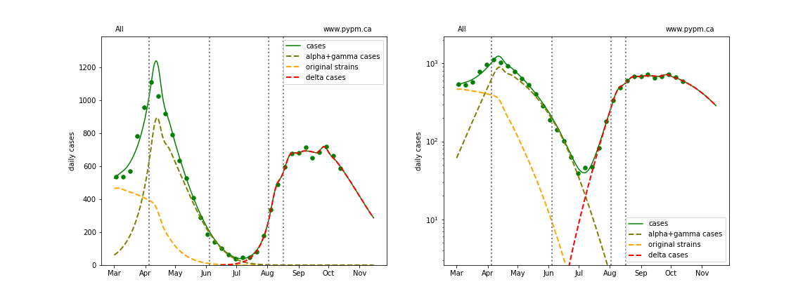
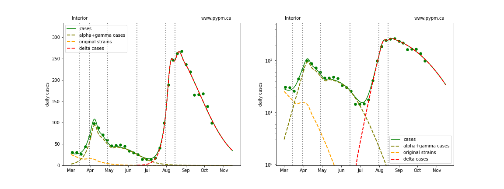
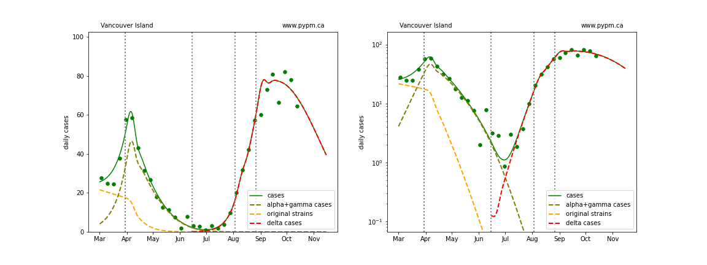
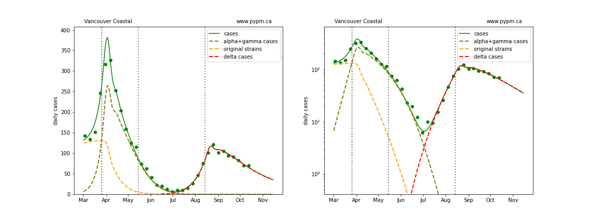
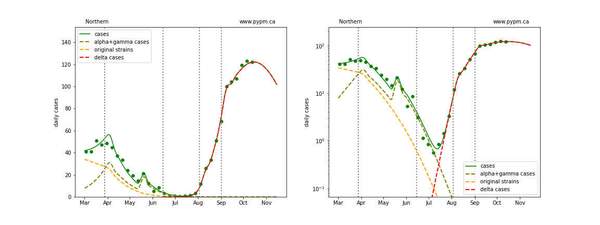
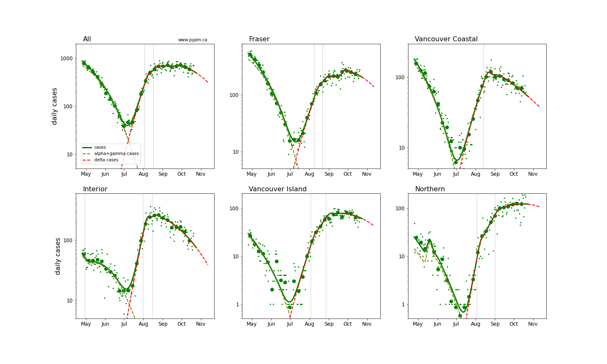
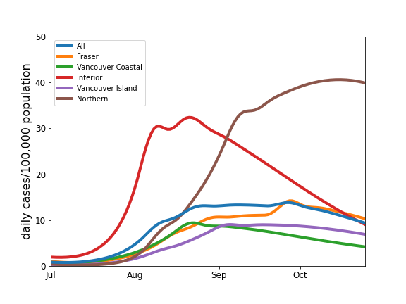
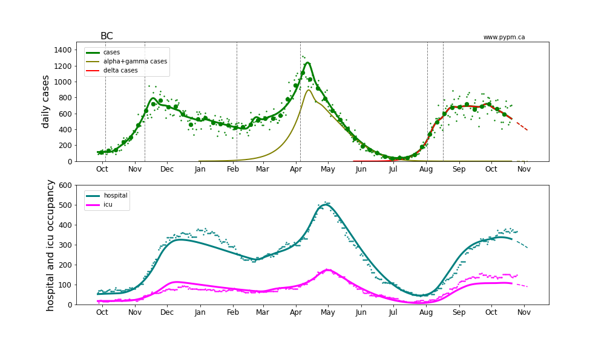
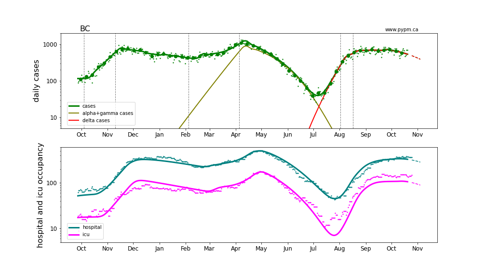

## October 25, 2021 Analysis of BC regional data

This page shows results of analyses reported in our regular [BC COVID-19 Modelling Group](https://bccovid-19group.ca/) reports.

## Fits to each health authority case data

The public health measures brought into force
have stopped or slowed the growth in daily cases in all health regions.

The following shows graphs of daily cases on linear and log scale.

The dashed curves illustrate how cases from the variants overtook the cases from the original strains, and
note the hypothesized introduction of delta at a low level and low rate of growth, consistent with
what was known at that time.

### [BC total](img/bc_2_9_1025.pdf)

### [Fraser](img/fraser_2_9_1025.pdf)

### [Interior](img/interior_2_9_1025.pdf)

### [Island](img/island_2_9_1025.pdf)

### [Coastal](img/coastal_2_9_1025.pdf)

### [Northern](img/northern_2_9_1025.pdf)

## Comparison of case rates for the health authorities

The recent case history for all health authorities are compared on log scale below.

The table below indicates the growth rates (shown as percent per day)
for each region for recent analyses.
The trend to reduced growth rates is evident.
Typical uncertainty (68% CL) is about 1%/day.
For estimates shortly after a transition, the uncertainties are
larger, and are included in the table.

Region | Aug 24 | Aug 30 | Sep 7 | Sep 13 | Sep 21 | Sep 28 | Oct 4 | Oct 13 | Oct 25
---|---|---|---|---|---|---|---|---|---
BC | +3%  | +2%  | +1% +/- 1% | +1% +/- 1% | 0% | -1% | -1% | -1% | -2%
Fraser | +7%  | +3%  | +2% +/- 1% | +2% +/- 1% | +1% | 0% | -1% | -1% | -2%
Interior | +1%  | 0%  | -1% +/- 1% | -1% +/- 1% | -2% | -3% | -2% | -3% | -3%
Coastal | +6%  | +2%  | -2% +/- 3% | -1% +/- 2% | -1% | -2% | -2% | -2% | -2%
Island | +7%  | +4%  | -3% +/- 4% | +1% +/- 3% | +1% | +1% | 0% | 0% | -1%
Northern | +10%  | +5%  | +5% +/- 3% | +5% +/- 2% | +2% | +1%  | +1% | 0% | 0%

The plot below compares the daily cases as a proportion of HA population.
Cases per capita in the Northern HA is similar to the levels reached in Alberta and Saskatchewan.

## Hospitalization projections

The figure below shows projections for hospital and ICU occupancy (calibrated to the third wave),
assuming the growth in case rates from the figure above.
It can be seen in the graphs that growth in hospital occupancy are delayed compared to the growth in cases.

The plots are shown in linear and log-scale.

## [return to case studies](../index.md)

