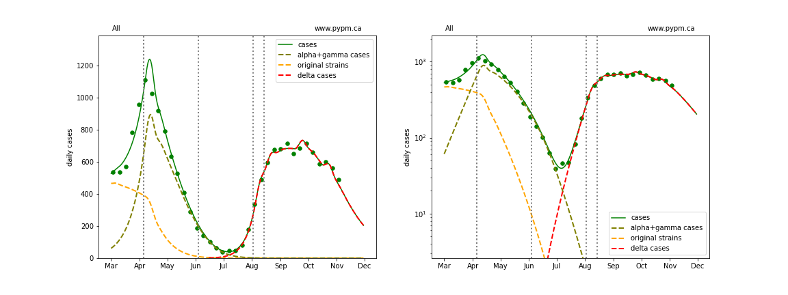
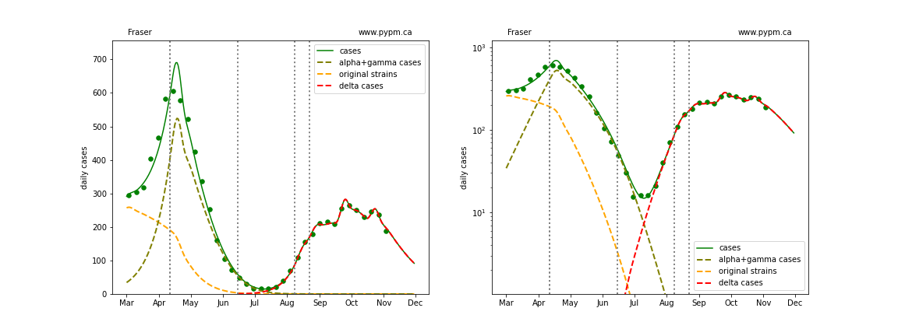
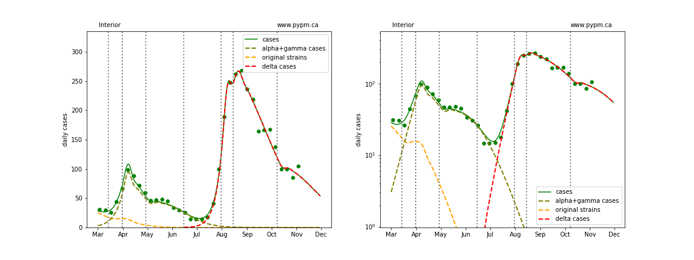
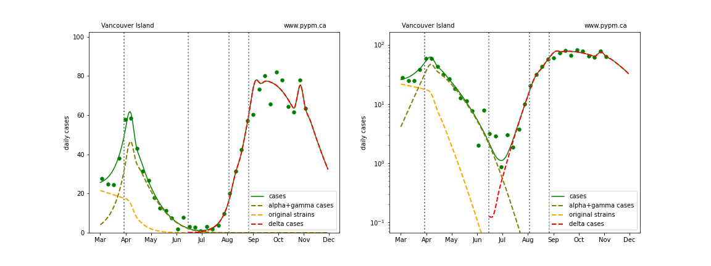
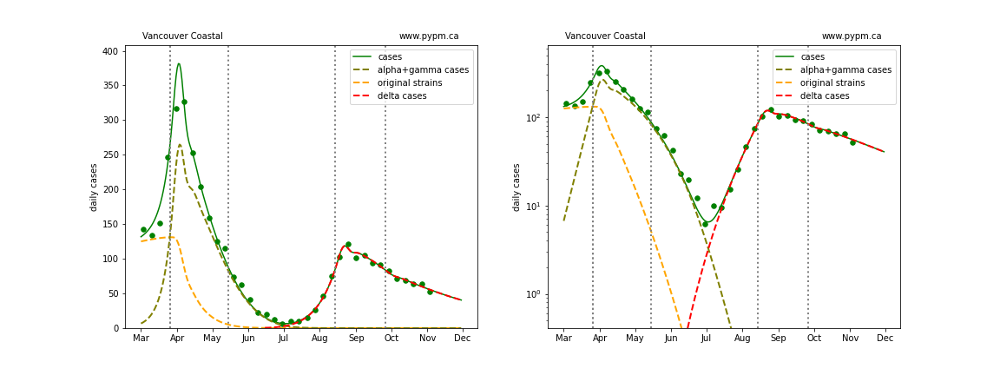
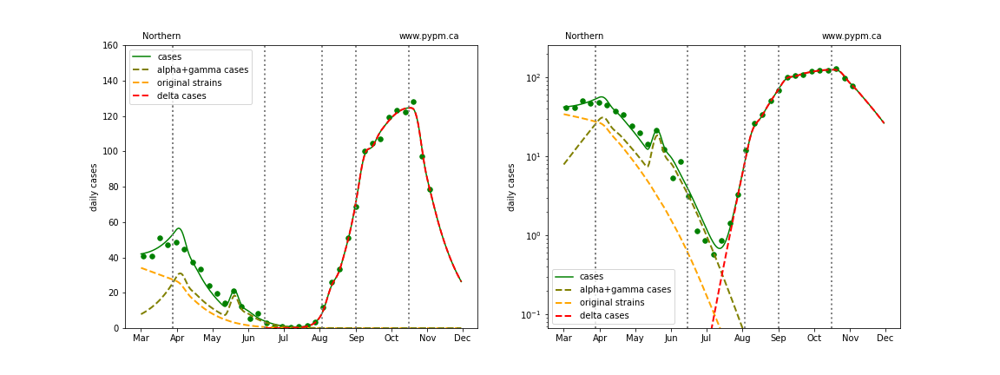
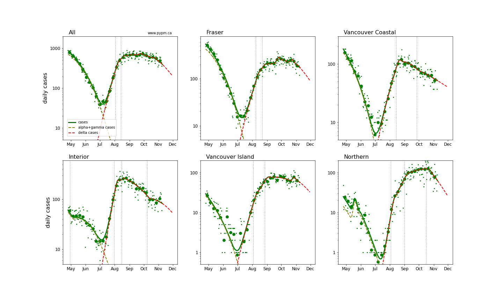
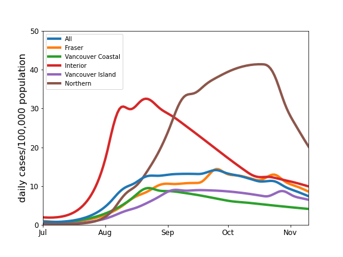
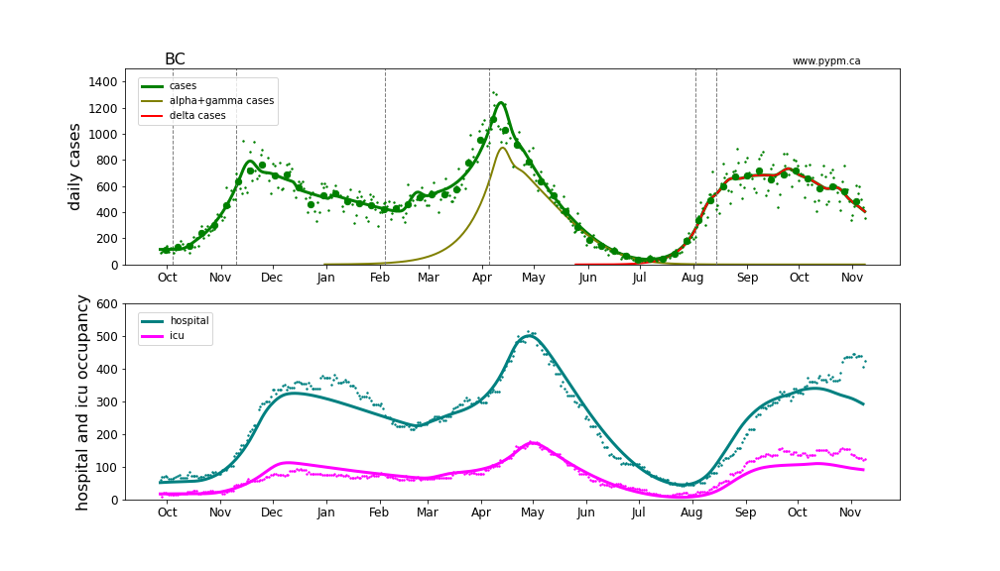
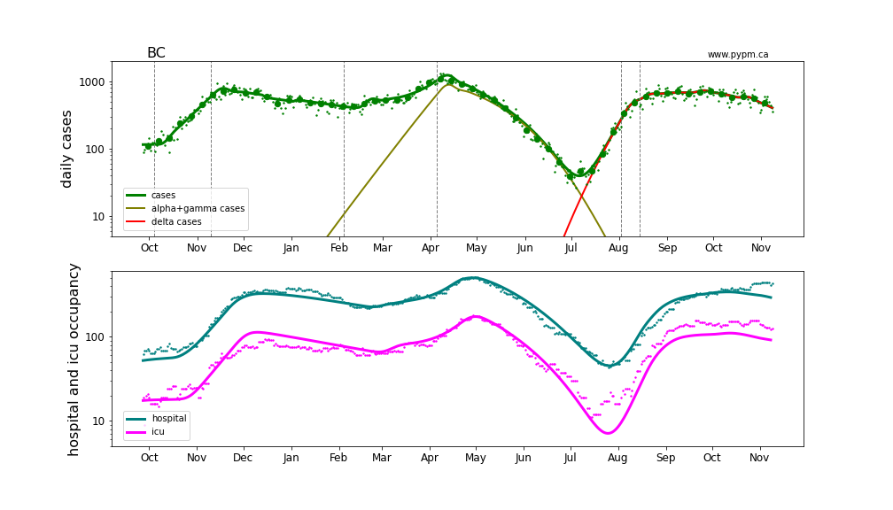

## November 10, 2021 Analysis of BC regional data

This page shows results of analyses reported in our regular [BC COVID-19 Modelling Group](https://bccovid-19group.ca/) reports.

## Fits to each health authority case data

The following shows graphs of daily cases on linear and log scale.

The dashed curves illustrate how cases from the variants overtook the cases from the original strains, and
note the hypothesized introduction of delta at a low level and low rate of growth, consistent with
what was known at that time.

While the general tendency of a slow decline in daily growth rate continues, the fits indicate
a few recent transitions to a higher growth rate, and 2 outbreaks in Fraser and 1 on Vancouver Island.
These outbreaks are included in the overall BC fit.

The Northern HA has seen a dramatic reduction in transmission rate.
The model fit the date for the transition to be October 16, consistent with the date that
new measures were brought into force for that region (Midnight, October 14).

### [BC total](img/bc_2_9_1110.pdf)

### [Fraser](img/fraser_2_9_1110.pdf)

### [Interior](img/interior_2_9_1110.pdf)

### [Island](img/island_2_9_1110.pdf)

### [Coastal](img/coastal_2_9_1110.pdf)

### [Northern](img/northern_2_9_1110.pdf)

## Comparison of case rates for the health authorities

The recent case history for all health authorities are compared on log scale below.

The table below indicates the growth rates (shown as percent per day)
for each region for recent analyses.
The trend to reduced growth rates is evident.
Typical uncertainty (68% CL) is about 1%/day.
For estimates shortly after a transition, the uncertainties are
larger, and are included in the table.

Region | Aug 30 | Sep 7 | Sep 13 | Sep 21 | Sep 28 | Oct 4 | Oct 13 | Oct 25 | Nov 11
---|---|---|---|---|---|---|---|---|---
BC | +2%  | +1% +/- 1% | +1% +/- 1% | 0% | -1% | -1% | -1% | -2% | -3%
Fraser | +3%  | +2% +/- 1% | +2% +/- 1% | +1% | 0% | -1% | -1% | -2% | -3%
Interior | 0%  | -1% +/- 1% | -1% +/- 1% | -2% | -3% | -2% | -3% | -3% | -2%
Coastal | +2%  | -2% +/- 3% | -1% +/- 2% | -1% | -2% | -2% | -2% | -2% | -1%
Island | +4%  | -3% +/- 4% | +1% +/- 3% | +1% | +1% | 0% | 0% | -1% | -2%
Northern | +5%  | +5% +/- 3% | +5% +/- 2% | +2% | +1%  | +1% | 0% | 0% | -4%

The plot below compares the daily cases as a proportion of HA population.
Cases per capita in the Northern HA is similar to the levels reached in Alberta and Saskatchewan.

## Hospitalization projections

The figure below shows projections for hospital and ICU occupancy (calibrated to the third wave),
assuming the growth in case rates from the figure above.
It can be seen in the graphs that growth in hospital occupancy are delayed compared to the growth in cases.
ICU occupancy is higher in the fourth wave, and recently the hospital occupancy has unexpectedly increased.

The plots are shown in linear and log-scale.

## [return to case studies](../index.md)

