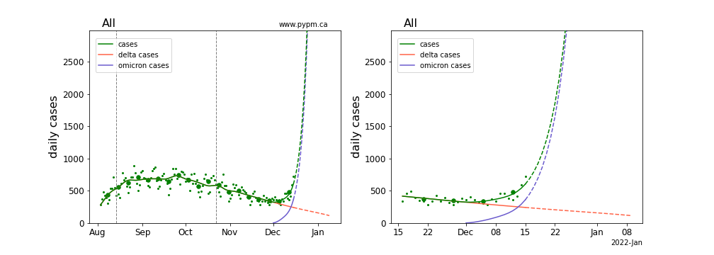
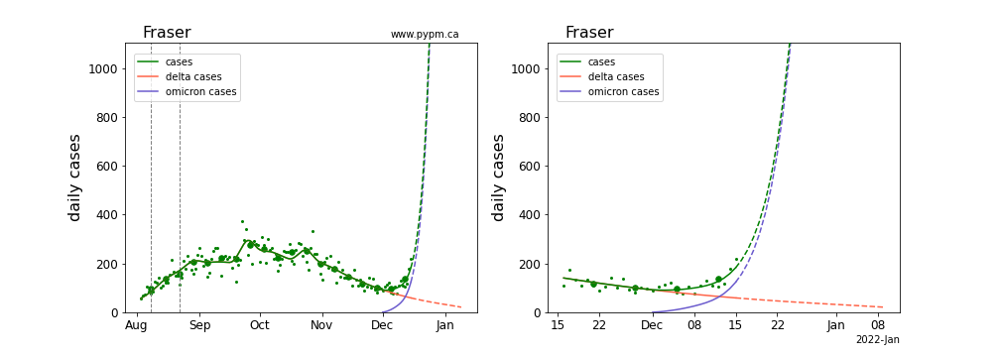
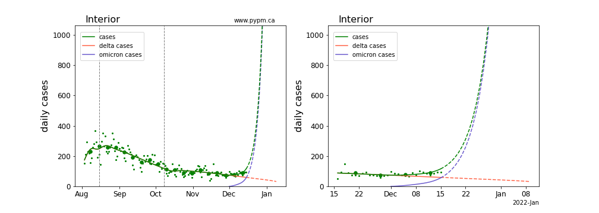
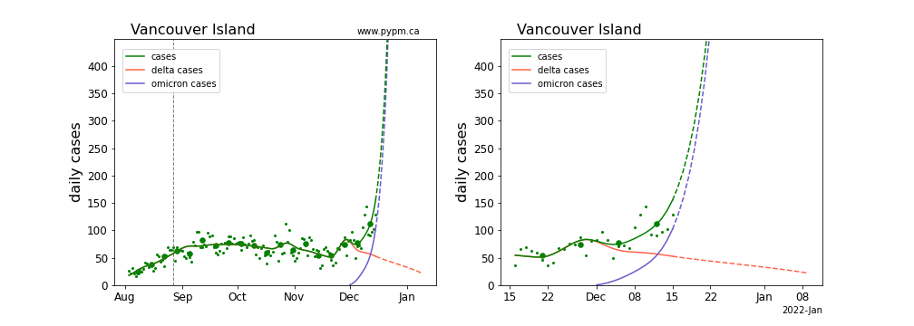
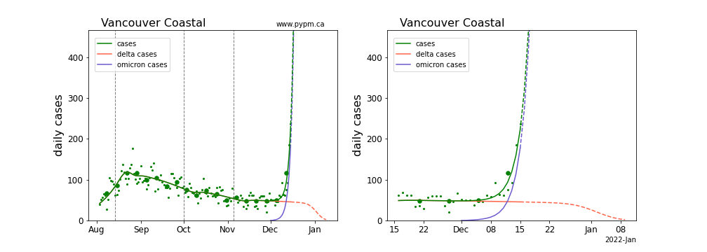
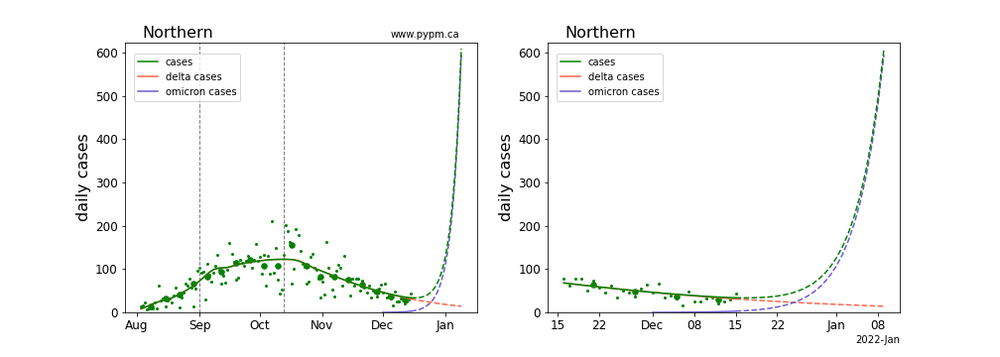

## December 16, 2021 Analysis of BC regional data: omicron projections

This page shows results of analyses reported in our regular [BC COVID-19 Modelling Group](https://bccovid-19group.ca/) reports.

## Projections for each health authority case data

Omicron parameters are estimated by fitting
models to case data for each health authority.
For the larger authorities, both the omicron growth rate and
its current fraction of cases can be fit.
For the others, a fixed growth rate of 25%/day is assumed, and the
current fraction is fit.
The Northern HA does not yet show evidence for omicron in the case
data, so its current fraction is set to 10%.

The Coastal HA best fit has a very large growth rate (55%/day).
Since there are very few data points and there are large
fluctuations from reporting issues, more data is required to
confirm such a large growth rate.

For more information, please refer to the introductory
material in the report on [provincial analyses](../prov20211216/index.md).

### [BC total](img/bc_4_1_1216_linear_omicron.pdf)

### [Fraser](img/fraser_4_1_1216_linear_omicron.pdf)

### [Interior](img/interior_4_1_1216_linear_omicron.pdf)

### [Island](img/island_4_1_1216_linear_omicron.pdf)

### [Coastal](img/coastal_4_1_1216_linear_omicron.pdf)

### [Northern](img/northern_4_1_1216_linear_omicron.pdf)

## Comparison of omicron parameters for the health authorities

The table below indicates the omicron growth rates (shown as percent per day)
and the current fraction of cases omicron is producing (percent).
Values in parenthesis are not estimated from data, but instead indicate the assumed values.
Uncertainties in these estimates are relatively large - no attempt to assess them, given the rapidly changing
situation.

Region | growth (%/day), fraction (%)
---|---
BC | 25, 66 
Fraser | 27, 73
Interior | (25), 55
Coastal | 55, 86
Island | (25), 71
Northern | (25), (10)

## [return to case studies](../index.md)

