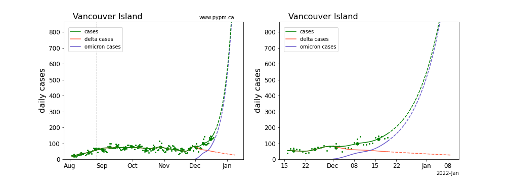

## December 20, 2021 Analysis of BC regional data: omicron projections

This page shows results of analyses reported in our regular [BC COVID-19 Modelling Group](https://bccovid-19group.ca/) reports.

## Projections for each health authority case data

Omicron parameters are estimated by fitting
models to case data for each health authority.
For the larger authorities, both the omicron growth rate and
its current fraction of cases are estimated.
The Northern HA does not yet show evidence for omicron in the case
data, so its growth rate is set to 25% per day and its current fraction is set to 10%.

The Interior and Vancouver Island HA data difficult to interpret, due to recent bursts of
infections (of either delta or omicron).
More data are needed to better estimate the omicron parameters, 
and revised estimates will likely be closer to typical growth rates for omicron.

The projections, which assume constant behaviour and testing, continue to rise beyond the maxima
shown in the figures. The plots show daily cases up to a maximum of 100 cases per 100,000 population. 

For more information, please refer to the introductory
material in the report on [provincial analyses](../prov20211220/index.md).

### [BC total](img/bc_4_1_1220_linear_omicron.pdf)

### [Fraser](img/fraser_4_1_1220_linear_omicron.pdf)

### [Interior](img/interior_4_1_1220_linear_omicron.pdf)

### [Island](img/island_4_1_1220_linear_omicron.pdf)

### [Coastal](img/coastal_4_1_1220_linear_omicron.pdf)

### [Northern](img/northern_4_1_1220_linear_omicron.pdf)

## Comparison of omicron parameters for the health authorities

The table below indicates the omicron growth rates (shown as percent per day)
and the current fraction of cases omicron is producing (percent).
Values in parenthesis are not estimated from data, but instead indicate the assumed values.
Uncertainties in these estimates are relatively large - no attempt to assess them, given the rapidly changing
situation.

Region | growth (%/day), fraction (%)
---|---
BC | 23, 83 
Fraser | 25, 88
Interior | 17, 49
Coastal | 29, 93
Island | 13, 73
Northern | (25), (10)

## [return to case studies](../index.md)

