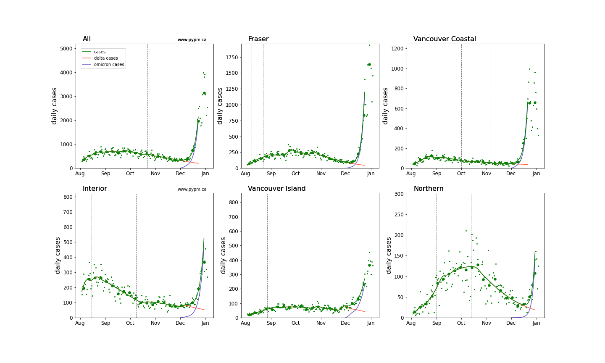
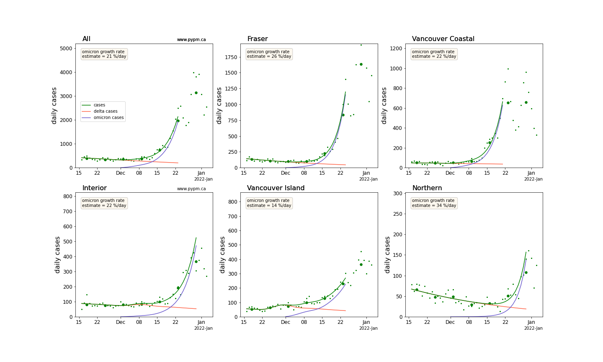
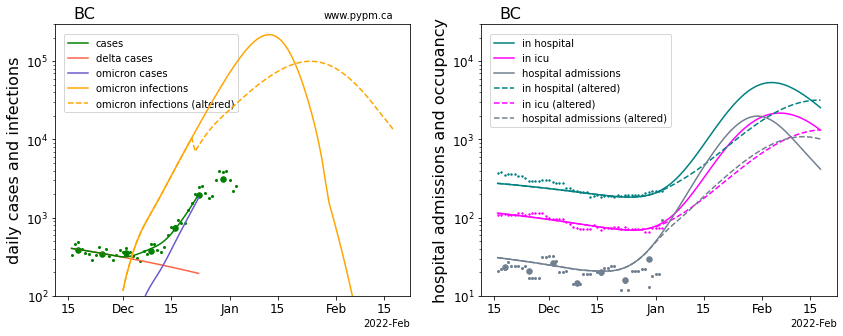
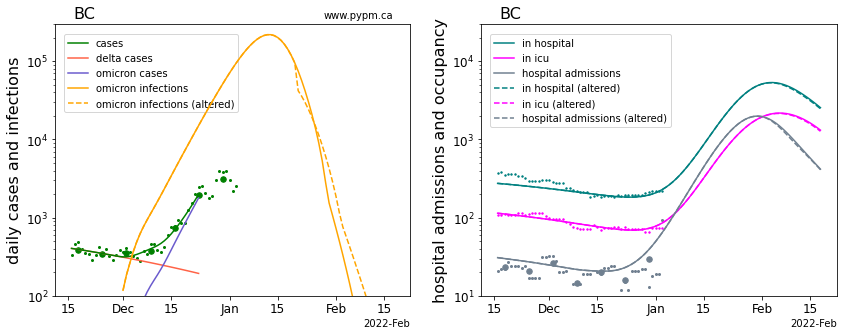
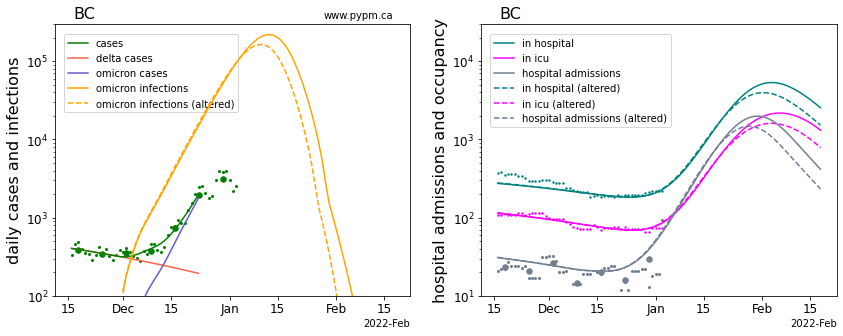
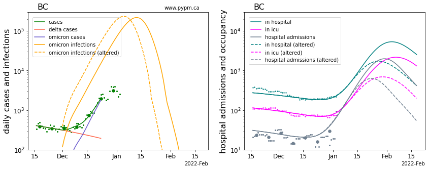

## January 4, 2021 Analysis of BC Omicron projections

This page shows results of analyses reported in our recent [BC COVID-19 Modelling Group](https://bccovid-19group.ca/) report.
Projections for other provinces are found [here](https://pypm.github.io/home/docs/studies/prov20220104/).

### Projections for Omicron

Omicron parameters are estimated by fitting models to case data for each health authority.
With testing capacity reached, case data from late December can no longer be used.
As a result, current growth rate of Omicron infections is not well known, and projections
generally assume constant growth rate, although the effects of changing transmssion rates are shown
in specific studies below.

Model fits to data showing how Delta and Omicron cases combine to give overall cases is shown below.
The maximum scale corresponds to 100 cases per 100,000 in each health authority.
The model curves end at the point that case data is no longer considered reliable due to testing capacity limits.
Small points are daily data and larger circles show weekly averages to guide the eye.

[pdf version](img/HA_4_1_1231_linear_omicron.pdf)

A zoomed in version, showing recent data, with a maximum scale of 50 cases per 100,000 is below:

[pdf version](img/HA2_4_1_1231_linear_omicron.pdf)

### Longer term projections for BC

There is a great deal of uncertainty in longer term projections.
The following shows 6-week projections for a set of nominal assumptions 
and for adjustments to those assumptions, to indicate sensitivity to the assumptions:

Model Parameter | Nominal | Altered
---|---|---
transmission rate | constant | 50% reduction in December or January
2-dose vaccine effectiveness against Omicron | 20% | 50%
fraction of Omicron infections reported | same as earlier variants | 0.3 times the reporting fraction for earlier variants
fraction of Omicron infections requiring hospitalization | 0.3 times the hospitalization fraction of earlier variants | 0.1 or 0.5 times the hospitalization fraction of earlier variants

Projections show infections instead of cases, 
since the reporting fraction is unknown and likely to change in the future, due to capacity limitations.
Projections do not include hospitalization capacity limits or changes to admission policies.
Heterogeneity (not present in these homogeneous models) may result in earlier onset of herd immunity.

### [Reduction in transmission rate (December 21)](img/bc_4_1_1231_trans1.pdf)

The solid yellow curve shows Omicron daily infections that led to the observed cases (after a delay). 
With a constant transmission rate, infections begin to decline in mid-January due to the herd effect.
The dashed yellow curve shows Omicron infections had transmission reduced on December 21, 
reducing growth rate from 20% to 10% per day, infection and hospitalization peaks reduced by about 50%, 
but capacity limits are still exceeded.

### [Reduction in transmission rate (January 5)](img/bc_4_1_1231_trans2.pdf)

The dashed yellow curve shows Omicron infections had the same reduction in transmission occured on January 5.
Infection and hospitalization peaks are reduced by about 30%. 

### [Reduction in transmission rate (January 20)](img/bc_4_1_1231_trans3.pdf)

The dashed yellow curve shows Omicron infections for the same reduction in transmission occuring on January 20,
midway through the rise in hospital demand. 
The reduced transmission rate comes too late to have any substantial effect.

### [Increased vaccine effectiveness against Omicron](img/bc_4_1_1231_escape.pdf)

Omicron has higher growth rates than Delta in part because the effectiveness of 2-dose vaccination is lower
against Omicron infections.
The solid curves shows projections assuming effectiveness of 2-dose vaccination against Omicron is 20%.
For the dashed curves, the effectiveness is adjusted to be 50% 
and the transmission rate is adjusted to fit case data. 
Since a larger fraction of the population is immunized against Omicron, 
herd immunity is reached earlier and peak hospital demands are reduced, but still exceed capacity.

### [Reduced fraction of Omicron infections reported](img/bc_4_1_1231_asympt.pdf)

For the solid curves, the fraction of Omicron infections reported in early December is the same as for other variants.
For the dasehd curves, the fraction of Omicron infections reported is 0.3 times the reporting fraction 
for other variants. 
In this scenario, we are further along the infection trajectory than we realized. 
As a result, herd immunity comes earlier than expected and Omicron severity is lower than estimated from data.

### [Omicron severity](img/bc_4_1_1231_severity.pdf)

Solid hospital curves assume that the fraction of Omicron infections requiring hospitalization is 0.3 
times the hospitalization fraction for Delta. 
The duration for hospital stay is 0.4 times that of Delta. 
These values are estimated from a [study](https://pypm.github.io/home/docs/studies/usa20220102/) 
of US states where Omicron has been dominant for weeks.
Alternative Omicron hospitalization scale factors: low (0.1) high (0.5). 
The duration scale factor is kept at 0.4.

## [return to case studies](../index.md)

