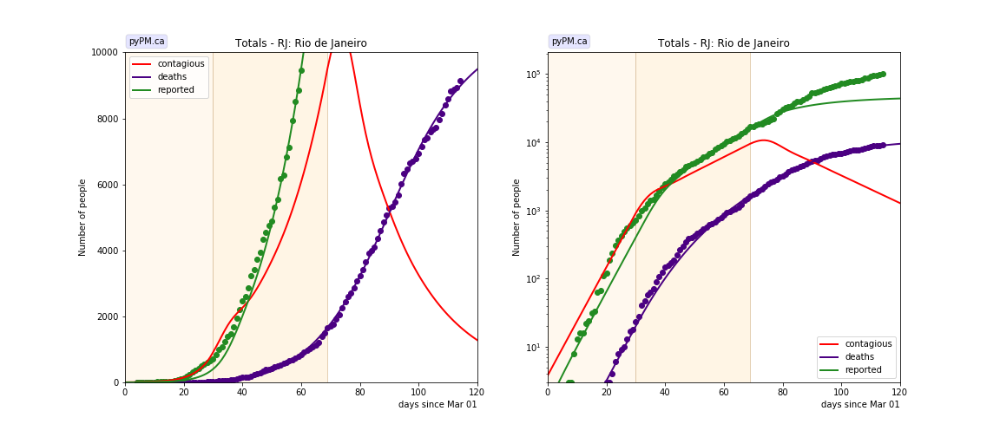

## June 24, 2020 Analysis of Brazil state data

Data from March 1-June 23 were included in this analysis.
The case data does not follow the expected steady state trajectories.
Instead, the death data was fit, yielding, reasonable fits.
The case data shows a faster growth rate than the death data.

### Acre

### Alagoas

### Amapa

### Amazonas

### Bahia

### Ceara

### Distrito Federal

### Espirito Santo

### Goias

### Maranhao

### Mato Grosso

### Para

### Paraiba

### Parana

### Pernambuco

### Piaui

### Rio de Janeiro

### Rio Grande do Norte

### Rio Grande do Sul

### Sao Paulo

## Tables

The tables below are results from the fits to reference model 2.3.
These are shown for purposes of comparison.

### daily growth/decline rates (&delta;)

state| &delta;0 | day 1 | &delta;1 | day 2 | &delta;2 | day 3 | &delta;3  
---|---|---|---|---|---|---|---
AC|0.076|72|-0.035
AL|0.103|58|0.004
AM|0.137|46|-0.033
AP|0.099|60|-0.006
BA|0.072|62|0.015
CE|0.089|55|0.001
DF|0.072|20|0.021|44|0.113|60|0.038
ES|0.092|54|0.023
GO|0.104|36|0.035
MA|0.162|41|0.010
MT|0.191|27|0.003|50|0.091
PA|0.173|57|-0.041
PB|0.142|35|0.030
PE|0.098|51|-0.010
PI|0.126|55|0.038
PR|0.162|25|-0.062|47|0.060
RJ|0.200|30|0.052|69|-0.042
RN|0.058|80|-0.025
RS|0.209|20|0.002|40|0.029
SP|0.199|24|0.024|59|0.010

## [return to case studies](../index.md)

