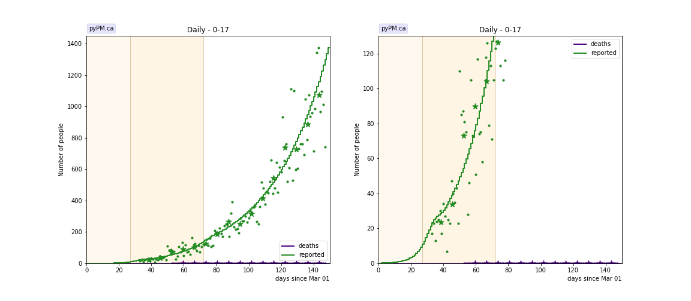
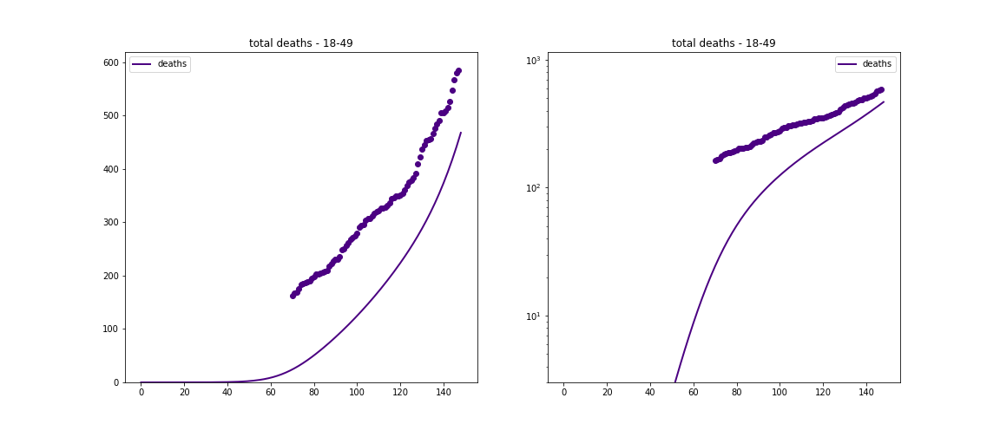
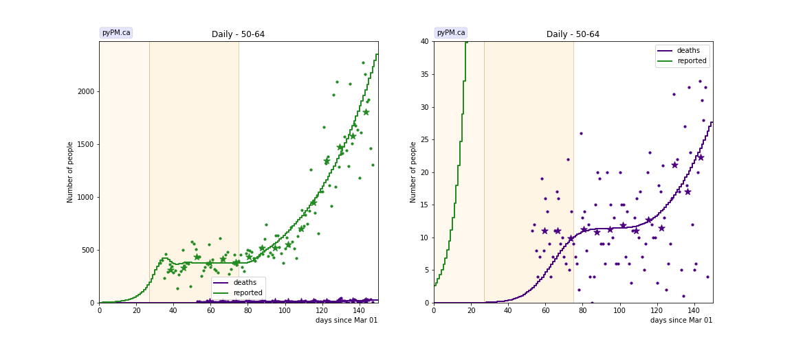
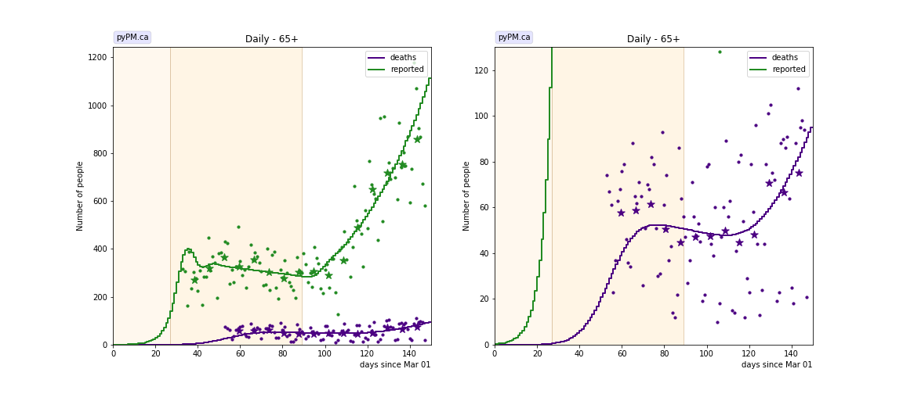
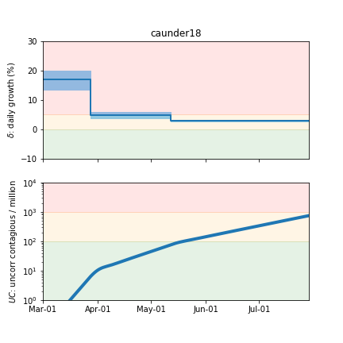
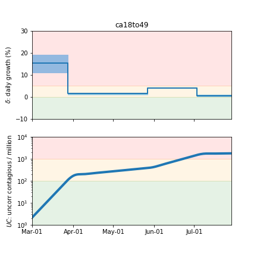
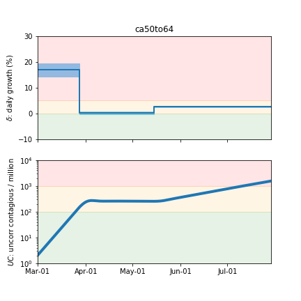

## July 29, 2020 Analysis of California data (in age groups)

Early in the pandemic, homogeneous models were able to describe US state cases, hospitalizations, and deaths by a
set of transmission rates and delays that applied to the entire population.
Starting in May, the trajectories for hospitalizations and deaths started to diverge from
model predicitions, in which transmission rates were estimated from case data alone.
Growth in hospitalizations and deaths were 1-3% lower than the growth in cases.
This was attributed to be due to the fact that case growth was primarily coming from younger people, while
the hospitalization and death growth were reflecting growth in older people.

COVID-19 daily case and death data broken down by age group is available from California.
A study was performed to understand how to account for this effect in all states.
Surprisingly, the death data suggests much longer times from infection to death that was
found in the study of data from German states.

The following shows graphs of daily cases and deaths, for different age groups, compared with model fits.
The first transition date is fixed to the day found from a fit to state-wide data.
The other transition dates were fit for each age group.

### [Under 18](img/caunder18_2_3_0728.pdf)

No deaths are reported in this group.
This group had the largest growth rate during the lockdown phase.

### [18-49](img/ca18to49_2_3_0728.pdf)

This group had the largest growth rate (about 4% per day) following relaxation of social distancing rules.
The other groups grew at 2.5%-3% per day.

### [50-64](img/ca50to64_2_3_0728.pdf)

### [65+](img/ca65plus_2_3_0728.pdf)

## Tables

The tables below are results from the fits to reference model 2.3.

### Daily fractional growth rates (&delta;)

group| &delta;0 | day 1 | &delta;1 | day 2 | &delta;2 | day 3 | &delta;3  
---|---|---|---|---|---|---
0-17|0.172 +/- 0.017|27|0.049 +/- 0.005|72|0.030 +/- 0.002
18-49|0.157 +/- 0.021|27|0.015 +/- 0.002|87|0.041 +/- 0.001|124|0.005 +/- 0.002
50-64|0.173 +/- 0.014|27|0.001 +/- 0.003|75|0.027 +/- 0.002
65+|0.248 +/- 0.022|27|-0.002 +/- 0.002|89|0.025 +/- 0.002

* &delta;0: initial daily fractional growth parameter
* day 1: days after March 1, 2020 when transmission rate changed

### Death fraction and mean time to death

group| death fraction | mean death delay
---|---|---
18-49|0.004 +/- 0.001|44.5 +/- 2.6
50-64|0.022 +/- 0.006|42.4 +/- 2.0
65+|0.115 +/- 0.080|31.9 +/- 1.3

* death fraction: fraction of those infected in this group who die. Note that the total number infected is not
well known, so this is only useful as a relative indicator.
* mean death delay: mean time between becoming infectious and death (days). These are significantly longer than
the delay estimated from German state data (18.4 days).

## Infection status

The following plots summarize the infection history.
The upper plot shows the daily growth/decline from the fit. Bands show approximate 95% CL intervals.
The lower plot shows the size of the infection: the uncorrected circulating contagious population per
million.

### [Under 18](img/caunder18-summary.pdf)

### [18-49](img/ca18to49-summary.pdf)

### [50-64](img/ca50to64-summary.pdf)

### [65+](img/ca65plus-summary.pdf)

## [return to case studies](../index.md)

