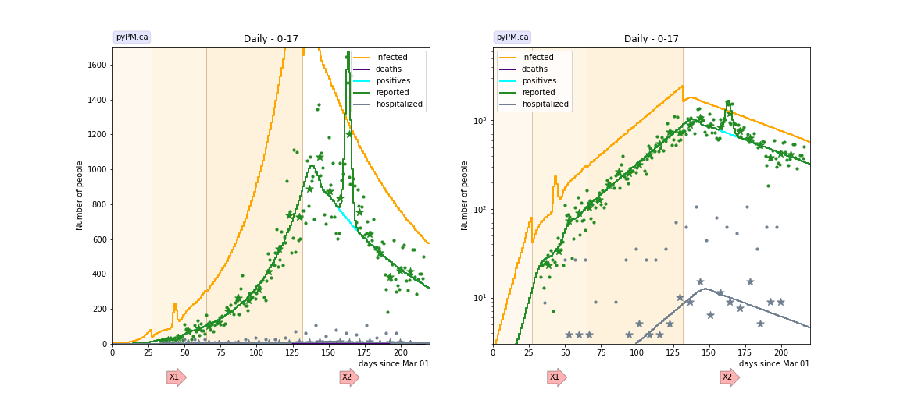
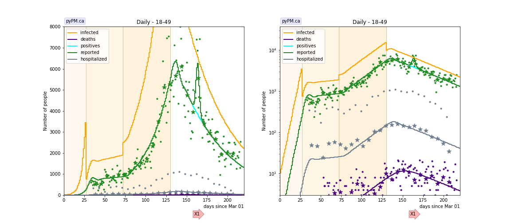
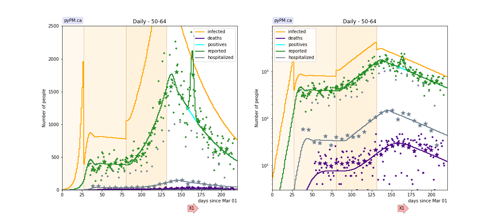
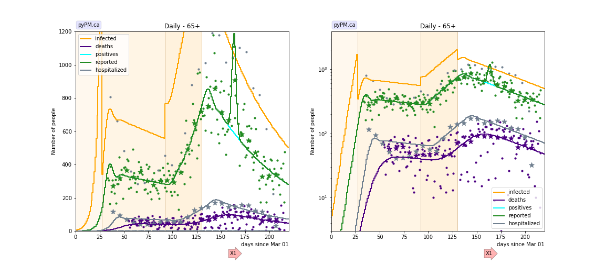
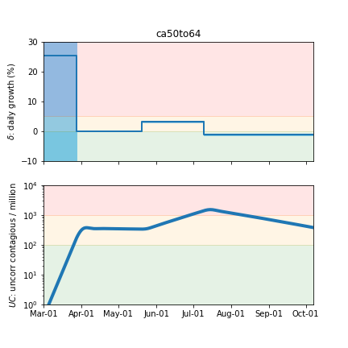
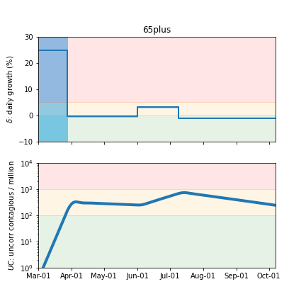

## October 5, 2020 Analysis of California data (in age groups)

Early in the pandemic, homogeneous models were able to describe US state cases, hospitalizations, and deaths by a
set of transmission rates and delays that applied to the entire population.
Starting in May, the trajectories for hospitalizations and deaths started to diverge from
model predicitions, in which transmission rates were estimated from case data alone.
Growth in hospitalizations and deaths were 1-3% lower than the growth in cases.
This was attributed to be due to the fact that case growth was primarily coming from younger people, while
the hospitalization and death growth were reflecting growth in older people.

COVID-19 daily case, death, and hospitalization data broken down by age group is available from California.
The following shows graphs of daily cases, hospitalizations, and deaths, for different age groups,
compared with model fits that estimate the injection trajectory from case data alone.
The first transition date is fixed to the day found from a fit to state-wide data.
The other transition dates were fit for each age group.

This study is used as the basis for heterogenous model studies, including vaccination.
In order to match the best estimate for the ratio of un-reported/reported cases for the US (about 2), the parameter
that specifies the fraction symptomatic people that have a positive test result is reduced from 0.8 (default) to 0.6.
The figures below include the predicted number of newly infected individuals.

### [Under 18](img/caunder18_2_5_1005.pdf)

Very few deaths are reported in this group.
There were very few cases reported in March, and after lockdown, 4% growth was seen,
unlike for the other age groups, where growth declined to less than 1% after lockdown.
After relaxation of lockdown rules, the growth in this group was similar to the other age groups.
The unusual growth pattern might be explained by undersampling of this group in March.

### [18-49](img/ca18to49_2_5_1005.pdf)

This group had the largest growth rate (about 3.6% per day) following relaxation of social distancing rules.
The other groups grew at about 3.2% per day. The growth phase for this group lasted 58 days compared to 51 for the
next older age group. Combining these factors, the overall growth in this group was 56% larger than the growth in
the next older age group for the growth period following relaxation.

### [50-64](img/ca50to64_2_5_1005.pdf)

### [65+](img/ca65plus_2_5_1005.pdf)

## Tables

The tables below are results from the fits to reference model 2.5.

### Daily fractional growth rates (&delta;)

group| &delta;0 | day 1 | &delta;1 | day 2 | &delta;2 | day 3 | &delta;3  
---|---|---|---|---|---|---
under 18|14.2|27|3.8 +/- 0.6|65|3.3 +/- 0.1|132|-1.1 +/- 0.1
18-49|25.0|27|0.6 +/- 0.1|72|3.6 +/- 0.1|130|-1.2 +/- 0.1
50-64|25.3|27|0.0 +/- 0.1|80|3.2 +/- 0.1|131|-1.1 +/- 0.1
65+|24.9|27|-0.2 +/- 0.1|92|3.1 +/- 0.1|130|-0.9 +/- 0.1

* &delta;0: initial daily fractional growth parameter (in percent)
* day 1: days after March 1, 2020 when transmission rate changed

### Hospitalization fraction and time to hospitalization

The mean delay between symptom onset and hospitalization is fit with the results shown below.
The delay sigma is fixed at 3 days.

group| hosp fraction (%) | mean hosp delay
---|---|---
under 18|0.8 +/- 0.6|11.9 +/- 3.2
18-49|1.8 +/- 0.3|5.6 +/- 0.7
50-64|5.2 +/- 1.3|10.4 +/- 1.3
65+|13.6 +/- 4.4|11.6 +/- 1.8

* hosp fraction: percent of those with symptoms in this age group who are admitted to hospital.
well known (since the fraction of those infected who are tested is not known), so this is only useful as a relative indicator.
* mean hosp delay: mean time between symptom onset and hospital admission (days).

### Death fraction and time to death

The death delay sigma is fixed at 10 days in the fits.

group| death fraction (%) | mean death delay
---|---|---
under 18| 0.002 | -
18-49|0.12 +/- 0.02|19.6 +/- 1.6
50-64|1.04 +/- 0.22|24.4 +/- 2.0
65+|7.06 +/- 2.04|24.0 +/- 2.0

* death fraction: percent of those infected in this age group who die. Note that the total number infected is not
well known (since the fraction of those infected who are tested is not known), so this is only useful as a relative indicator.
* mean death delay: mean time between becoming infectious and death (days). These are similar to
the delays estimated from German state data (18.4 days).

## Infection status

The following plots summarize the infection history.
The upper plot shows the daily growth/decline from the fit. Bands show approximate 95% CL intervals.
The lower plot shows the size of the infection: the uncorrected circulating contagious population per
million.

### [Under 18](img/caunder18-summary.pdf)

### [18-49](img/ca18to49-summary.pdf)

### [50-64](img/ca50to64-summary.pdf)

### [65+](img/ca65plus-summary.pdf)

## [return to case studies](../index.md)

