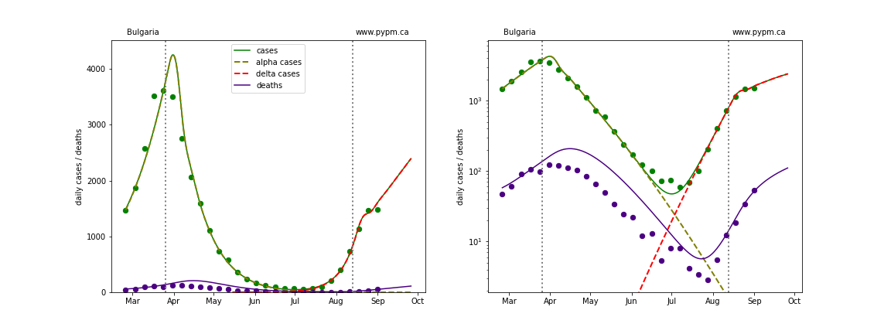

## September 5, 2021 Analysis of EU national data

## Fits to case data

The plots below show the case and death data for 29 EU nations.
The data fits were done using data up until September 4, 2021.

The large green, grey, and indigo circles are the daily cases, hospitalizations, and deaths respectively, averaged over each week.
The smaller points show the daily values.
The case data are used to define the periods for which transmission rate appears to be constant.
The vertical lines show where the transmission rate is changed.

If the susceptible fraction is roughly constant, constant transmission rates
lead to steady exponential growth or decline during, which appear as straight lines on
these log-scale plots.
With immunity growing, these lines are no longer straight - bending downwards due to the herd effect.
The solid curves show the model expectations for cases, hospitalizations, and deaths, as determined from
the case data.

The fraction of infections that lead to hospitalization or death are calibrated only to recent data.
The extent that the model projection curves match earlier hospitalization and death data
indicates whether probabilities for infections leads to severe disease is changing or not.

Since this analysis started in July, fine tuning of the model for May date was not done, resulting in
some discrepency with data.

The dashed curves separately show the reported cases interpretted as coming
from variants of
concern, divided into two types B.1.1.7 (alpha) and B.1.617.2 (delta).
The very rapid growth of cases is a combination of relaxing restrictions and the introduction of the delta variant.

### [Austria](img/at_2_9_0905.pdf)

### [Belgium](img/be_2_9_0905.pdf)

### [Bulgaria](img/bg_2_9_0905.pdf)

### [Croatia](img/hr_2_9_0905.pdf)

### [Cyprus](img/cy_2_9_0905.pdf)

### [Czechia](img/cz_2_9_0905.pdf)

### [Denmark](img/dk_2_9_0905.pdf)

### [Estonia](img/ee_2_9_0905.pdf)

### [Finland](img/fi_2_9_0905.pdf)

### [France](img/fr_2_9_0905.pdf)

### [Germany](img/de_2_9_0905.pdf)

### [Greece](img/gr_2_9_0905.pdf)

### [Hungary](img/hu_2_9_0905.pdf)

### [Ireland](img/ie_2_9_0905.pdf)

### [Italy](img/it_2_9_0905.pdf)

### [Latvia](img/lv_2_9_0905.pdf)

### [Lithuania](img/lt_2_9_0905.pdf)

### [Luxembourg](img/lu_2_9_0905.pdf)

### [Netherlands](img/nl_2_9_0905.pdf)

### [Norway](img/no_2_9_0905.pdf)

### [Poland](img/pl_2_9_0905.pdf)

### [Portugal](img/pt_2_9_0905.pdf)

### [Romania](img/ro_2_9_0905.pdf)

### [Slovakia](img/sk_2_9_0905.pdf)

### [Slovenia](img/si_2_9_0905.pdf)

### [Spain](img/es_2_9_0905.pdf)

### [Sweden](img/se_2_9_0905.pdf)

### [Switzerland](img/ch_2_9_0905.pdf)

### [United Kingdom](img/gb_2_9_0905.pdf)

## [return to case studies](../index.md)

