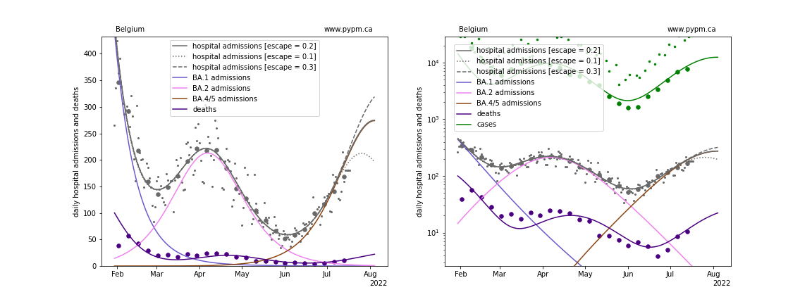
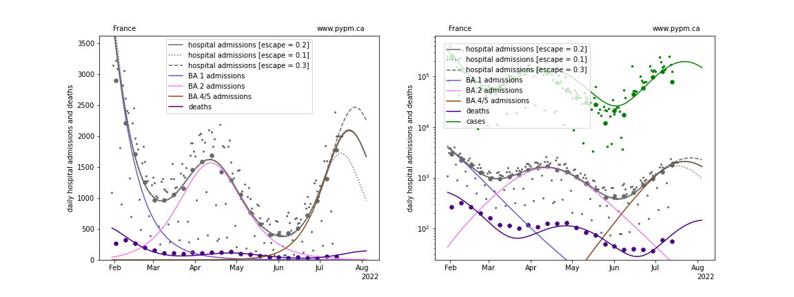
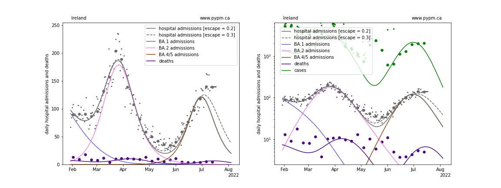
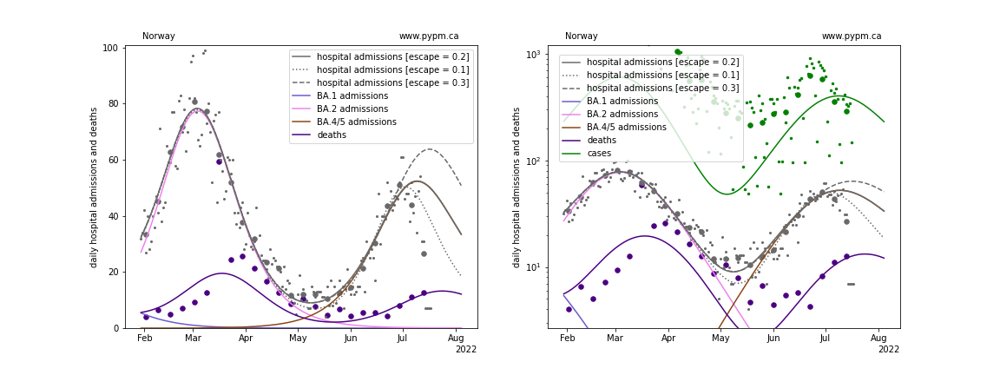
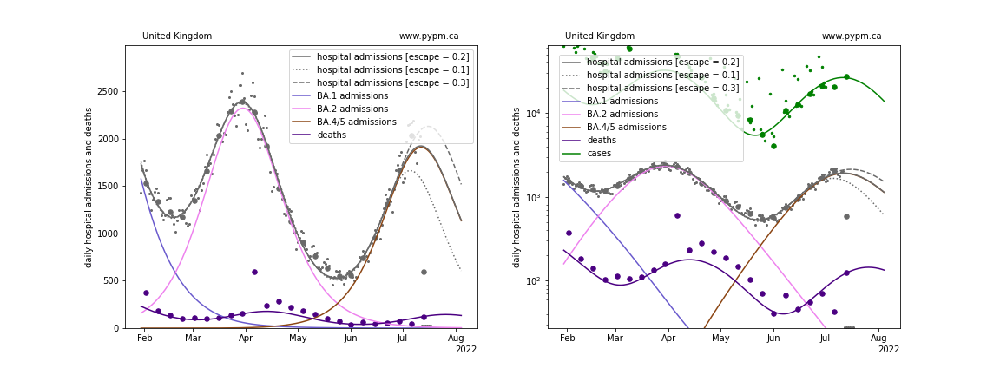

## July 17, 2022 Analysis of EU national data

Prior to 2022, the dynamics of COVIOD infections were primarily due to
changing behaviour and, later, the emergence of new variants of concern.
Dramatic turn-arounds in growth rates were generally attributed to
to changes in health measures or personal behaviour.
As a result, transitions
from growth to decline could not be predicted in advance in general.

In 2022 the dynamics of infection rates are predominantly determined
by emergence of new variants and the changing population immunity.
Transitions from growth to decline can be predicted in advance in principle,
since this can primarily be a result of growing population immunity.

There is a great deal of uncertainty in modelling population
immunity from infection and vaccination histories:
 * vaccine and natural immunity effectiveness
 * waning of vaccine and natural immunity
 * escape from vaccine and natural immunity by new variants

The analysis presented in this report uses a new approach to
evaluate population immunity and forecast the growth of the
current variant of concern, Omicron BA.5.

## Evaluating population immunity from the BA.2 wave

Hospital admission data are used for these analyses and it is assumed
that the a constant fraction of COVID infections lead to hospitalization
in 2022. Furthermore, personal behaviour is assumed to be constant throughout.

For the six nations studied in this report, the BA.2 wave is
distinct from the BA.1 and BA.4/5 waves.
These three waves are modelled by separate strains.

The model starts with a fully susceptible population in late 2021
with the emergence of BA.1.
There is no attempt to fit the full BA.1 wave.
Instead, the
magnitude of the BA.1 wave is effectively set by requiring that the
BA.2 wave is reproduced by a new variant which has no
escape from BA.1 natural infections.
In other words, the modelled BA.1 wave defines the population immunity
early in 2022.

Vaccinations are not explicitly included,
to keep the model as simple as possible.
They are implicitly included in that the modelled BA.1 wave
captures the full population immunity.

The model fits estimates the following parameters in fitting the BA.2 wave:
 * BA.1 outbreak and growth rate (magnitude of infections prior to BA.2)
 * fraction of hospitalizations leading to hospitalization
 * BA.2 outbreak timing and initial growth rate

The advantage of BA.4/5 is assumed to arise from two factors,
a different transmission rate, and partial escape from previous BA.1
and BA.2 infections.

Natural immunity escape for BA.4/5 is unknown.
For this study, it is assumed that the probability for individuals to become
susceptible to BA.4/5 is 20% (+/- 10%).
This is implemented by introducing a new susceptible population
specifically for BA.4/5, that contains 20% of the population infected by
BA.1 or BA.2.
At that level of immunity escape, the transmission rate is similar for
BA.4/5 as for BA.2.

The simple model fits the hospital admission data well, having 7
adjustable parameters.
When the natural escape fraction is increased to 30% (decreased to 10%), the
turnover data is later (earlier) and magnitude of the peak is higher (lower),
as expected.
One turnovers are established in data, the natural escape fraction can
be included in the set of adjustable parameters.

If this approach is to have value in predicting future turnover in growth
rates, the natural escape fraction for different populations will
be seen to take on similar values, since natural escape should
be a property of the virus, not the population.

## Model fits to data

The figures below show the fit of the simple model to six nations.

### [Belgium](img/be_4_4_0717_escape.pdf)

### [France](img/fr_4_4_0717_escape.pdf)

### [Ireland](img/ie_4_4_0717_escape.pdf)

### [Norway](img/no_4_4_0717_escape.pdf)

### [Switzerland](img/ch_4_4_0717_escape.pdf)

### [United Kingdom](img/gb_4_4_0717_escape.pdf)

## Comparing the evolution of the susceptible fractions

The following plot shows how the susceptible fraction of the populations
change with increasing infections on a log scale.
Those who are infected are removed from the "original" susceptible population
shown by the solid lines.
Of those, 20% are added to the "escape" susceptible population (susceptible
only to BA.4/5 infections) shown by the dotted lines.

The decline in susceptible fraction is set by the fit to the BA.2 wave.

When the escape susceptible population is larger
than the original susceptible population, most of the
new infections come from reinfections.

## [return to case studies](../index.md)

