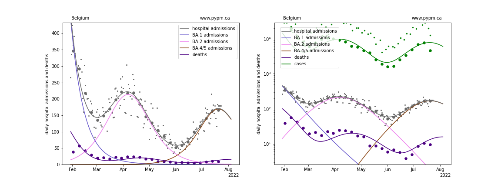
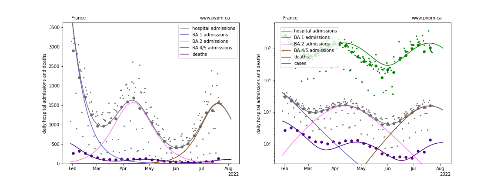
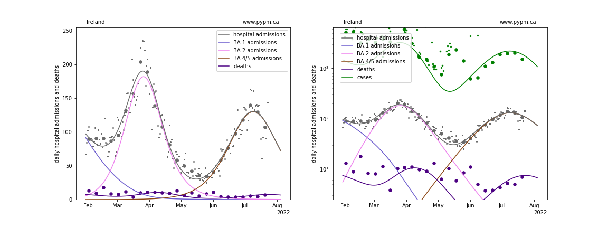
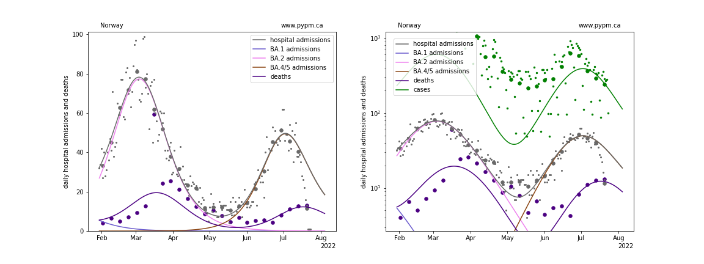
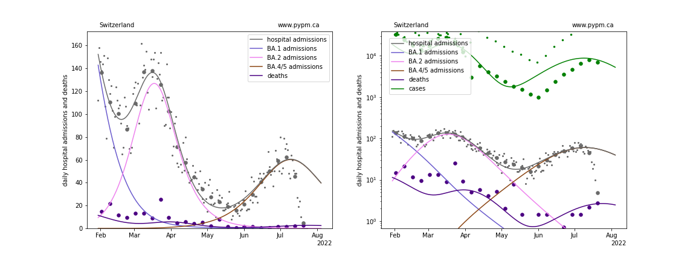
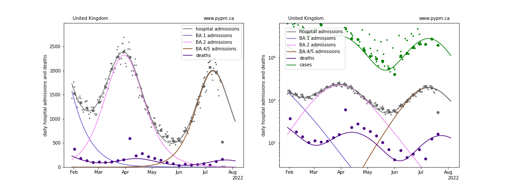
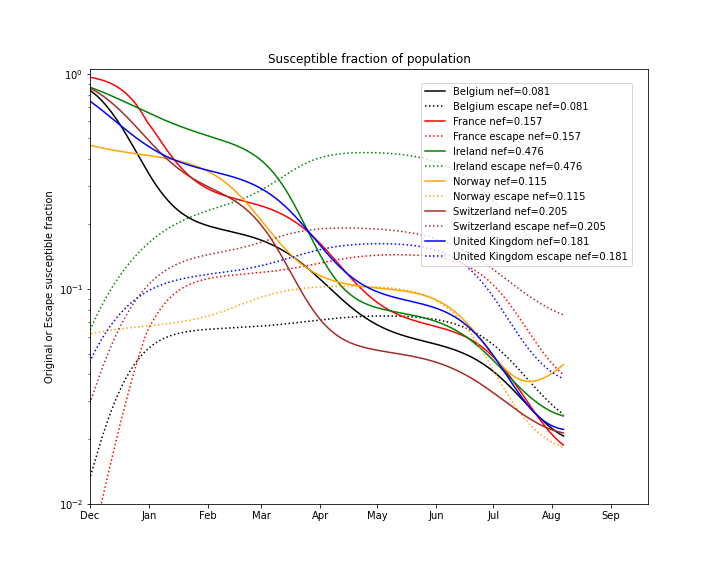

## July 24, 2022 Analysis of EU national data

This is an update to the analysis approach first used for July 17 data.
See the description from that [page](../eu20220717/index.md) for background about the analysis.
The method uses hospital admission data alone to estimate population immunity by the shape of the BA.2 wave.

## Model fits to data

The figures below show the fit of the simple model to six nations.
Unlike the previous week's data, there appears to be good evidence that the
BA.5 wave has recently peaked in hospital admissions.
As a result, the 8th parameter (the immunity escape fraction for BA.5) is also fit to data.

### [Belgium](img/be_4_4_0724.pdf)

### [France](img/fr_4_4_0724.pdf)

### [Ireland](img/ie_4_4_0724.pdf)

### [Norway](img/no_4_4_0724.pdf)

### [Switzerland](img/ch_4_4_0724.pdf)

### [United Kingdom](img/gb_4_4_0724.pdf)

## Comparing the evolution of the susceptible fractions

The following plot shows how the susceptible fraction of the populations
change with increasing infections on a log scale.
Those who are infected are removed from the "original" susceptible population
shown by the solid lines.
Of those, the fit fraction are added to the "escape" susceptible population (susceptible
only to BA.4/5 infections) shown by the dotted lines.

The decline in susceptible fraction is set by the fit to the BA.2 wave.

When the escape susceptible population is larger
than the original susceptible population, most of the
new BA.4/5 infections come from reinfections.

## fit results

Country | alpha (BA.2) | alpha (BA.4/5) | escape frac | hosp frac
--|--|--|--|--
Belgium | 1.42 | 2.14 | 0.08 | 0.0117
France | 1.09 | 1.44 | 0.16 | 0.0092
Ireland | 0.7 | 0.54 | 0.48 | 0.0057
Norway | 0.71 | 1.54 | 0.12 | 0.0035
Switzerland | 1.13 | 1.05 | 0.21 | 0.004
United Kingdom | 0.83 | 1.23 | 0.18 | 0.0101

* alpha: transmission rate
* escape frac: fraction of BA.1 and BA.2 infections that BA.4/5 infections can escape
* hosp frac: fraction of infections that are collected by hospital admissions

## [return to case studies](../index.md)

