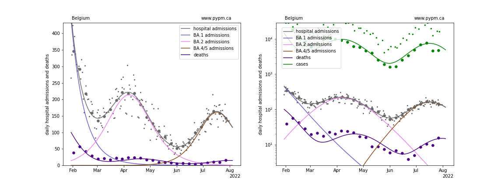
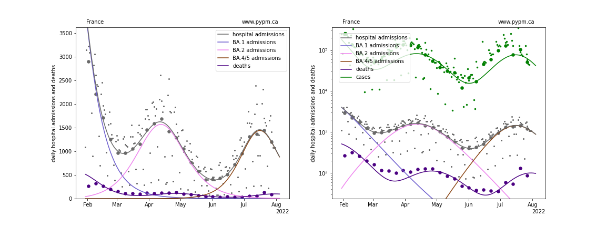
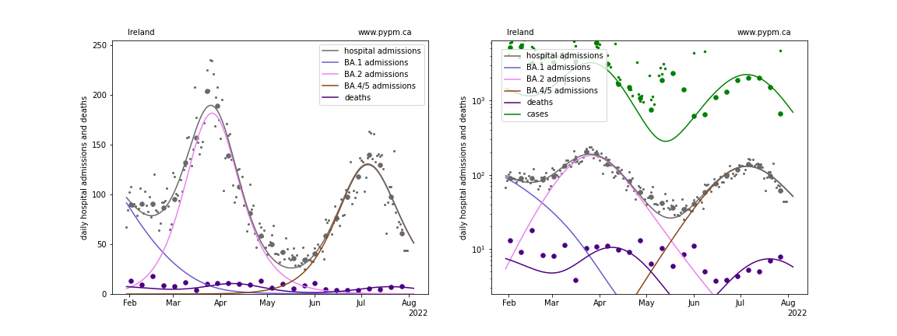
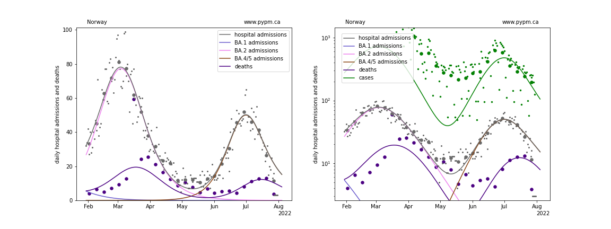
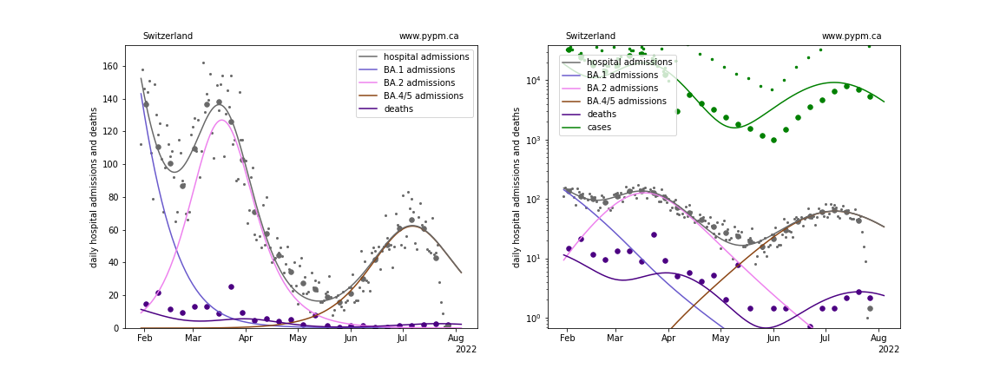
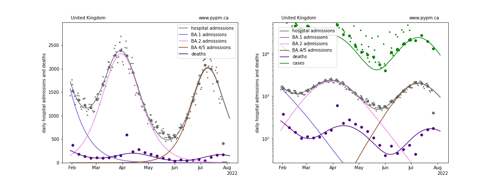

## July 31, 2022 Analysis of EU national data

This is an update to the analysis approach first used for [July 17](../eu20220717/index.md) and [July 24](../eu20220724/index.md) data.
See the description from those page for background about the analysis.
The method uses hospital admission data alone to estimate population immunity by the shape of the BA.2 wave.

## Model fits to data

The figures below show the updated fits of the simple model to six nations.
Unlike the previous week's data, it is very clear that the
BA.5 wave has recently peaked in hospital admissions for all these nations.
The immunity escape fraction for BA.5 fit from these data are somewhat lower than from the previous week.

### [Belgium](img/be_4_4_0731.pdf)

### [France](img/fr_4_4_0731.pdf)

### [Ireland](img/ie_4_4_0731.pdf)

### [Norway](img/no_4_4_0731.pdf)

### [Switzerland](img/ch_4_4_0731.pdf)

### [United Kingdom](img/gb_4_4_0731.pdf)

## fit results

Country | alpha (BA.2) | alpha (BA.4/5) | escape frac | hosp frac
--|--|--|--|--
Belgium | 1.42 | 2.65 | 0.06 | 0.0117
France | 1.09 | 1.84 | 0.12 | 0.0092
Ireland | 0.7 | 0.78 | 0.35 | 0.0057
Norway | 0.71 | 1.88 | 0.09 | 0.0035
Switzerland | 1.13 | 1.34 | 0.16 | 0.004
United Kingdom | 0.83 | 1.3 | 0.17 | 0.0101

* alpha: transmission rate
* escape frac: fraction of BA.1 and BA.2 infections that BA.4/5 infections escape
* hosp frac: fraction of infections that are collected in hospital admission data. These are fixed to the values from the
July 24 analysis.

## [return to case studies](../index.md)

