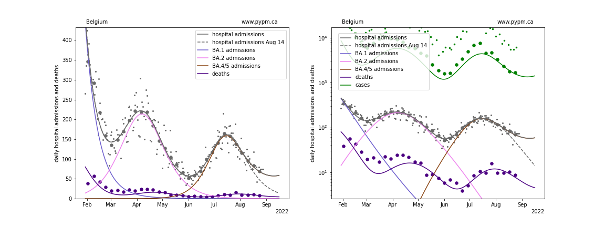

## August 28, 2022 Analysis of EU national data

This is an update to the analysis approach first used for the July 2022 analyses of European data.
See the descriptions from those pages for background about the analysis.
The method uses hospital admission data alone to estimate population-level immunity by the shape of the BA.2 wave.

## Model fits to data: possible signs for waning of immunity

Hospital admission data from August 14 followed the projection from the analysis of August 7 data, except for Norway which
had greater than expected admissions.
August 21 data from all six countries were all above expectations, and to interpret these data,
waning of immunity was added, with typical time scales of about 8 months.
The latest data, retreived on August 28, have hospital admissions following the August 21 forecast, and deviating
further from the no-waning model (referred to as August 14 in the plots below).
The models were not updated since August 21 for the plots below, except for Switzerland, in which the effect of waning was reduced.

More data is required to
establish evidence for waning of population-level immunity.

### [Belgium](img/be_4_4_0828.pdf)

### [France](img/fr_4_4_0828.pdf)

### [Ireland](img/ie_4_4_0828.pdf)

### [Norway](img/no_4_4_0828.pdf)

### [Switzerland](img/ch_4_4_0828.pdf)

### [United Kingdom](img/gb_4_4_0828.pdf)

## [return to case studies](../index.md)

